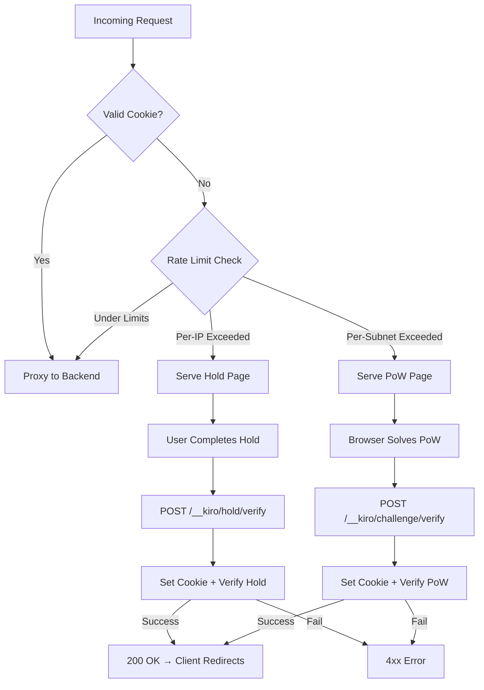

# Design Document: Challenge Pages Upgrade

## Overview

This design upgrades the Kiro WAF challenge pages (Hold page and PoW page) with a modern dark theme, inline SVG logo, smooth animations, and optimized response size. The implementation maintains the existing architecture of static HTML template constants served via `strings.NewReplacer`, ensuring zero server-side resource consumption beyond string replacement during DDoS attacks.

Key design goals:
- Replace the text "K" logo with the decoded SVG shield logo (already present as base64 favicon)
- Maintain all resources inline (no external dependencies)
- Keep response size under 10KB per page
- Preserve the existing challenge verification flow and cookie handling order
- Support responsive design from 320px to 2560px viewport widths

## Architecture

The challenge pages system follows a simple static-serving architecture:



### File Structure (unchanged)

```
internal/client/challenge/
├── challenge.go    # Package doc (minimal)
├── hold.go         # Hold page template + ServeHoldPage + VerifyHold
├── pow.go          # PoW page template + ServeChallengePage + VerifyChallenge + Store
└── pow_test.go     # Existing tests
internal/client/
├── proxy.go        # ProxyHandler with cookie-before-response ordering
└── client_waf.go   # Main WAF setup, cleanup goroutines
```

## Components and Interfaces

### 1. HTML Template Constants

Both `holdCaptchaHTML` and `powChallengeHTML` are Go `const` strings containing the complete HTML document. Template variables are injected via `strings.NewReplacer`:

**Hold page variables:**
- `{{TOKEN}}` — challenge token (base64url, 44 chars)
- `{{HOLD_SECONDS}}` — required hold duration (1-3 chars)
- `{{NEXT}}` — redirect URL after success (up to 2048 chars)

**PoW page variables:**
- `{{TOKEN}}` — challenge token (base64url, 44 chars)
- `{{SALT}}` — challenge salt (base64url, 44 chars)
- `{{DIFFICULTY}}` — number of leading zeros required (1-2 chars)
- `{{NEXT}}` — redirect URL after success (up to 2048 chars)

### 2. SVG Logo Component

The SVG shield logo is decoded from the existing base64 favicon data URI and embedded directly as an inline `<svg>` element. The decoded SVG content:

```svg
<svg xmlns="http://www.w3.org/2000/svg" viewBox="0 0 32 32" width="48" height="48" role="img" aria-label="Kiro WAF Shield Logo">
  <defs>
    <linearGradient id="fg" x1="0%" y1="0%" x2="100%" y2="100%">
      <stop offset="0%" stop-color="#14b8a6"/>
      <stop offset="100%" stop-color="#0d9488"/>
    </linearGradient>
  </defs>
  <path d="M16 2 L28 7 C28 7 29 17.5 24 23 C20.5 27 16 30 16 30 C16 30 11.5 27 8 23 C3 17.5 4 7 4 7 Z" fill="url(#fg)"/>
  <path d="M16 5 L26 9 C26 9 27 17 22.5 21.5 C19.5 24.5 16 27 16 27 C16 27 12.5 24.5 9.5 21.5 C5 17 6 9 6 9 Z" fill="#0f172a"/>
  <rect x="12" y="17" width="8" height="7" rx="1.5" fill="#14b8a6"/>
  <path d="M13.5 17 L13.5 14.5 C13.5 12.5 14.5 11.5 16 11.5 C17.5 11.5 18.5 12.5 18.5 14.5 L18.5 17" fill="none" stroke="#14b8a6" stroke-width="2" stroke-linecap="round"/>
  <circle cx="16" cy="20" r="1.5" fill="#0f172a"/>
  <rect x="15.5" y="20" width="1" height="2.5" rx="0.5" fill="#0f172a"/>
</svg>
```

This replaces the current `.logo` div that displays the letter "K". The SVG is rendered at 48×48px using the existing gradient colors from CSS custom properties.

### 3. CSS Design System

The CSS uses custom properties defined in `:root` for theming:

```css
:root {
  color-scheme: dark;
  --kiro-primary: #0d9488;
  --kiro-accent: #14b8a6;
  --kiro-background: #0f0f1a;
  --kiro-surface: #1a1a2e;
  --kiro-text-primary: #f0f0f0;
  --kiro-text-secondary: #a0a0b0;
  --kiro-border: #2a2a3e;
  --kiro-success: #10b981;
  --kiro-danger: #ef4444;
  --kiro-warning: #f59e0b;
}
```

**Responsive breakpoints:**
- Default (361px–1919px): card padding 32px/28px, heading 1.5rem
- Small (≤360px): card padding 24px/20px, heading 1.25rem, button padding 16px/24px
- Large (≥1920px): card padding 40px/36px, heading 1.75rem

### 4. JavaScript Components

**Hold page JS:**
- Event listeners: mousedown/mouseup/mouseleave + touchstart/touchend/touchcancel
- Timer: `setInterval(updateTimer, 50)` for 50ms progress updates
- State: `holdStart` timestamp, `completed` flag, `holdInterval` reference
- Format: elapsed displayed as "X.X / Y giây"
- On success: POST to `/__kiro/hold/verify` with `{token}`

**PoW page JS:**
- Pure JS SHA-256 implementation (no external crypto library)
- Batch processing: 500 nonces per batch with `setTimeout(batch, 0)` for UI responsiveness
- Progress formula: `min(95, 5 + (nonce / (16^difficulty * 0.6)) * 90)`
- On solution found: POST to `/__kiro/challenge/verify` with `{token, nonce}`

### 5. Proxy Handler (proxy.go)

The cookie-before-response pattern in `handleChallengeVerify` and `handleHoldVerify`:

```go
func (h *ProxyHandler) handleChallengeVerify(w http.ResponseWriter, r *http.Request) {
    ip := ClientIP(r)
    h.setAccessCookie(w, ip)  // Set cookie FIRST (headers before body)
    challenge.VerifyChallenge(w, r, h.challengeStore, ip)
}
```

This ensures `Set-Cookie` is always in the response headers regardless of verification outcome.

### 6. Response Size Optimization Strategy

To keep responses under 10KB:

1. **Minified CSS**: No indentation, no comments, single-line declarations where possible. CSS is written in a compact but readable format in the Go source, with minimal whitespace.
2. **Minified JS**: No leading indentation, no single-line comments, compact variable names in hot paths.
3. **Shared structure**: Both pages share the same CSS custom properties and base layout, but each page's HTML constant is self-contained (no shared template includes).
4. **SVG optimization**: The inline SVG uses minimal attributes and no unnecessary whitespace.
5. **No redundant HTML attributes**: Only essential attributes are included.

**Size budget (approximate):**
- HTML structure: ~500 bytes
- CSS (minified): ~2500 bytes
- JavaScript (minified): ~2000 bytes (hold) / ~3500 bytes (PoW with SHA-256)
- SVG logo: ~800 bytes
- Template variables (max): ~2200 bytes
- Total target: ~8000-9000 bytes per page

## Data Models

### ChallengeEntry (unchanged)

```go
type ChallengeEntry struct {
    Token      string    // base64url, 44 chars
    Salt       string    // base64url, 44 chars
    ClientIP   string    // client IP for binding
    Difficulty int       // number of leading zeros
    IssuedAt   time.Time // for hold duration validation
    ExpiresAt  time.Time // TTL expiration
}
```

### Template Variable Constraints

| Variable | Max Length | Source |
|----------|-----------|--------|
| TOKEN | 44 chars | base64url(32 bytes) |
| SALT | 44 chars | base64url(32 bytes) |
| DIFFICULTY | 2 chars | int 1-99 |
| HOLD_SECONDS | 3 chars | int 1-999 |
| NEXT | 2048 chars | request URI |

### Cookie Structure (unchanged)

```
kiro_access cookie:
  Name: "kiro_access"
  Value: HMAC-SHA256 signed payload (IP + expiry)
  HttpOnly: true
  SameSite: Lax
  Secure: true
  Path: "/"
  MaxAge: CookieTTL (default 1200s)
```

## Correctness Properties

*A property is a characteristic or behavior that should hold true across all valid executions of a system—essentially, a formal statement about what the system should do. Properties serve as the bridge between human-readable specifications and machine-verifiable correctness guarantees.*

### Property 1: Cookie header presence on all verification responses

*For any* challenge or hold verification request (with any combination of valid/invalid token, correct/incorrect IP, valid/invalid nonce, sufficient/insufficient hold duration), the HTTP response SHALL contain a `Set-Cookie` header with name "kiro_access" regardless of whether the verification succeeds or fails.

**Validates: Requirements 10.1, 10.3**

## Error Handling

### Challenge Verification Errors

| Condition | HTTP Status | JSON Response |
|-----------|-------------|---------------|
| Wrong HTTP method | 405 | `{"error":"method not allowed"}` |
| Invalid request body | 400 | `{"error":"invalid request body"}` |
| Token expired/invalid/wrong IP | 403 | `{"error":"challenge expired or invalid"}` |
| PoW solution incorrect | 403 | `{"error":"proof of work failed"}` |
| Hold duration too short | 403 | `{"error":"hold duration too short"}` |

### Client-Side Error Handling

- **PoW verification failure**: Display red error box "Xác thực thất bại. Vui lòng tải lại trang để thử lại.", reset progress bar to 0%.
- **Hold verification failure**: Display red error box "Xác thực thất bại. Vui lòng thử lại.", reset state to allow immediate retry without page reload.
- **Network error (XHR failure)**: Same as verification failure — display error, allow retry.

### Template Variable Escaping

All template variables are escaped via `jsStringEscape()` (JSON marshal + strip quotes) to prevent XSS injection through the `next` URL or token values.

## Testing Strategy

### Unit Tests (example-based)

The primary testing approach for this feature is example-based unit tests, since most requirements are structural checks on HTML/CSS/JS output:

1. **Response size tests**: Render both pages with maximum-length template variables, assert byte length < 10240.
2. **No external resources tests**: Parse rendered HTML, verify absence of external URLs (existing test pattern in `pow_test.go`).
3. **SVG logo presence**: Verify rendered output contains inline `<svg>` with `role="img"` and `aria-label`.
4. **Noscript fallback**: Verify `<noscript>` block with Vietnamese text is present.
5. **CSS custom properties**: Verify `:root` contains all required custom properties.
6. **Responsive breakpoints**: Verify media queries at 360px and 1920px exist.
7. **Dark theme**: Verify `color-scheme: dark` is present.
8. **Event handlers**: Verify JavaScript contains all required event listeners (mouse + touch).
9. **Cookie attributes**: Verify `setAccessCookie` produces cookie with correct name, flags, and MaxAge.

### Property-Based Tests (using pgregory.net/rapid)

**Property 1: Cookie header presence on all verification responses**

```go
// Feature: challenge-pages-upgrade, Property 1: Cookie header presence on all verification responses
func TestCookieAlwaysSetBeforeVerification(t *testing.T) {
    rapid.Check(t, func(t *rapid.T) {
        // Generate random verification scenario
        // ...verify Set-Cookie header is always present
    })
}
```

- Library: `pgregory.net/rapid` (already in go.mod)
- Minimum iterations: 100
- Tag: `Feature: challenge-pages-upgrade, Property 1: Cookie header presence on all verification responses`

### Integration Tests

- **Full request flow**: Issue challenge → solve → verify → check cookie is set → subsequent request passes with cookie.
- **Hold flow**: Issue hold → wait holdSeconds → verify → check cookie is set.

### Size Regression Test

A dedicated test that fails if either page exceeds 10KB when rendered with maximum-length template variables. This acts as a CI gate to prevent size regressions.

```go
func TestResponseSizeUnder10KB(t *testing.T) {
    // Render with max-length vars
    // Assert len(body) < 10240
}
```
