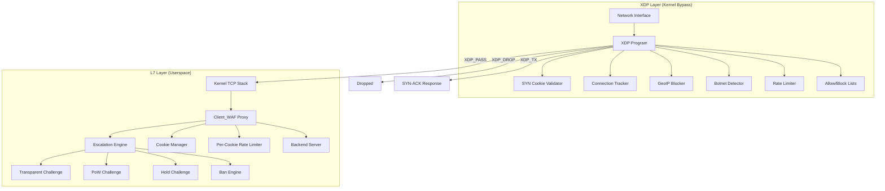
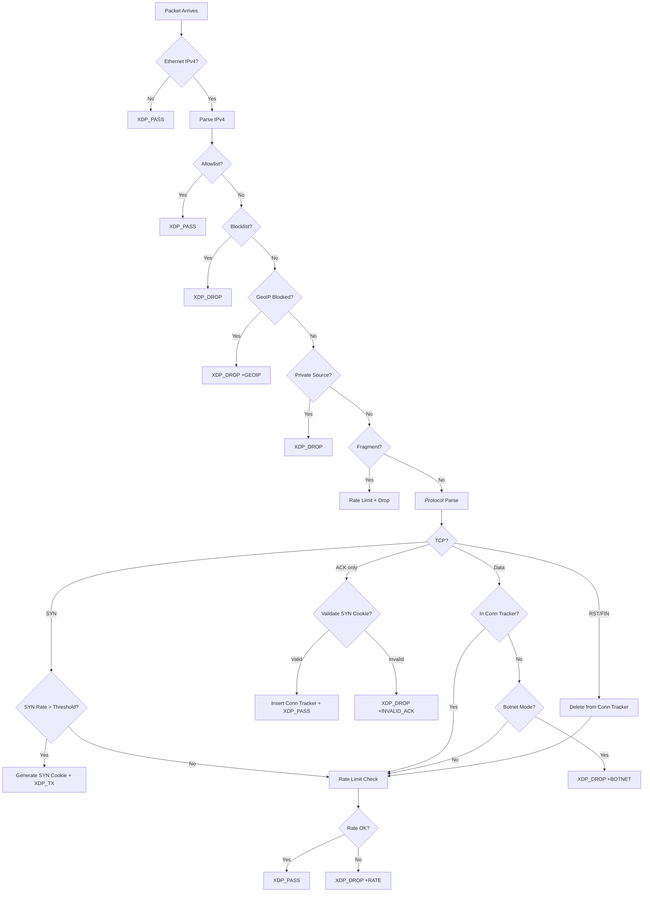

# Design Document: Transparent JS Challenge + XDP Hardening

## Overview

This design covers a multi-layered defense system for Kiro WAF combining **L7 intelligent challenge escalation** with **XDP/eBPF packet-level filtering**. The L7 layer introduces a transparent JavaScript challenge that auto-solves invisibly for real browsers, a 5-tier escalation engine, cookie hardening with TLS fingerprint binding, per-cookie rate limiting, and Cloudflare proxy compatibility. The XDP layer adds SYN cookie validation, lightweight connection tracking, GeoIP blocking, and distributed botnet detection — all operating within a <100ns per-packet budget.

The system addresses the gap where distributed botnets using many unique IPs across different subnets bypass per-IP/per-subnet rate limits. The XDP layer provides kernel-bypass packet filtering at 10M pps, while the L7 layer handles application-level bot detection and challenge serving.

### Design Rationale

- **Defense in depth**: XDP drops volumetric attacks before they reach the kernel TCP stack; L7 handles sophisticated bots that pass network-level checks.
- **Zero friction for legitimate users**: The transparent JS challenge auto-solves in <100ms without user interaction.
- **Progressive escalation**: Rather than blocking immediately, the system escalates through challenge tiers, giving legitimate users multiple chances while making attacks expensive.
- **Stateless where possible**: SYN cookies are stateless (computed from packet fields + secret); connection tracking uses bounded LRU maps with automatic eviction.

## Architecture



### Packet Flow

1. **XDP Layer** (per-packet, <100ns):
   - Allowlist/blocklist LPM check
   - GeoIP country blocking
   - SYN cookie validation (when SYN rate > threshold)
   - Connection tracker lookup (drop untracked data packets)
   - Botnet mode enforcement (drop all untracked when active)
   - Per-IP/subnet rate limiting

2. **L7 Layer** (per-HTTP-request):
   - Cookie validation (HMAC + IP + TLS fingerprint)
   - Per-cookie rate limiting
   - Escalation engine level determination
   - Challenge serving (transparent → PoW → hold → ban)
   - Cookie rotation and refresh


## Components and Interfaces

### L7 Components

#### 1. Transparent JS Challenge (`internal/client/challenge/transparent.go`)

Serves a <2KB HTML page with inline JavaScript that:
- Computes a lightweight proof (HMAC-based, not PoW) in <100ms
- Collects browser fingerprint (canvas hash, WebGL renderer, timezone, navigator.webdriver)
- POSTs solution to `/__kiro/transparent/verify` (relative URL)
- Redirects to original URL on success

```go
type TransparentChallenge struct {
    Store       *Store
    TTL         time.Duration  // default: 30s
    MinSolveMs  int64          // default: 50ms (reject faster submissions)
}

func ServeTransparentPage(w http.ResponseWriter, r *http.Request, store *Store, ttl time.Duration, clientIP string)
func VerifyTransparent(w http.ResponseWriter, r *http.Request, store *Store, clientIP string, escalation *EscalationEngine) bool
```

#### 2. Escalation Engine (`internal/client/escalation/engine.go`)

Maintains per-IP escalation state in memory. Determines challenge level (0-4) based on:
- Admin allowlist membership (level 0)
- Failed challenge count within time window
- Rate limit violations
- Cooldown-based de-escalation

```go
type EscalationEngine struct {
    mu              sync.RWMutex
    states          map[string]*IPState  // IP → escalation state
    adminAllowlist  map[string]bool
    config          EscalationConfig
}

type EscalationConfig struct {
    FailureThreshold   int           // default: 3 failures in window
    FailureWindow      time.Duration // default: 5 minutes
    CooldownDuration   time.Duration // default: 10 minutes
}

type IPState struct {
    Level           int       // 0-4
    FailureCount    int
    LastFailure     time.Time
    LastEscalation  time.Time
}

func (e *EscalationEngine) GetLevel(ip string) int
func (e *EscalationEngine) RecordFailure(ip string, challengeType string)
func (e *EscalationEngine) RecordSuccess(ip string)
```

#### 3. Cookie Manager v2 (`internal/client/cookie/manager_v2.go`)

Enhanced cookie manager with TLS fingerprint binding and short-lived rotation:

```go
type CookieManagerV2 struct {
    secret     []byte
    defaultTTL time.Duration  // default: 5 minutes
}

// Cookie payload: IP | TLS_Fingerprint | Expiry | Nonce
// HMAC: SHA-256(secret, payload)
func (m *CookieManagerV2) GenerateCookie(ip, tlsFingerprint string, ttl time.Duration) (string, error)
func (m *CookieManagerV2) ValidateCookie(cookie, ip, tlsFingerprint string) (bool, time.Duration, error)
func (m *CookieManagerV2) ShouldRefresh(remainingTTL, totalTTL time.Duration) bool
```

#### 4. Per-Cookie Rate Limiter (`internal/client/ratelimit/cookie_limiter.go`)

O(1) lookup using a map of cookie hash → counter with sliding window:

```go
type CookieRateLimiter struct {
    mu          sync.Mutex
    counters    map[uint64]*cookieCounter  // FNV-1a hash of cookie → counter
    revoked     map[uint64]time.Time       // revoked cookie hashes
    threshold   int                        // default: 300 req/min
    window      time.Duration              // default: 60s
}

func (c *CookieRateLimiter) RecordAndCheck(cookieValue string) bool  // false = revoked
func (c *CookieRateLimiter) IsRevoked(cookieValue string) bool
func (c *CookieRateLimiter) Cleanup()
```

#### 5. Cloudflare IP Extractor (`internal/client/cf/extractor.go`)

```go
type CFExtractor struct {
    trustedRanges []*net.IPNet  // Cloudflare published IP ranges
    trustMode     string        // "strict" | "permissive"
}

func (e *CFExtractor) ExtractClientIP(r *http.Request) string
func (e *CFExtractor) IsCloudflarePeer(remoteAddr string) bool
```


### XDP Components

#### 6. SYN Cookie Validator (`internal/client/xdp/xdp_filter.c` — new section)

Stateless SYN flood mitigation activated when global SYN rate exceeds threshold (default: 10K SYN/s).

**Algorithm:**
1. On SYN packet (when rate > threshold): compute `cookie = SipHash(key, src_ip || src_port || dst_port || timestamp_bucket)`, encode in SYN-ACK ISN, transmit via `XDP_TX`
2. On ACK packet: recompute expected cookie from packet fields, compare with `ack_num - 1`
3. On match: insert into connection tracker, `XDP_PASS`
4. On mismatch: `XDP_DROP`, increment `DROP_INVALID_ACK`

**Timestamp bucketing:** Uses `bpf_ktime_get_ns() / 1_000_000_000` (1-second buckets). Validation checks current bucket AND previous bucket to handle boundary crossings.

```c
/* SYN cookie key (stored in kiro_config or separate array map) */
struct syn_cookie_key {
    __u64 k0;  /* SipHash key part 1 */
    __u64 k1;  /* SipHash key part 2 */
};

/* New statistics counters */
#define KIRO_STAT_DROP_INVALID_ACK   11
#define KIRO_STAT_SYNCOOKIE_ISSUED   12
#define KIRO_STAT_SYNCOOKIE_VALID    13

/* Global SYN rate tracking (per-CPU array, index 0) */
struct syn_rate_state {
    __u64 window_start_ns;
    __u32 syn_count;
    __u32 _pad;
};
```

**SipHash implementation** (inline, ~20 cycles for 12-byte input):
- Uses the standard SipHash-2-4 algorithm truncated to 32 bits for the ISN
- Key rotated every 24h from userspace via `kiro_config` map update

#### 7. Connection Tracker (`internal/client/xdp/xdp_filter.c` — new map + logic)

Lightweight stateful tracking of established TCP connections.

```c
/* Connection tracker key */
struct conn_key {
    __u32 src_ip;      /* network byte order */
    __u16 src_port;    /* network byte order */
    __u16 dst_port;    /* network byte order */
};

/* Connection tracker value */
struct conn_value {
    __u64 established_ns;  /* timestamp when connection was validated */
    __u8  state;           /* 1=established, 0=closing */
    __u8  _pad[7];
};

/* BPF map definition */
struct bpf_map_def SEC("maps") conn_tracker = {
    .type = BPF_MAP_TYPE_LRU_HASH,
    .key_size = sizeof(struct conn_key),
    .value_size = sizeof(struct conn_value),
    .max_entries = 524288,  /* 512K entries */
};
```

**Logic integration in main XDP program:**
- After allowlist/blocklist checks, before rate limiting
- SYN packets: handled by SYN cookie logic (no tracker insert yet)
- ACK packets (SYN cookie validation): insert on success
- Data packets (non-SYN, non-RST, non-FIN): lookup tracker → DROP if absent
- RST/FIN packets: delete from tracker

#### 8. GeoIP Blocker (`internal/client/xdp/xdp_filter.c` — new maps)

```c
/* GeoIP LPM trie: IP prefix → 2-letter country code (as __u16) */
struct geoip_value {
    __u16 country_code;  /* e.g., 'C'<<8|'N' for "CN" */
};

struct bpf_map_def SEC("maps") geoip_map = {
    .type = BPF_MAP_TYPE_LPM_TRIE,
    .key_size = sizeof(struct lpm_v4_key),
    .value_size = sizeof(struct geoip_value),
    .max_entries = 524288,  /* 500K+ prefixes */
    .map_flags = BPF_F_NO_PREALLOC,
};

/* Country blocklist: country_code → 1 (blocked) */
struct bpf_map_def SEC("maps") country_blocklist = {
    .type = BPF_MAP_TYPE_HASH,
    .key_size = sizeof(__u16),
    .value_size = sizeof(__u8),
    .max_entries = 256,  /* max possible countries */
};
```

**Lookup order** (inserted after blocklist check, before rate limiting):
1. LPM lookup in `geoip_map` → get country code
2. Hash lookup in `country_blocklist` → if found, `XDP_DROP` + increment `DROP_GEOIP`

**Userspace loader** (`internal/client/xdp/geoip_loader.go`):
- Reads MaxMind GeoLite2 CSV or binary format
- Populates `geoip_map` via `bpf_map_update_elem` at startup
- Refreshes every 24h via background goroutine
- Reads `KIRO_XDP_BLOCKED_COUNTRIES` env var → populates `country_blocklist`

#### 9. Distributed Botnet Detector (`internal/client/xdp/xdp_filter.c` — new maps + logic)

Detects distributed attacks where thousands of unique IPs each send few packets.

```c
/* IP deduplication map: src_ip → last_seen_second */
struct bpf_map_def SEC("maps") ip_dedup = {
    .type = BPF_MAP_TYPE_LRU_HASH,
    .key_size = sizeof(__u32),       /* src_ip */
    .value_size = sizeof(__u64),     /* last_seen_ns */
    .max_entries = 262144,           /* 256K IPs for dedup window */
};

/* Per-CPU new-IP counter (per-CPU array, single entry) */
struct new_ip_counter {
    __u64 window_start_ns;
    __u32 count;
    __u32 _pad;
};

struct bpf_map_def SEC("maps") new_ip_rate = {
    .type = BPF_MAP_TYPE_PERCPU_ARRAY,
    .key_size = sizeof(__u32),
    .value_size = sizeof(struct new_ip_counter),
    .max_entries = 1,
};
```

**Extended kiro_config structure:**
```c
struct kiro_xdp_config {
    /* ... existing fields ... */
    __u32 syn_cookie_threshold;       /* SYN/s to activate cookies (default: 10000) */
    __u32 botnet_new_ip_threshold;    /* new IPs/s to activate botnet mode (default: 5000) */
    __u32 botnet_cooldown_seconds;    /* seconds below 50% to deactivate (default: 30) */
    __u8  botnet_mode_active;         /* 1 = botnet mode on, 0 = off */
    __u8  syn_cookie_active;          /* 1 = SYN cookies active, 0 = off */
    __u8  geoip_enabled;              /* 1 = GeoIP blocking enabled */
    __u8  conn_tracker_enabled;       /* 1 = connection tracking enabled */
};
```

**Botnet detection algorithm:**
1. For each packet, check if `src_ip` exists in `ip_dedup` map
2. If NOT found: increment per-CPU `new_ip_rate` counter, insert into `ip_dedup`
3. Sum per-CPU counters (approximate — each CPU checks independently)
4. If `new_ip_rate > botnet_new_ip_threshold`: set `botnet_mode_active = 1`
5. In botnet mode: any packet from IP NOT in `conn_tracker` → `XDP_DROP`
6. Cooldown: userspace monitors `new_ip_rate` via map read; when rate < 50% threshold for 30s, sets `botnet_mode_active = 0`

**Per-CPU approximate counting:**
- Each CPU maintains its own counter independently
- No cross-CPU synchronization in the hot path
- Userspace sums all CPU counters for the true rate (used for cooldown decisions)
- Individual CPU threshold = `botnet_new_ip_threshold / num_cpus` (approximate activation)


## Data Models

### L7 Data Models

#### Escalation State (in-memory map)

```go
// Key: IP address string
// Value:
type IPState struct {
    Level              int           // 0=none, 1=transparent, 2=PoW, 3=hold, 4=ban
    TransparentFails   int           // failures at transparent level
    PowFails           int           // failures at PoW level
    LastFailureAt      time.Time     // for window-based counting
    EscalatedAt        time.Time     // when current level was set
    LastActivityAt     time.Time     // for cooldown calculation
}
```

#### Cookie Payload (binary, base64url encoded)

```
| Field           | Size    | Description                          |
|-----------------|---------|--------------------------------------|
| Version         | 1 byte  | Cookie format version (0x02)         |
| IP Hash         | 4 bytes | FNV-1a of client IP                  |
| TLS FP Hash     | 4 bytes | FNV-1a of TLS fingerprint (0 if N/A) |
| Expiry          | 8 bytes | Unix timestamp (seconds)             |
| Nonce           | 8 bytes | Random nonce for uniqueness          |
| HMAC            | 32 bytes| SHA-256 HMAC of above fields         |
| Total           | 57 bytes| Base64url: 76 characters             |
```

#### Transparent Challenge Solution Payload (JSON POST body)

```json
{
    "token": "base64url_challenge_token",
    "solution": "computed_hmac_response",
    "fp": {
        "canvas": "sha256_of_canvas_rendering",
        "webgl": "webgl_renderer_string",
        "tz": -420,
        "wd": false
    }
}
```

### XDP Data Models

#### BPF Map Summary

| Map Name | Type | Key | Value | Max Entries | Purpose |
|----------|------|-----|-------|-------------|---------|
| `ipv4_allowlist` | LPM_TRIE | `lpm_v4_key` | `__u8` | 4,096 | IP/subnet allowlist |
| `ipv4_blocklist` | LPM_TRIE | `lpm_v4_key` | `__u8` | 65,536 | IP/subnet blocklist |
| `kiro_config` | ARRAY | `__u32` | `kiro_xdp_config` | 1 | Runtime configuration |
| `kiro_stats` | PERCPU_ARRAY | `__u32` | `__u64` | 16 | Statistics counters |
| `ipv4_rate_state` | LRU_HASH | `kiro_rate_key` | `kiro_rate_value` | 262,144 | Per-IP/subnet rate state |
| `conn_tracker` | LRU_HASH | `conn_key` | `conn_value` | 524,288 | TCP connection state |
| `geoip_map` | LPM_TRIE | `lpm_v4_key` | `geoip_value` | 524,288 | IP→country mapping |
| `country_blocklist` | HASH | `__u16` | `__u8` | 256 | Blocked country codes |
| `ip_dedup` | LRU_HASH | `__u32` | `__u64` | 262,144 | New-IP deduplication |
| `new_ip_rate` | PERCPU_ARRAY | `__u32` | `new_ip_counter` | 1 | Per-CPU new-IP counter |
| `syn_rate` | PERCPU_ARRAY | `__u32` | `syn_rate_state` | 1 | Global SYN rate tracking |

#### Updated XDP Processing Flow



#### Performance Budget (Updated)

| Operation | Cycles | Time @3GHz | Notes |
|-----------|--------|-----------|-------|
| Ethernet parse | 15 | 5ns | Bounds check + proto |
| IPv4 parse | 30 | 10ns | Header validation |
| Allowlist LPM | 60 | 20ns | O(prefix_len) |
| Blocklist LPM | 60 | 20ns | O(prefix_len) |
| GeoIP LPM | 60 | 20ns | O(prefix_len) |
| Conn tracker lookup | 30 | 10ns | O(1) hash |
| SipHash (cookie) | 20 | 7ns | 12-byte input |
| Rate state check | 30 | 10ns | O(1) hash |
| Stats increment | 15 | 5ns | Per-CPU, no lock |
| **Worst case total** | **~290** | **~97ns** | **Within budget** |

Note: Not all operations execute on every packet. GeoIP is skipped if disabled. SYN cookie only on SYN packets when rate > threshold. Connection tracker only for TCP data packets.


## Correctness Properties

*A property is a characteristic or behavior that should hold true across all valid executions of a system — essentially, a formal statement about what the system should do. Properties serve as the bridge between human-readable specifications and machine-verifiable correctness guarantees.*

### Property 1: Escalation level routing

*For any* request without a valid cookie from an IP at escalation level N, the Client_WAF SHALL serve the challenge type corresponding to that level (1→transparent, 2→PoW, 3→hold, 4→block).

**Validates: Requirements 1.1, 3.2, 3.3, 3.4, 3.5**

### Property 2: Valid challenge solution grants access

*For any* valid challenge token with correct solution, matching client IP, and submission within TTL (but after minimum solve time), the Client_WAF SHALL respond with HTTP 200 and set an access cookie.

**Validates: Requirements 2.2**

### Property 3: Invalid token submission is rejected

*For any* challenge token that does not exist in the store, has expired, or is submitted from a non-matching IP, the Client_WAF SHALL respond with HTTP 403.

**Validates: Requirements 2.3, 2.4, 2.5**

### Property 4: Challenge tokens are single-use

*For any* challenge token, after the first verification attempt (regardless of success or failure), the token SHALL no longer exist in the store and subsequent attempts SHALL be rejected.

**Validates: Requirements 8.1**

### Property 5: Submissions faster than minimum solve time are rejected

*For any* challenge solution submitted less than 50ms after token issuance, the Client_WAF SHALL reject the solution with HTTP 403.

**Validates: Requirements 8.5**

### Property 6: Admin IPs bypass all challenges

*For any* IP address present in the configured admin allowlist, the Escalation_Engine SHALL assign Challenge_Level 0 (no challenge).

**Validates: Requirements 3.1**

### Property 7: Escalation on repeated failures

*For any* IP that accumulates more than the configured failure threshold within the failure window, the Escalation_Engine SHALL increase the challenge level by one tier.

**Validates: Requirements 3.3, 3.4**

### Property 8: De-escalation after cooldown

*For any* IP at challenge level N > 0, when the cooldown period elapses without further violations, the Escalation_Engine SHALL reduce the level to N-1.

**Validates: Requirements 3.7**

### Property 9: TLS fingerprint binding rejects mismatched cookies

*For any* access cookie generated with TLS fingerprint A, validation with a different TLS fingerprint B SHALL fail.

**Validates: Requirements 4.1, 4.2, 4.3**

### Property 10: Missing TLS fingerprint falls back to IP-only

*For any* request where TLS fingerprint data is unavailable, the Cookie_Manager SHALL validate cookies using IP-only binding without rejecting the request.

**Validates: Requirements 4.5**

### Property 11: Per-cookie rate limit revocation

*For any* access cookie that exceeds the configured request threshold within the sliding window, the Per_Cookie_Rate_Limiter SHALL revoke it, and subsequent requests with that cookie SHALL be challenged.

**Validates: Requirements 5.2, 5.3**

### Property 12: Cookie expiry triggers re-challenge

*For any* access cookie past its TTL, the Client_WAF SHALL treat it as invalid and serve the appropriate challenge.

**Validates: Requirements 6.1, 6.3**

### Property 13: Cookie refresh preserves bindings

*For any* cookie refresh operation, the new cookie SHALL maintain the same IP and TLS fingerprint binding as the original, but with a different nonce value.

**Validates: Requirements 6.4, 6.5**

### Property 14: Cookie refresh at 50% TTL

*For any* valid access cookie with less than 50% of its TTL remaining, the Client_WAF SHALL issue a refreshed cookie in the response.

**Validates: Requirements 6.2**

### Property 15: Cloudflare IP extraction

*For any* request with CF-Connecting-IP header originating from a verified Cloudflare IP range, the Client_WAF SHALL use the header value as the client IP.

**Validates: Requirements 7.1, 7.2**

### Property 16: Redirect loop bypass

*For any* IP receiving the same challenge more than 3 times within 10 seconds, the Client_WAF SHALL bypass the challenge and proxy to backend.

**Validates: Requirements 7.5**

### Property 17: Webdriver detection escalates

*For any* transparent challenge solution where the fingerprint payload indicates `navigator.webdriver = true` or is missing expected fields, the Client_WAF SHALL reject and escalate to Level 2.

**Validates: Requirements 9.3, 9.4**

### Property 18: SYN cookie round-trip

*For any* valid (src_ip, src_port, dst_port, timestamp_bucket) tuple, computing the SYN cookie and then validating an ACK with `ack_num = cookie + 1` SHALL succeed.

**Validates: Requirements 12.1, 12.2, 12.5**

### Property 19: Invalid ACK is dropped

*For any* TCP ACK packet where the acknowledgment number does not match the expected SYN cookie for the packet's tuple, the XDP_Filter SHALL drop the packet and increment DROP_INVALID_ACK.

**Validates: Requirements 12.4**

### Property 20: Valid handshake inserts into connection tracker

*For any* TCP ACK that passes SYN cookie validation, the connection (src_ip, src_port, dst_port) SHALL be present in the Connection_Tracker immediately after.

**Validates: Requirements 12.3, 13.2**

### Property 21: Untracked data packets are dropped

*For any* TCP data packet (non-SYN, non-RST, non-FIN) from a connection NOT in the Connection_Tracker, the XDP_Filter SHALL drop the packet.

**Validates: Requirements 13.3**

### Property 22: RST/FIN removes from connection tracker

*For any* tracked connection, when a TCP RST or FIN packet is received, the connection SHALL be removed from the Connection_Tracker.

**Validates: Requirements 13.5**

### Property 23: GeoIP blocked country drops packets

*For any* packet whose source IP resolves to a country code present in the country blocklist, the XDP_Filter SHALL drop the packet and increment DROP_GEOIP.

**Validates: Requirements 14.3**

### Property 24: Botnet mode activation and enforcement

*For any* state where the Global_New_IP_Rate exceeds the configured threshold, the XDP_Filter SHALL enter botnet mode and drop all packets from IPs not in the Connection_Tracker.

**Validates: Requirements 15.2, 15.3**

### Property 25: Botnet mode cooldown exit

*For any* state where botnet mode is active and the Global_New_IP_Rate drops below 50% of the threshold for the configured cooldown period, the XDP_Filter SHALL exit botnet mode.

**Validates: Requirements 15.4**

### Property 26: New-IP counter accuracy

*For any* sequence of N packets from K unique source IPs within a 1-second window, the Global_New_IP_Rate counter SHALL approximate K (within per-CPU counting tolerance).

**Validates: Requirements 15.1**


## Error Handling

### L7 Error Handling

| Scenario | Behavior | Response |
|----------|----------|----------|
| Cookie HMAC validation fails | Treat as no cookie, enter challenge flow | Challenge page |
| TLS fingerprint unavailable | Fall back to IP-only binding | Normal flow |
| Challenge store full (memory) | Reject new challenge issuance, log error | 503 with retry |
| Backend unreachable | Serve branded 502 page | 502 |
| Invalid JSON in verify POST | Return 400 with error message | `{"error":"invalid request body"}` |
| Cookie rate limiter OOM | Stop tracking new cookies, log warning | Normal flow (degraded) |
| Escalation map grows unbounded | Periodic cleanup of stale entries (every 5min) | N/A |

### XDP Error Handling

| Scenario | Behavior | Rationale |
|----------|----------|-----------|
| `conn_tracker` map full | LRU eviction (oldest connection removed) | Kernel handles automatically |
| `ip_dedup` map full | LRU eviction (oldest IP removed) | Undercounts new IPs briefly |
| `geoip_map` lookup miss | Treat as "no country" → pass | Conservative: don't block unknown |
| `country_blocklist` lookup miss | Pass (country not blocked) | Expected for non-blocked countries |
| SYN cookie timestamp bucket mismatch | Check both current and previous bucket | Handles 1-second boundary crossing |
| `bpf_map_update_elem` fails | Silently continue (BPF_ANY on LRU never fails) | LRU maps auto-evict |
| Config map empty (index 0 missing) | All optional features disabled, XDP_PASS | Safe default |
| Botnet mode false positive | Userspace can override via `kiro_config` write | Manual intervention path |

### Critical Design Decisions

1. **Never XDP_ABORTED**: All error paths use XDP_DROP or XDP_PASS. XDP_ABORTED triggers kernel trace exceptions and is reserved for program bugs.

2. **Conservative defaults**: When config is missing or maps are empty, the XDP program passes all traffic. Features must be explicitly enabled.

3. **Graceful degradation**: If the connection tracker is full, LRU eviction removes the oldest connections. New connections can still be tracked. Legitimate long-lived connections may be evicted but will be re-validated on next packet.

4. **Botnet mode override**: Userspace can force-disable botnet mode by writing `botnet_mode_active = 0` to `kiro_config`. This provides an escape hatch for false positives.

## Testing Strategy

### Property-Based Testing (PBT)

**Library**: `github.com/flyingmutant/rapid` (Go property-based testing library)

**Configuration**: Minimum 100 iterations per property test.

**Tag format**: `Feature: transparent-js-challenge, Property {N}: {description}`

Properties 1-17 (L7 layer) will be tested with `rapid` generating:
- Random IP addresses (valid IPv4)
- Random challenge tokens and solutions
- Random TLS fingerprints
- Random timestamps within and outside TTL windows
- Random escalation states

Properties 18-26 (XDP layer) will be tested with:
- **Unit tests in Go** for the SYN cookie computation logic (extracted as a pure Go function mirroring the C implementation)
- **BPF program testing** using `cilium/ebpf` test framework with mock packet data
- Property tests generating random (src_ip, src_port, dst_port) tuples for cookie round-trip validation

### Unit Tests

- Specific examples for each challenge type (transparent, PoW, hold)
- Edge cases: empty IP, IPv6 addresses, maximum-length tokens
- Cookie format version migration
- Cloudflare IP range validation with known ranges
- GeoIP loader parsing with sample MaxMind data

### Integration Tests

- Full HTTP request flow through ProxyHandler with escalation
- XDP program loaded and tested with `bpf_prog_test_run` syscall
- Browser-based tests for transparent challenge auto-solve timing
- End-to-end: SYN flood → SYN cookie activation → legitimate client handshake succeeds

### Performance Tests

- Benchmark cookie validation: target <1μs per validation
- Benchmark escalation engine lookup: target <100ns per lookup
- XDP program: verify <100ns per packet using `bpf_prog_test_run` with timing
- Load test: 10K concurrent connections with mixed challenge levels

