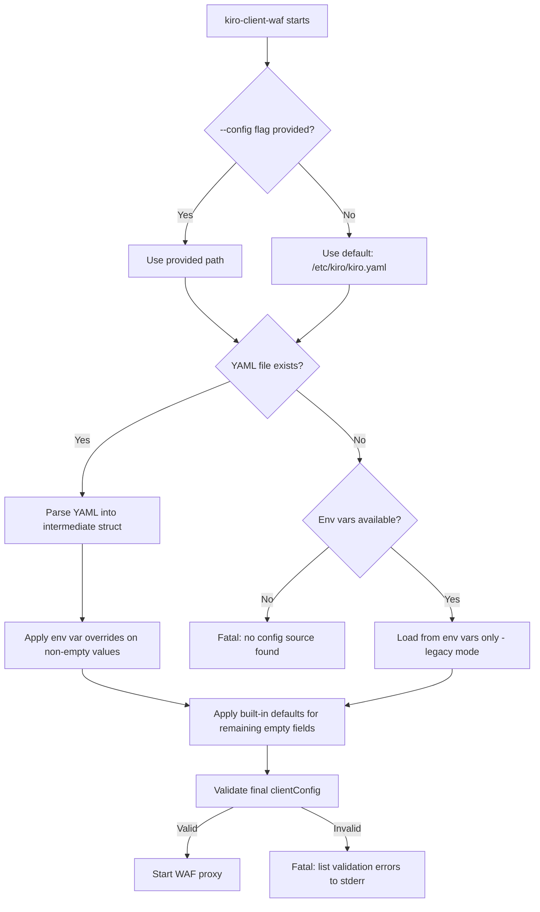

# Design Document: Unified YAML Config

## Overview

This feature unifies configuration loading for `kiro-client-waf` so it reads from the same `/etc/kiro/kiro.yaml` file that `kiro-cli` already uses. The current approach uses environment variables via `.env` files loaded by systemd's `EnvironmentFile=` directive. The new approach adds YAML as the primary config source while keeping env var overrides for backward compatibility.

**Key design goals:**
- Single config file (`/etc/kiro/kiro.yaml`) for both `kiro-cli` and `kiro-client-waf`
- Env vars still override YAML values (gradual migration, no downtime)
- Reuse existing `internal/shared/config` package for YAML parsing
- Minimal changes to the `clientConfig` struct — only the loading mechanism changes

**Precedence order (highest to lowest):**
1. Environment variables (explicit, non-empty)
2. YAML config file values
3. Built-in defaults (hardcoded in Go)

## Architecture



**Data flow:**
1. Binary starts, parses `--config` flag (default: `/etc/kiro/kiro.yaml`)
2. If YAML exists → parse into `ClientYAMLConfig` struct
3. Map YAML fields to `clientConfig` fields
4. For each field, check if a corresponding env var is set and non-empty → override
5. Apply built-in defaults for any remaining zero-value fields
6. Validate the final `clientConfig` (required fields, URL format, CIDR format)
7. If validation fails → fatal with all errors listed

## Components and Interfaces

### 1. Config Flag (`cmd/kiro-client/main.go`)

Add a `--config` flag to the binary entry point using Go's `flag` package.

```go
// cmd/kiro-client/main.go
var configPath = flag.String("config", "/etc/kiro/kiro.yaml", "path to YAML config file")

func main() {
    flag.Parse()
    os.Exit(client.RunWithConfig(*configPath))
}
```

The existing `client.Run()` function is preserved for backward compatibility but internally calls `RunWithConfig` with the default path.

### 2. YAML Config Struct (`internal/client/config_yaml.go`)

A new file defining the YAML-specific struct that extends the existing `TenantConfig` with a `client` section:

```go
// ClientYAMLConfig extends the tenant YAML schema with WAF-specific runtime fields.
// It embeds the shared TenantConfig and adds a `client` top-level section.
type ClientYAMLConfig struct {
    // Embedded tenant fields (mode, plan, license_key, admin, website, protection, etc.)
    Mode       string                `yaml:"mode"`
    Plan       string                `yaml:"plan"`
    LicenseKey string                `yaml:"license_key"`
    Admin      config.TenantAdmin    `yaml:"admin"`
    Server     config.TenantServer   `yaml:"server"`
    Website    config.TenantWebsite  `yaml:"website"`
    Protection config.TenantProtection `yaml:"protection"`

    // WAF-specific runtime settings (new section)
    Client ClientSection `yaml:"client"`
}

// ClientSection contains WAF runtime settings not present in the tenant schema.
type ClientSection struct {
    CookieSecret     string `yaml:"cookie_secret"`
    MasterURL        string `yaml:"master_url"`
    ListenAddr       string `yaml:"listen_addr"`
    NodeID           string `yaml:"node_id"`
    PoWDifficulty    int    `yaml:"pow_difficulty"`
    HoldSeconds      int    `yaml:"hold_seconds"`
    RPMPerIP         int    `yaml:"rpm_per_ip"`
    SubnetRPM        int    `yaml:"subnet_rpm"`
    HardBlockAfter   int    `yaml:"hard_block_after"`
    BlockTTLSeconds  int    `yaml:"block_ttl_seconds"`
    BlocklistFile    string `yaml:"blocklist_file"`
    XDPSyncCommand   string `yaml:"xdp_sync_command"`
    HeartbeatSeconds int    `yaml:"heartbeat_seconds"`
    UpdateSeconds    int    `yaml:"update_seconds"`
    ChallengeAllNew  bool   `yaml:"challenge_all_new"`

    // Transparent challenge / escalation
    TransparentTTL      int    `yaml:"transparent_ttl"`
    CookieShortTTL      int    `yaml:"cookie_short_ttl"`
    EscalationThreshold int    `yaml:"escalation_threshold"`
    EscalationCooldown  int    `yaml:"escalation_cooldown"`
    CookieRateLimit     int    `yaml:"cookie_rate_limit"`
    CFTrustMode         string `yaml:"cf_trust_mode"`
    XDPBlockedCountries string `yaml:"xdp_blocked_countries"`
    GeoIPCSVPath        string `yaml:"geoip_csv_path"`
}
```

### 3. Config Loader (`internal/client/config_load.go`)

A new file with the unified loading logic:

```go
// LoadClientConfig loads configuration from YAML file with env var overrides.
// Returns a fully populated clientConfig or an error describing all validation failures.
func LoadClientConfig(yamlPath string) (clientConfig, error)

// loadFromYAML parses the YAML file and maps fields to clientConfig.
func loadFromYAML(path string) (clientConfig, error)

// applyEnvOverrides overlays non-empty environment variables onto the config.
func applyEnvOverrides(cfg *clientConfig)

// applyDefaults fills zero-value fields with built-in defaults.
func applyDefaults(cfg *clientConfig)

// validateClientConfig checks all required fields and value formats.
// Returns a multi-error listing ALL validation failures (not just the first).
func validateClientConfig(cfg clientConfig) error
```

### 4. Field Mapping Logic

The mapping from YAML to `clientConfig` follows these rules:

| clientConfig field | YAML path | Env var | Default |
|---|---|---|---|
| `LicenseKey` | `license_key` | `KIRO_LICENSE_KEY` | — (required) |
| `BackendURL` | `website.sites[0].backend` | `KIRO_BACKEND_URL` | — (required) |
| `MasterURL` | `client.master_url` | `KIRO_MASTER_URL` | — (required) |
| `CookieSecret` | `client.cookie_secret` | `KIRO_CLIENT_COOKIE_SECRET` | — (required) |
| `ListenAddr` | `client.listen_addr` | `KIRO_CLIENT_LISTEN` | `:8090` |
| `NodeID` | `client.node_id` | `KIRO_NODE_ID` | hostname |
| `AdminIPs` | `admin.allow_ips` | `KIRO_ADMIN_IPS` | `[]` |
| `RPMPerIP` | `client.rpm_per_ip` | `KIRO_RPM_PER_IP` | from `protection.profile` |
| `SubnetRPM` | `client.subnet_rpm` | `KIRO_SUBNET_RPM` | from `protection.profile` |
| `HardBlockAfter` | `client.hard_block_after` | `KIRO_HARD_BLOCK_AFTER` | from `protection.profile` |
| `PoWDifficulty` | `client.pow_difficulty` | `KIRO_POW_DIFFICULTY` | `4` |
| `HoldSeconds` | `client.hold_seconds` | `KIRO_HOLD_SECONDS` | `2` |
| `BlockTTLSeconds` | `client.block_ttl_seconds` | `KIRO_BLOCK_TTL_SECONDS` | `900` |
| `BlocklistFile` | `client.blocklist_file` | `KIRO_XDP_BLOCKLIST_FILE` | `/var/lib/kiro/xdp-blocklist.txt` |
| `XDPSyncCommand` | `client.xdp_sync_command` | `KIRO_XDP_SYNC_COMMAND` | `""` |
| `HeartbeatSeconds` | `client.heartbeat_seconds` | `KIRO_HEARTBEAT_SECONDS` | `60` |
| `UpdateSeconds` | `client.update_seconds` | `KIRO_UPDATE_SECONDS` | `300` |
| `ChallengeAllNew` | `client.challenge_all_new` | `KIRO_CHALLENGE_ALL_NEW` | `false` |
| `TransparentTTL` | `client.transparent_ttl` | `KIRO_TRANSPARENT_TTL` | `30` |
| `CookieShortTTL` | `client.cookie_short_ttl` | `KIRO_COOKIE_SHORT_TTL` | `300` |
| `EscalationThreshold` | `client.escalation_threshold` | `KIRO_ESCALATION_THRESHOLD` | `3` |
| `EscalationCooldown` | `client.escalation_cooldown` | `KIRO_ESCALATION_COOLDOWN` | `600` |
| `CookieRateLimit` | `client.cookie_rate_limit` | `KIRO_COOKIE_RATE_LIMIT` | `300` |
| `CFTrustMode` | `client.cf_trust_mode` | `KIRO_CF_TRUST_MODE` | `strict` |
| `XDPBlockedCountries` | `client.xdp_blocked_countries` | `KIRO_XDP_BLOCKED_COUNTRIES` | `""` |
| `GeoIPCSVPath` | `client.geoip_csv_path` | `KIRO_GEOIP_CSV_PATH` | `""` |

**Protection profile → rate-limit defaults:**

| Profile | RPMPerIP | SubnetRPM | HardBlockAfter |
|---|---|---|---|
| `light` | 200 | 3000 | 600 |
| `balanced` | 120 | 1800 | 360 |
| `strict` | 60 | 900 | 180 |
| `lockdown` | 30 | 450 | 90 |

If `client.rpm_per_ip` (or env var) is explicitly set, it overrides the profile default.

### 5. Install Script Changes

The `create_config()` function in `install_script_embed.sh` is updated to generate YAML instead of `.env`:

```bash
create_config() {
    # ... existing directory creation ...

    # Check for existing YAML config first
    if [[ -f "$YAML_FILE" ]]; then
        log_success "File cấu hình YAML đã tồn tại tại ${YAML_FILE}. Giữ nguyên."
        return 0
    fi

    # Check for legacy .env file
    if [[ -f "$ENV_FILE" ]]; then
        log_warn "Phát hiện cấu hình legacy tại ${ENV_FILE}."
        log_warn "kiro-client-waf vẫn hỗ trợ env vars. Khuyến nghị migrate sang YAML."
        return 0
    fi

    # Generate new YAML config
    local cookie_secret
    cookie_secret=$(head -c 32 /dev/urandom | base64 | tr -d '/+=' | head -c 40)

    cat > "$YAML_FILE" << EOF
# Kiro WAF - Cấu hình thống nhất
# Được tạo bởi install-client.sh vào $(date '+%Y-%m-%d %H:%M:%S')

mode: full
license_key: ${LICENSE_KEY}

admin:
  allow_ips: []

website:
  enabled: true
  cloudflare: true
  tls_mode: flexible_http
  sites:
    - domains: []
      backend: ${backend_url}

protection:
  profile: balanced

client:
  cookie_secret: "${cookie_secret}"
  master_url: ${MASTER_URL}
  listen_addr: ":8090"
EOF
}
```

### 6. Systemd Service Update

```ini
[Service]
Type=simple
ExecStart=/usr/local/bin/kiro-client-waf --config /etc/kiro/kiro.yaml
# EnvironmentFile removed — config comes from YAML + env var overrides
WorkingDirectory=/var/lib/kiro
```

The `EnvironmentFile` directive is removed. All other directives (security hardening, capabilities, resource limits) remain unchanged.

## Data Models

### ClientYAMLConfig (YAML input)

```yaml
# /etc/kiro/kiro.yaml — unified config for both kiro-cli and kiro-client-waf
mode: full
plan: school_smb
license_key: KIRO-XXXX-XXXX

admin:
  allow_ips:
    - 203.0.113.10/32

website:
  enabled: true
  cloudflare: true
  tls_mode: flexible_http
  sites:
    - domains: [example.com]
      backend: http://127.0.0.1:3000

protection:
  profile: balanced

# NEW: WAF-specific runtime settings
client:
  cookie_secret: "random-40-char-secret"
  master_url: https://firewall.vpsgen.com
  listen_addr: ":8090"
  node_id: my-server
  heartbeat_seconds: 60
  update_seconds: 300
  challenge_all_new: false
```

### clientConfig (Go struct — unchanged)

The existing `clientConfig` struct in `internal/client/client_waf.go` remains unchanged. Only the loading mechanism changes — from `os.Getenv()` calls to YAML parsing + env override.

### Validation Error Type

```go
// ConfigValidationError collects all validation failures.
type ConfigValidationError struct {
    Errors []FieldError
}

type FieldError struct {
    Field   string // e.g. "license_key", "client.master_url"
    Reason  string // e.g. "required but empty", "invalid URL format"
}

func (e *ConfigValidationError) Error() string {
    // Format: "config validation failed: license_key: required but empty; client.master_url: invalid URL format"
}
```

## Correctness Properties

*A property is a characteristic or behavior that should hold true across all valid executions of a system — essentially, a formal statement about what the system should do. Properties serve as the bridge between human-readable specifications and machine-verifiable correctness guarantees.*

### Property 1: YAML-to-clientConfig field mapping preserves all values

*For any* valid `ClientYAMLConfig` struct (with all required fields populated and valid values), parsing the YAML into a `clientConfig` should produce a struct where every field matches the corresponding YAML source field according to the documented mapping table.

**Validates: Requirements 1.3, 3.5**

### Property 2: Config precedence — env vars override YAML, YAML overrides defaults

*For any* valid YAML configuration and any set of non-empty environment variables, the final `clientConfig` field value SHALL equal the environment variable value when set and non-empty, the YAML value when the env var is empty/unset, or the built-in default when both are empty/unset.

**Validates: Requirements 2.1, 2.3, 2.4**

### Property 3: YAML/env-var equivalence — identical inputs produce identical configs

*For any* set of configuration values, loading them via a YAML file (with no env vars set) SHALL produce an identical `clientConfig` as loading the same values via environment variables (with no YAML file), field by field.

**Validates: Requirements 8.2, 8.3**

### Property 4: Validation reports all missing required fields

*For any* YAML configuration missing one or more required fields (from the set: `license_key`, `cookie_secret`, `master_url`, `backend_url`), the validation error SHALL list every missing field by name in a single error message, not just the first one encountered.

**Validates: Requirements 6.1, 6.4**

### Property 5: Validation rejects invalid field values with descriptive errors

*For any* YAML configuration containing an invalid value (malformed URL in `master_url`/`backend_url`, invalid CIDR in `admin.allow_ips`, negative integer for positive-only fields), the validation error SHALL include the field name and a human-readable reason for the failure.

**Validates: Requirements 6.2, 6.4**

### Property 6: Type conversion correctness

*For any* valid string representation of an integer, boolean, or duration value in YAML, the Config_Loader SHALL produce the correct typed Go value (e.g., `"120"` → `int(120)`, `"true"` → `bool(true)`), and for any invalid string representation, it SHALL either use the default value or report a validation error.

**Validates: Requirements 8.4**

## Error Handling

### Startup Errors (Fatal)

| Condition | Behavior |
|---|---|
| `--config` path doesn't exist AND no env vars | Fatal with message listing both expected paths |
| YAML parse error (invalid syntax) | Fatal with YAML parse error and line number |
| Required fields missing | Fatal listing ALL missing fields |
| Invalid field values | Fatal listing ALL invalid fields with reasons |

### Graceful Degradation

| Condition | Behavior |
|---|---|
| YAML file missing but env vars present | Load from env vars only (legacy mode), log warning |
| Env var set to empty string | Treat as unset, use YAML value |
| `protection.profile` not recognized | Use `balanced` defaults, log warning |
| `client` section missing from YAML | Use env vars or defaults for all client fields |

### Error Output Format

All validation errors go to stderr in a structured format:
```
FATAL: config validation failed:
  - license_key: required but empty
  - client.master_url: invalid URL format (must be http:// or https://)
  - admin.allow_ips[1]: invalid CIDR notation "192.168.1.999/32"
```

## Testing Strategy

### Property-Based Tests (using `pgregory.net/rapid`)

The project already uses `rapid` for property-based testing (see `internal/client/ban/` and `internal/client/lockdown_property_test.go`). We continue with the same library.

Each property test runs a minimum of 100 iterations with random inputs.

**Test file:** `internal/client/config_load_property_test.go`

| Property | Test approach |
|---|---|
| Property 1: Field mapping | Generate random valid `ClientYAMLConfig`, write to temp file, parse, compare field-by-field |
| Property 2: Precedence | Generate random YAML + random env vars, verify highest-priority non-empty source wins |
| Property 3: Equivalence | Generate random config values, load via YAML and via env vars separately, assert equality |
| Property 4: Missing fields | Generate random subsets of required fields to omit, verify all are listed in error |
| Property 5: Invalid values | Generate random invalid URLs/CIDRs/integers, verify error contains field name + reason |
| Property 6: Type conversion | Generate random valid int/bool strings, verify correct Go type output |

Tag format: `// Feature: unified-yaml-config, Property N: <description>`

### Unit Tests (example-based)

**Test file:** `internal/client/config_load_test.go`

- `TestLoadClientConfig_DefaultPath` — no `--config` flag uses `/etc/kiro/kiro.yaml`
- `TestLoadClientConfig_CustomPath` — `--config /custom/path.yaml` reads that file
- `TestLoadClientConfig_LegacyEnvOnly` — no YAML, only env vars → works as before
- `TestLoadClientConfig_NoConfigSource` — no YAML, no env vars → fatal error
- `TestLoadClientConfig_ProfileDefaults` — each profile maps to correct RPM values
- `TestLoadClientConfig_EmptyEnvVarIgnored` — `KIRO_LICENSE_KEY=""` doesn't override YAML
- `TestLoadClientConfig_AdminIPsParsing` — comma-separated string and YAML array both work

### Integration Tests

- Install script generates valid YAML (run in Docker container)
- Systemd service starts with `--config` flag (manual verification in staging)

### Test Configuration

```go
// Property tests use rapid with default settings (100+ iterations)
// Tag format for traceability:
// Feature: unified-yaml-config, Property 1: YAML-to-clientConfig field mapping preserves all values
```
