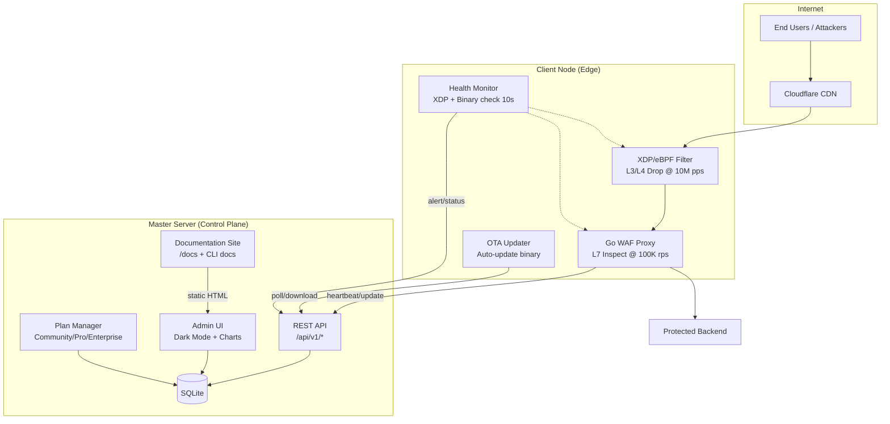
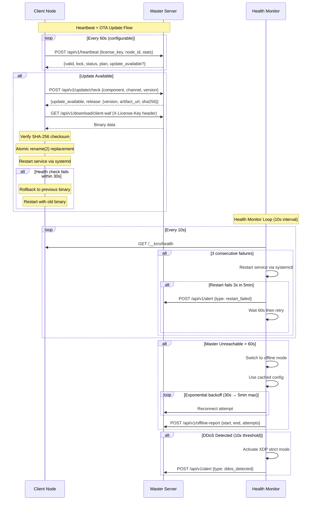
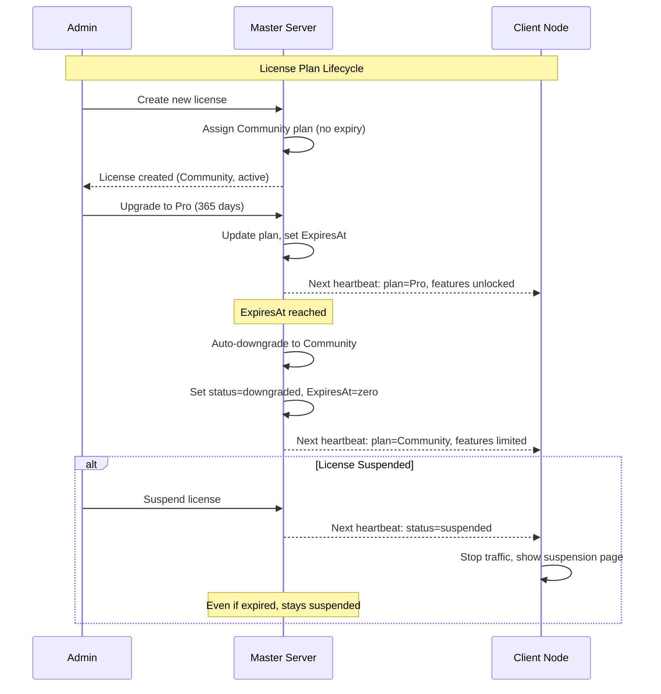
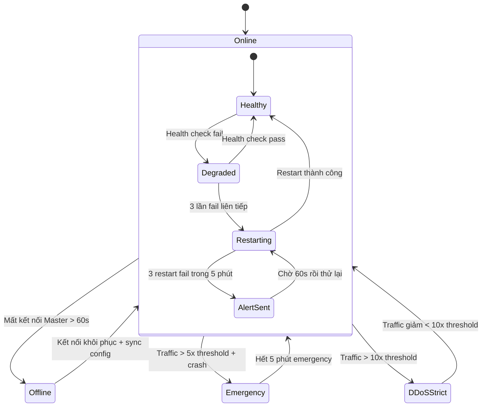
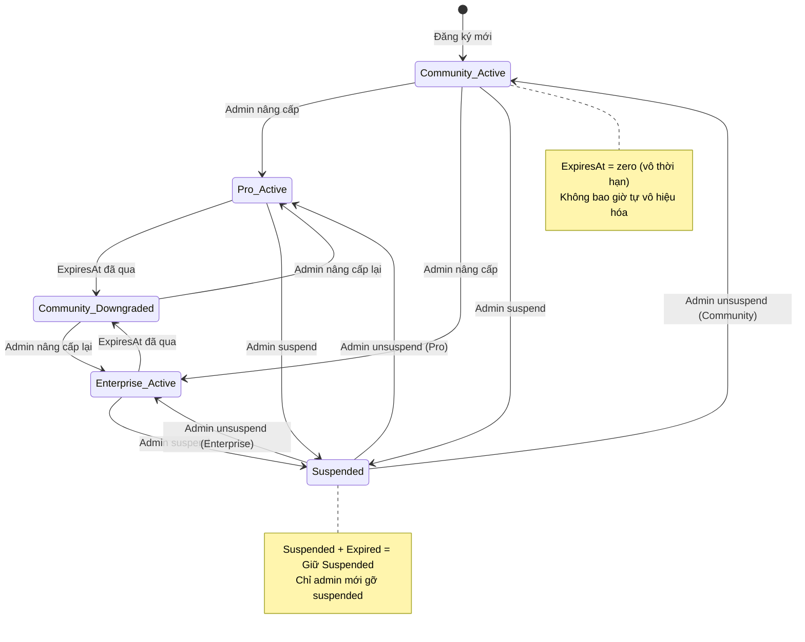

# Design Document: WAF System Overhaul

## Overview

Đại tu toàn diện hệ thống Kiro WAF bao gồm 15 lĩnh vực: nhận diện thương hiệu, giao diện frontend hiện đại, trực quan hóa dữ liệu, cài đặt client thông minh, cập nhật OTA tự động, tối ưu hiệu năng XDP/eBPF, tối ưu hiệu năng Golang WAF, tái cấu trúc thư mục, tài liệu dự án, tài liệu người dùng cuối, xử lý lỗi/ngăn rò rỉ bộ nhớ, CLI commands đầy đủ với tài liệu website, kiểm tra liên tục XDP/binary với tự phục hồi, gói Community không giới hạn thời gian, và cải thiện trải nghiệm cài đặt (Install UX).

Hệ thống hiện tại đã có kiến trúc Master Server + Client Node hoạt động, với XDP filter, rate limiter, challenge system, và admin UI. Overhaul này nâng cấp chất lượng, hiệu năng, và trải nghiệm vận hành lên mức production-grade.

### Design Decisions

1. **Single CSS file, no CDN** — Giảm dependency bên ngoài, tăng tốc tải trang, và đảm bảo hoạt động trong môi trường mạng hạn chế.
2. **Chart.js bundled locally** — Thư viện nhẹ (~60KB gzipped cho full, ~40KB cho subset), hỗ trợ SVG/Canvas, responsive, tooltip built-in.
3. **pgregory.net/rapid cho PBT** — Đã được sử dụng trong project (tests/property/pow_test.go), Go-native, API đơn giản.
4. **Atomic binary replacement via rename(2)** — Đảm bảo không có trạng thái trung gian khi cập nhật binary.
5. **Per-CPU maps cho XDP stats** — Loại bỏ lock contention, tối ưu cho multi-core.
6. **sync.Pool + zero-alloc hot path** — Giảm GC pressure, đạt mục tiêu <1ms GC pause.
7. **Standard Go Layout** — cmd/, internal/, pkg/, web/ — tuân theo quy ước cộng đồng Go.
8. **Health Monitor tách riêng goroutine** — Monitor chạy độc lập với WAF proxy, không ảnh hưởng hiệu năng xử lý request. Sử dụng channel-based communication.
9. **Exponential backoff cho reconnect** — Tránh thundering herd khi Master Server phục hồi, giảm tải không cần thiết.
10. **Community plan vô thời hạn (ExpiresAt = zero)** — Sử dụng zero value của time.Time thay vì giá trị magic number, tương thích với Go idiom và database NULL.
11. **State snapshot dạng JSON compressed** — Dễ debug, dễ migrate giữa các phiên bản, gzip giảm kích thước ~70%.
12. **Install UX tích hợp trực tiếp vào install-client.sh** — Không tạo dependency mới, giữ script self-contained, dễ curl | bash.
13. **Braille spinner (⠋⠙⠹⠸⠼⠴⠦⠧⠇⠏)** — Smooth animation trên hầu hết terminal hiện đại, fallback graceful khi không hỗ trợ Unicode.

## Architecture







## Components and Interfaces

### 1. Brand System (`web/static/css/kiro-brand.css`)

```css
/* Design Token Interface */
:root {
  --kiro-primary: #0d9488;
  --kiro-accent: #14b8a6;
  --kiro-background: #0f0f1a;
  --kiro-surface: #1a1a2e;
  --kiro-text-primary: #f0f0f0;
  --kiro-text-secondary: #a0a0b0;
  --kiro-border: #2a2a3e;
  --kiro-success: #10b981;
  --kiro-danger: #ef4444;
  --kiro-warning: #f59e0b;
}
```

- SVG logo file: `web/static/img/kiro-logo.svg` (vector-only, 16px–512px scalable)
- Favicon: `web/static/img/favicon.svg` (derived from logo)
- Single unified CSS: `web/static/css/kiro.css` (<100KB uncompressed)

### 2. Admin UI Frontend (`web/templates/admin/`)

| Component | CSS Technique | Fallback |
|-----------|--------------|----------|
| Cards/Panels | `backdrop-filter: blur(12px)` + `rgba(26,26,46,0.7)` | Solid `rgba(26,26,46,0.9)` |
| Action Buttons | `box-shadow: 0 0 8px rgba(13,148,136,0.6)` | Standard border highlight |
| Active Nav | Neon glow `box-shadow` | Solid background color |
| Layout | CSS Grid + Flexbox | Single column <768px |

WCAG 2.1 AA compliance: all text ≥4.5:1 contrast ratio against direct background.

### 3. Chart Engine (`web/static/js/kiro-charts.js`)

```typescript
// Chart Engine Interface (JavaScript)
interface ChartEngine {
  renderLicenseDistribution(container: HTMLElement, data: LicenseStats): void;
  renderHeartbeatTimeline(container: HTMLElement, data: HeartbeatHourly[]): void;
  renderReleaseHistory(container: HTMLElement, data: Release[]): void;
  renderDDoSEvents(container: HTMLElement, data: DDoSEvent[]): void;
}

interface LicenseStats {
  active: number;
  suspended: number;
  revoked: number;
  expired: number;
}

interface HeartbeatHourly {
  hour: string;  // ISO timestamp
  count: number;
}
```

- Library: Chart.js (bundled locally, <50KB gzipped)
- Rendering: Canvas with SVG fallback
- Responsive: scales 320px–2560px
- Empty state: placeholder message when no data

### 4. Install Script (`scripts/install-client.sh`)

```bash
# Interface Contract
# Input: --license-key <KEY> [--xdp-mode]
# Output: Installed binary + systemd service running
# Exit codes: 0 = success, 1 = error

# OS Detection Interface
detect_os() -> {distro, version, pkg_manager}
# Supported: Ubuntu, Debian, CentOS, Rocky, Fedora, Arch

# Dependency Installation Interface  
install_dependencies(pkg_manager, deps[]) -> exit_code
# Required: curl, sha256sum, systemctl
# XDP mode: clang, llvm, libbpf-dev

# Binary Download Interface
download_binary(master_url, license_key) -> {binary_path, checksum_valid}
# Timeout: 30s connection
# Verification: SHA-256 checksum
```

### 5. OTA Updater (`internal/client/updater/`)

```go
// OTA Updater Interface
type Updater interface {
    // CheckForUpdate polls master server for available updates
    CheckForUpdate(ctx context.Context) (*UpdateInfo, error)
    
    // DownloadAndVerify downloads binary and verifies SHA-256
    DownloadAndVerify(ctx context.Context, info *UpdateInfo) (string, error)
    
    // ApplyUpdate performs atomic binary replacement
    ApplyUpdate(ctx context.Context, newBinaryPath string) error
    
    // Rollback restores previous binary version
    Rollback(ctx context.Context) error
}

type UpdaterConfig struct {
    MasterURL       string
    LicenseKey      string
    Component       string
    Channel         string
    CurrentVersion  string
    PollInterval    time.Duration // default 300s, min 60s, max 86400s
    DownloadTimeout time.Duration // 5 minutes
    HealthTimeout   time.Duration // 30 seconds
    BinaryPath      string        // /usr/local/bin/kiro-client-waf
    BackupPath      string        // /usr/local/bin/kiro-client-waf.prev
}

type UpdateInfo struct {
    Version     string
    ArtifactURL string
    SHA256      string
    Notes       string
}
```

### 6. XDP Filter (`internal/client/xdp/xdp_filter.c`)

```c
// XDP Filter Map Interface (existing, to be optimized)
// Per-CPU stats: BPF_MAP_TYPE_PERCPU_ARRAY (already implemented)
// Rate state: BPF_MAP_TYPE_LRU_HASH, max 262,144 entries (already implemented)
// Blocklist: BPF_MAP_TYPE_LPM_TRIE, max 65,536 entries (already implemented)

// Performance targets:
// - <100ns per 64-byte packet on x86_64 @ 3.0GHz
// - 10M pps single core throughput
// - Zero dynamic allocation in XDP path
// - BPF object < 32KB compiled with clang -O2
```

### 7. WAF Proxy Performance (`internal/client/proxy/`)

```go
// High-Performance Proxy Interface
type ProxyHandler struct {
    pool        *sync.Pool       // Buffer reuse
    connPool    *ConnPool        // Backend connection pool
    semaphore   chan struct{}     // Goroutine limiter (default 10,000)
}

type ConnPoolConfig struct {
    MaxIdleConns    int           // default 256
    MaxTotalConns   int           // default 1024
    IdleTimeout     time.Duration // default 90s
    QueueTimeout    time.Duration // 1s max wait for connection
}

// Zero-allocation hot path: header inspection + routing
// Uses pre-allocated buffers from sync.Pool
// No heap allocation per-request for header checks
```

### 8. Directory Structure (Standard Go Layout)

```
kiro_waf/
├── cmd/
│   ├── kiro-master/main.go      # Master server entry point
│   ├── kiro-client/main.go      # Client WAF entry point
│   └── kiro-cli/main.go         # CLI tool entry point
├── internal/
│   ├── master/                   # Master server packages
│   │   ├── handlers/
│   │   ├── db/
│   │   ├── models/
│   │   ├── plan/                 # Community/Pro/Enterprise plan logic
│   │   └── templates/
│   ├── client/                   # Client node packages
│   │   ├── proxy/
│   │   ├── ratelimit/
│   │   ├── challenge/
│   │   ├── cookie/
│   │   ├── ban/
│   │   ├── ua/
│   │   ├── updater/
│   │   ├── monitor/              # Health Monitor (XDP + binary check)
│   │   └── xdp/
│   └── shared/                   # Shared internal packages
├── pkg/                          # Public shared packages
│   ├── version/
│   └── health/
├── web/
│   ├── templates/                # HTML templates
│   └── static/                   # CSS, JS, images
├── deployments/                  # systemd, nginx, nftables, sysctl
├── configs/                      # Example configuration files
├── scripts/                      # Build and install scripts
├── docs/                         # Documentation
├── tests/
│   └── property/                 # Property-based tests
├── build/                        # Build output directory
├── go.mod
├── go.sum
└── Makefile
```

### 9. Documentation Site (`docs/` + `/docs` route)

```go
// Documentation serving interface
type DocsHandler struct {
    staticDir string  // docs/public/
    languages []string // ["vi", "en"]
}

// Routes:
// GET /docs           -> docs index with language switcher
// GET /docs/{lang}/*  -> language-specific pages
// Sidebar navigation with TOC
// Version/date display per page
```

### 10. Error Handling Patterns

```go
// Goroutine semaphore pattern
type Semaphore struct {
    ch chan struct{}
}

func NewSemaphore(max int) *Semaphore {
    return &Semaphore{ch: make(chan struct{}, max)}
}

func (s *Semaphore) Acquire() bool {
    select {
    case s.ch <- struct{}{}:
        return true
    default:
        return false // At capacity → return 503
    }
}

func (s *Semaphore) Release() {
    <-s.ch
}

// Panic recovery middleware
func RecoverMiddleware(next http.Handler) http.Handler {
    return http.HandlerFunc(func(w http.ResponseWriter, r *http.Request) {
        defer func() {
            if err := recover(); err != nil {
                log.Printf("PANIC recovered: %v\n%s", err, debug.Stack())
                http.Error(w, "internal server error", 500)
            }
        }()
        next.ServeHTTP(w, r)
    })
}
```

### 11. Health Monitor (`internal/client/monitor/`)

```go
// Health Monitor Interface - Kiểm tra liên tục XDP và binary, tự phục hồi
type HealthMonitor interface {
    // Start khởi động vòng lặp kiểm tra sức khỏe
    Start(ctx context.Context) error
    
    // Stop dừng monitor gracefully
    Stop() error
    
    // Status trả về trạng thái hiện tại của monitor
    Status() MonitorStatus
}

type MonitorConfig struct {
    CheckInterval       time.Duration // 10 giây
    HealthEndpoint      string        // /__kiro/health
    HealthTimeout       time.Duration // 5 giây
    MaxConsecFailures   int           // 3 lần liên tiếp trước khi restart
    MaxRestartFailures  int           // 3 lần restart thất bại trước khi alert
    RestartCooldown     time.Duration // 60 giây chờ sau 3 lần restart thất bại
    OfflineThreshold    time.Duration // 60 giây mất kết nối → offline mode
    ReconnectInterval   time.Duration // 30 giây ban đầu, exponential backoff
    MaxReconnectBackoff time.Duration // 5 phút tối đa
    SnapshotInterval    time.Duration // 60 giây
    SnapshotMaxSize     int64         // 64MB
    SnapshotPath        string        // /var/lib/kiro/snapshots/
    EmergencyDuration   time.Duration // 5 phút chế độ emergency
    EmergencyThreshold  float64       // 5x ngưỡng rate-limit
    DDoSThreshold       float64       // 10x ngưỡng rate-limit
    DDoSWindow          time.Duration // 10 giây sliding window
    PlanConfig          PlanConfig    // Giới hạn theo Package_Plan
}

type MonitorStatus struct {
    Mode              OperationMode `json:"mode"`              // online, offline, emergency
    XDPAttached       bool          `json:"xdp_attached"`
    BinaryHealthy     bool          `json:"binary_healthy"`
    ConsecFailures    int           `json:"consec_failures"`
    LastCheckAt       time.Time     `json:"last_check_at"`
    LastSnapshotAt    time.Time     `json:"last_snapshot_at"`
    OfflineSince      *time.Time    `json:"offline_since,omitempty"`
    ReconnectAttempts int           `json:"reconnect_attempts"`
    CurrentPlan       string        `json:"current_plan"`
}

type OperationMode string

const (
    ModeOnline    OperationMode = "online"
    ModeOffline   OperationMode = "offline"
    ModeEmergency OperationMode = "emergency"
)

// FailureTracker theo dõi chuỗi thất bại liên tiếp cho state machine
type FailureTracker struct {
    ConsecutiveFailures int
    FirstFailureAt      time.Time
    LastFailureAt       time.Time
    WindowDuration      time.Duration // 5 phút cho restart failures
}

// ShouldEscalate trả về true khi đạt ngưỡng thất bại trong cửa sổ thời gian
func (ft *FailureTracker) ShouldEscalate(threshold int) bool

// Reset đặt lại bộ đếm khi thành công
func (ft *FailureTracker) Reset()

// TrafficAnalyzer phân tích traffic trong sliding window
type TrafficAnalyzer struct {
    Window       time.Duration // 10 giây
    Samples      []TrafficSample
    PlanThreshold uint64 // Ngưỡng rate-limit từ Package_Plan
}

type TrafficSample struct {
    Timestamp time.Time
    PPS       uint64 // Packets per second
}

// CurrentRate trả về tốc độ trung bình trong sliding window
func (ta *TrafficAnalyzer) CurrentRate() uint64

// IsEmergency trả về true khi rate > 5x threshold
func (ta *TrafficAnalyzer) IsEmergency() bool

// IsDDoS trả về true khi rate > 10x threshold
func (ta *TrafficAnalyzer) IsDDoS() bool
```



### 12. CLI Testing & Documentation Structure

```go
// CLI Test Strategy Interface
// Mỗi command có unit test riêng trong sub-package tương ứng

// Test structure cho mỗi CLI command:
// cmd/kiro-cli/<command>/<command>_test.go

// Ví dụ test pattern:
type CLITestCase struct {
    Name           string
    Args           []string
    ConfigFixture  string   // Path to test config YAML
    ExpectedExit   int
    ExpectedFields []string // Required JSON fields in output
    ExpectedError  string   // Expected error substring
}

// Integration test sử dụng testscript hoặc exec.Command
// để test full CLI binary behavior
```

**Website Documentation Structure cho CLI:**

```
/docs/vi/cli/           → Trang tổng quan CLI (mục lục tất cả lệnh)
/docs/vi/cli/version    → Lệnh version
/docs/vi/cli/status     → Lệnh status  
/docs/vi/cli/health     → Lệnh health
/docs/vi/cli/preflight  → Lệnh preflight
/docs/vi/cli/mode       → Lệnh mode show/set
/docs/vi/cli/install    → Lệnh install plan/stage-lab/apply-lab
/docs/vi/cli/update     → Lệnh update check/apply/rollback
/docs/vi/cli/incident   → Lệnh incident report
/docs/vi/cli/pilot      → Lệnh pilot report
/docs/vi/cli/report     → Lệnh report
/docs/vi/cli/license    → Lệnh license fingerprint
```

Mỗi trang CLI documentation chứa:
- Cú pháp sử dụng (usage syntax)
- Bảng tham số (bắt buộc/tùy chọn, kiểu dữ liệu, giá trị mặc định)
- Ví dụ sử dụng thực tế (ít nhất 1 ví dụ)
- Mã thoát và ý nghĩa
- Liên kết đến lệnh liên quan

### 13. Community Plan Logic (`internal/master/plan/`)

```go
// Plan Management Interface
type PlanManager interface {
    // CreateCommunityLicense tạo license Community vô thời hạn cho đăng ký mới
    CreateCommunityLicense(customerID, customerName, fingerprint string) (*License, error)
    
    // CheckExpiry kiểm tra và xử lý license hết hạn
    // Chuyển Pro/Enterprise → Community khi ExpiresAt đã qua
    CheckExpiry(ctx context.Context) ([]DowngradeEvent, error)
    
    // UpgradePlan nâng cấp license lên gói cao hơn
    // Giữ nguyên license_key, fingerprint, history
    UpgradePlan(licenseID string, newPlan string, validDays int) error
    
    // DowngradeToCommunity hạ cấp license về Community
    // Giữ nguyên identity, xóa tính năng premium
    DowngradeToCommunity(licenseID string) error
    
    // EnforcePlanLimits kiểm tra config có vượt giới hạn plan không
    EnforcePlanLimits(plan string, config RequestedConfig) error
}

type DowngradeEvent struct {
    LicenseID    string    `json:"license_id"`
    PreviousPlan string    `json:"previous_plan"`
    DowngradedAt time.Time `json:"downgraded_at"`
    Reason       string    `json:"reason"` // "expired"
}

type RequestedConfig struct {
    Domains       int  `json:"domains"`
    XDPEnabled    bool `json:"xdp_enabled"`
    OTAEnabled    bool `json:"ota_enabled"`
    CustomRPM     int  `json:"custom_rpm"`
}

// License Status Constants
const (
    StatusActive     = "active"
    StatusSuspended  = "suspended"
    StatusDowngraded = "downgraded"
)

// Quy tắc ưu tiên trạng thái:
// - suspended > expired: Nếu license bị suspended VÀ hết hạn → giữ suspended
// - expired + active → downgraded (chuyển về Community)
// - Community không bao giờ hết hạn (ExpiresAt = zero value)
```



### 14. Install UX (`scripts/install-ux.sh` hoặc tích hợp trong `install-client.sh`)

```bash
# Install UX Interface Contract
# Các hàm UI được source vào install-client.sh

# --- Progress Bar ---
# Input: current_bytes, total_bytes, bar_width (min 20)
# Output: [████████░░░░░░░░] 50% (cập nhật mỗi 1s hoặc 2%)
show_progress_bar() {
    local current=$1 total=$2 width=${3:-40}
    local percent=$((current * 100 / total))
    local filled=$((percent * width / 100))
    # ... render bar
}

# --- Spinner ---
# Characters: ⠋⠙⠹⠸⠼⠴⠦⠧⠇⠏
# Speed: 80-120ms per frame
# Input: message text
start_spinner() { ... }
stop_spinner() { ... }

# --- Color Codes ---
# Nhất quán toàn script:
# SUCCESS: \033[0;32m ✓  (xanh lá)
# ERROR:   \033[0;31m ✗  (đỏ)
# WARNING: \033[1;33m ⚠  (vàng)
# INFO:    \033[0;36m →  (cyan)
# TITLE:   \033[1;37m    (trắng đậm)

# --- Step Counter ---
# Format: [N/T] Step description
# N = bước hiện tại, T = tổng số bước
print_step() {
    local step=$1 total=$2 message=$3
    echo -e "${BOLD}[${step}/${total}]${NC} ${message}"
}

# --- Timing ---
# Mỗi bước hiển thị thời gian: "✓ Tải binary hoàn tất (3.2s)"
step_complete() {
    local message=$1 duration=$2
    printf "${GREEN}✓${NC} %s (%.1fs)\n" "$message" "$duration"
}

# --- Summary Box ---
# Box-drawing characters: ┌─┐│└─┘
# Chứa: version, binary path, service status, IP, useful commands
print_summary_box() { ... }

# --- Error Handling ---
# Dừng animation, hiển thị: tên bước, nguyên nhân, gợi ý khắc phục
print_error_with_suggestion() {
    local step=$1 cause=$2 suggestion=$3
    stop_spinner 2>/dev/null || true
    printf "\r\033[K"  # Xóa dòng animation
    echo -e "${RED}✗${NC} ${step}"
    echo -e "  Nguyên nhân: ${cause}"
    echo -e "  ${YELLOW}→${NC} ${suggestion}"
}

# --- Quiet Mode ---
# --quiet hoặc -q: Tắt animation + màu
# TERM=dumb hoặc ! -t 1: Auto-fallback text thuần
detect_color_support() {
    if [[ "${QUIET:-0}" == "1" ]] || [[ "${TERM:-}" == "dumb" ]] || [[ ! -t 1 ]]; then
        NO_COLOR=1
        NO_ANIMATION=1
    fi
}
```

## Data Models

### License (existing, unchanged)

```go
type License struct {
    ID              int64     `db:"id"`
    LicenseID       string    `db:"license_id"`
    LicenseKey      string    `db:"license_key"`
    CustomerID      string    `db:"customer_id"`
    CustomerName    string    `db:"customer_name"`
    ClientIP        string    `db:"client_ip"`
    Plan            string    `db:"plan"`
    Status          string    `db:"status"` // active, suspended, revoked, expired
    ValidDays       int       `db:"valid_days"`
    CreatedAt       time.Time `db:"created_at"`
    ExpiresAt       time.Time `db:"expires_at"`
    LastHeartbeatAt time.Time `db:"last_heartbeat_at"`
    Notes           string    `db:"notes"`
}
```

### Release (existing, unchanged)

```go
type Release struct {
    ID          int64     `db:"id"`
    Component   string    `db:"component"`   // kiro-client-waf, xdp-filter
    Channel     string    `db:"channel"`      // stable, beta
    Version     string    `db:"version"`
    ArtifactURL string    `db:"artifact_url"`
    SHA256      string    `db:"sha256"`
    Notes       string    `db:"notes"`
    MinVersion  string    `db:"min_version"`
    CreatedAt   time.Time `db:"created_at"`
}
```

### Heartbeat (existing, unchanged)

```go
type Heartbeat struct {
    ID              int64          `db:"id"`
    LicenseID       string         `db:"license_id"`
    NodeID          string         `db:"node_id"`
    ClientIP        string         `db:"client_ip"`
    FingerprintHash string         `db:"fingerprint_hash"`
    Stats           map[string]any `db:"stats"`
    CreatedAt       time.Time      `db:"created_at"`
}
```

### OTA Update State (new)

```go
type UpdateState struct {
    CurrentVersion  string    `json:"current_version"`
    PreviousVersion string    `json:"previous_version"`
    LastCheckAt     time.Time `json:"last_check_at"`
    LastUpdateAt    time.Time `json:"last_update_at"`
    BackupPath      string    `json:"backup_path"`
    Status          string    `json:"status"` // idle, downloading, applying, rolling_back
}
```

### XDP Statistics (new structured model)

```go
type XDPStats struct {
    Pass             uint64 `json:"pass"`
    DropBlocklist    uint64 `json:"drop_blocklist"`
    DropPrivate      uint64 `json:"drop_private"`
    DropMalformed    uint64 `json:"drop_malformed"`
    DropRateTotal    uint64 `json:"drop_rate_total"`
    DropRateSyn      uint64 `json:"drop_rate_syn"`
    DropRateUDP      uint64 `json:"drop_rate_udp"`
    DropRateICMP     uint64 `json:"drop_rate_icmp"`
    DropRateSubnet24 uint64 `json:"drop_rate_subnet24"`
    DropFragment     uint64 `json:"drop_fragment"`
    DropUDPPort      uint64 `json:"drop_udp_port"`
}
```

### Chart Data Transfer Objects (new)

```go
type DashboardChartData struct {
    LicenseDistribution map[string]int `json:"license_distribution"`
    HeartbeatTimeline   []HourlyCount  `json:"heartbeat_timeline"`
}

type HourlyCount struct {
    Hour  string `json:"hour"`  // "2024-01-15T14:00:00Z"
    Count int    `json:"count"`
}

type ReleaseChartData struct {
    Releases []ReleasePoint `json:"releases"`
}

type ReleasePoint struct {
    Version   string `json:"version"`
    CreatedAt string `json:"created_at"`
}
```


### Health Monitor State (new)

```go
type HealthSnapshot struct {
    Timestamp       time.Time              `json:"timestamp"`
    RateLimitState  map[string]RateBucket  `json:"rate_limit_state"`
    SessionState    map[string]SessionData `json:"session_state"`
    BanList         []BanEntry             `json:"ban_list"`
    XDPStats        XDPStats               `json:"xdp_stats"`
}

type RateBucket struct {
    IP        string    `json:"ip"`
    Count     int       `json:"count"`
    WindowEnd time.Time `json:"window_end"`
}

type SessionData struct {
    Token     string    `json:"token"`
    CreatedAt time.Time `json:"created_at"`
    ExpiresAt time.Time `json:"expires_at"`
}
```

### License Plan Extension (cập nhật model License)

```go
// Mở rộng License model cho Community plan logic
// Thêm trường mới vào License struct hiện tại:

type LicenseExtended struct {
    License                        // Embed struct hiện tại
    PreviousPlan    string         `json:"previous_plan,omitempty"`    // Plan trước khi downgrade
    DowngradedAt    *time.Time     `json:"downgraded_at,omitempty"`   // Thời điểm downgrade
    UpgradedAt      *time.Time     `json:"upgraded_at,omitempty"`     // Thời điểm upgrade gần nhất
    PlanHistory     []PlanChange   `json:"plan_history,omitempty"`    // Lịch sử thay đổi plan
}

type PlanChange struct {
    FromPlan  string    `json:"from_plan"`
    ToPlan    string    `json:"to_plan"`
    ChangedAt time.Time `json:"changed_at"`
    Reason    string    `json:"reason"` // "expired", "admin_upgrade", "admin_downgrade"
}
```

### Install UX State (new)

```go
// InstallProgress theo dõi tiến trình cài đặt cho UX rendering
type InstallProgress struct {
    TotalSteps    int           `json:"total_steps"`
    CurrentStep   int           `json:"current_step"`
    StepName      string        `json:"step_name"`
    StartedAt     time.Time     `json:"started_at"`
    StepStartedAt time.Time     `json:"step_started_at"`
    BytesTotal    int64         `json:"bytes_total,omitempty"`
    BytesDone     int64         `json:"bytes_done,omitempty"`
    QuietMode     bool          `json:"quiet_mode"`
    ColorSupport  bool          `json:"color_support"`
}

// InstallSummary chứa thông tin hiển thị trong summary box
type InstallSummary struct {
    Version       string `json:"version"`
    BinaryPath    string `json:"binary_path"`
    ServiceStatus string `json:"service_status"` // running, stopped
    ServerIP      string `json:"server_ip"`
    TotalDuration float64 `json:"total_duration_seconds"`
}
```

## Correctness Properties

*A property is a characteristic or behavior that should hold true across all valid executions of a system — essentially, a formal statement about what the system should do. Properties serve as the bridge between human-readable specifications and machine-verifiable correctness guarantees.*

### Property 1: SHA-256 Verification Round-Trip

*For any* binary content and its computed SHA-256 hash, the verification function SHALL return true when the computed hash of the content matches the expected hash, and SHALL return false when the content is modified (even by a single byte).

**Validates: Requirements 4.6, 5.3**

### Property 2: OTA Poll Interval Clamping

*For any* integer value provided as poll interval configuration, the effective interval SHALL be clamped to minimum 60 seconds and maximum 86,400 seconds, with a default of 300 seconds when no value or an invalid value is provided.

**Validates: Requirements 5.1**

### Property 3: Atomic Binary Replacement Preserves Content

*For any* valid binary file content, after performing atomic replacement via rename(2), reading the target path SHALL return exactly the new content with no partial writes or corruption observable.

**Validates: Requirements 5.6**

### Property 4: Exactly One Backup Version Retained

*For any* sequence of N successful OTA updates (N ≥ 1), the backup directory SHALL contain exactly one previous binary version (the version immediately preceding the current one).

**Validates: Requirements 5.8**

### Property 5: Non-IPv4 Packets Pass Through XDP

*For any* Ethernet frame where the EtherType field is not ETH_P_IP (0x0800), the XDP filter SHALL return XDP_PASS without performing any filtering, rate limiting, or blocklist checks.

**Validates: Requirements 6.9**

### Property 6: Zero-Allocation Proxy Hot Path

*For any* valid HTTP request processed through the WAF proxy header inspection and routing path, the number of heap allocations SHALL be zero (verified via Go benchmark reporting 0 allocs/op).

**Validates: Requirements 7.4**

### Property 7: Unreachable Backend Returns 502 Without Goroutine Leak

*For any* number of concurrent requests sent when the backend is unreachable, each request SHALL receive a 502 response within 5 seconds, and the total goroutine count SHALL not grow unboundedly (SHALL return to baseline after requests complete).

**Validates: Requirements 7.7**

### Property 8: Pool Exhaustion Returns 503 Within Queue Timeout

*For any* request arriving when all backend connections are in use and the maximum total connection limit is reached, the request SHALL be queued for at most 1 second and SHALL receive a 503 response if no connection becomes available within that period.

**Validates: Requirements 7.8**

### Property 9: Goroutine Semaphore Enforces Maximum Concurrency

*For any* number of concurrent incoming requests exceeding the configured goroutine limit, the number of concurrently executing handler goroutines SHALL never exceed the configured maximum, and excess requests SHALL receive HTTP 503 responses.

**Validates: Requirements 11.3, 11.9**

### Property 10: Panic Recovery Continues Serving

*For any* request that causes a panic within a handler goroutine, the server SHALL recover the panic, log the stack trace, and continue serving subsequent requests without process termination.

**Validates: Requirements 11.4**

### Property 11: Periodic Cleanup Removes Exactly Expired Entries

*For any* set of rate-limit entries with various timestamps, running cleanup SHALL remove exactly those entries whose timestamp is older than the configured window duration, and SHALL retain all entries within the window. Similarly for challenge tokens with their 60-second TTL.

**Validates: Requirements 11.7**

### Property 12: Install Script Idempotency

*For any* system state where Client_Node is already installed, running the install script again with the same version SHALL not modify the binary, SHALL preserve existing configuration files, and SHALL leave the systemd service in enabled+running state.

**Validates: Requirements 4.9**

### Property 13: OS Detection Correctness

*For any* valid `/etc/os-release` file content containing a supported distribution identifier (Ubuntu, Debian, CentOS, Rocky, Fedora, Arch), the detection function SHALL correctly extract the distribution name and version number.

**Validates: Requirements 4.1**

### Property 14: CLI Fingerprint Produces Valid Hex

*For any* salt string (bao gồm chuỗi rỗng, ASCII, Unicode), lệnh `license fingerprint` SHALL trả về chuỗi hex hợp lệ gồm chính xác 64 ký tự lowercase hexadecimal (0-9, a-f), và cùng một salt trên cùng máy SHALL luôn trả về cùng kết quả.

**Validates: Requirements 12.2**

### Property 15: CLI Command Output Contains Required JSON Fields

*For any* valid runtime configuration, lệnh `status` SHALL trả về JSON chứa các trường mode, uptime, license status, và version; lệnh `health` SHALL trả về JSON chứa trường overall status (healthy, degraded, hoặc unhealthy); lệnh `preflight` SHALL trả về JSON chứa kết quả OS compatibility, root check, và command availability.

**Validates: Requirements 12.3, 12.4, 12.5**

### Property 16: CLI Mode Validation Rejects Invalid Values

*For any* chuỗi không phải "server" hoặc "full", lệnh `mode set --mode <value>` SHALL từ chối với thông báo lỗi và mã thoát 1. Chỉ hai giá trị "server" và "full" SHALL được chấp nhận.

**Validates: Requirements 12.6**

### Property 17: CLI Invalid Command and Missing Params Exit Code 2

*For any* chuỗi không nằm trong tập lệnh hợp lệ (version, license, status, health, preflight, mode, install, update, incident, pilot, report), CLI SHALL thoát với mã 2 và hiển thị usage. *For any* lệnh yêu cầu tham số bắt buộc mà tham số đó bị thiếu, CLI SHALL thoát với mã 2 và thông báo lỗi chỉ rõ tên tham số bị thiếu.

**Validates: Requirements 12.12, 12.13**

### Property 18: Install Apply-Lab Access Control

*For any* giá trị --ack không chính xác bằng "KIRO_LAB_INSTALL_APPLY" HOẶC *for any* UID khác 0, lệnh `install apply-lab` SHALL từ chối thực thi và thoát với mã 1 kèm thông báo lỗi cụ thể.

**Validates: Requirements 12.18**

### Property 19: Health Monitor Failure Threshold State Machine

*For any* chuỗi kết quả health check (pass/fail) cho binary Client_Node, restart service SHALL được kích hoạt khi và chỉ khi có 3 lần fail liên tiếp. *For any* chuỗi kết quả restart (success/fail) với timestamp, alert SHALL được gửi khi và chỉ khi có 3 lần restart thất bại trong cửa sổ 5 phút. *For any* chuỗi kết quả reload XDP (success/fail), critical log SHALL được ghi khi và chỉ khi có 3 lần reload thất bại liên tiếp.

**Validates: Requirements 13.4, 13.9, 13.12**

### Property 20: DDoS Traffic Threshold Detection

*For any* chuỗi traffic samples trong sliding window 10 giây và ngưỡng rate-limit từ Package_Plan, emergency recovery mode SHALL được kích hoạt khi tốc độ trung bình vượt 5x ngưỡng (với rate-limit giảm 50% trong 5 phút), và XDP strict mode SHALL được kích hoạt khi tốc độ trung bình vượt 10x ngưỡng. Khi tốc độ dưới ngưỡng tương ứng, chế độ bảo vệ SHALL trở về bình thường.

**Validates: Requirements 13.5, 13.11**

### Property 21: Offline Mode with Exponential Backoff

*For any* thời gian mất kết nối Master_Server vượt 60 giây, Health_Monitor SHALL chuyển sang offline mode. *For any* số lần thử reconnect N, khoảng cách giữa các lần thử SHALL tuân theo exponential backoff: min(30s × 2^(N-1), 300s), đảm bảo khoảng cách không bao giờ vượt 5 phút.

**Validates: Requirements 13.6**

### Property 22: State Snapshot Size Bounded

*For any* tập hợp rate-limit entries và session state, snapshot được serialize ra disk SHALL có kích thước không vượt quá 64MB. Nếu dữ liệu vượt giới hạn, snapshot SHALL truncate entries cũ nhất để đảm bảo giới hạn kích thước.

**Validates: Requirements 13.8**

### Property 23: Package_Plan Enforcement

*For any* Package_Plan (Community, Pro, Enterprise) và *for any* requested configuration, Health_Monitor SHALL từ chối áp dụng cấu hình khi số domain vượt max_domains, hoặc XDP được yêu cầu khi plan không cho phép, hoặc OTA được yêu cầu khi plan không cho phép, hoặc custom RPM vượt giới hạn plan. Cấu hình trong giới hạn SHALL được chấp nhận.

**Validates: Requirements 13.10**

### Property 24: License Expiry Downgrade Preserves Identity

*For any* license gói Pro hoặc Enterprise đã hết hạn (ExpiresAt < now), Master_Server SHALL chuyển về Community với: license_key giữ nguyên, fingerprint_hash giữ nguyên, plan = "community", status = "downgraded", ExpiresAt = zero value (vô thời hạn). *For any* đăng ký mới, license SHALL được tạo với plan = "community", status = "active", ExpiresAt = zero value.

**Validates: Requirements 14.1, 14.2, 14.3**

### Property 25: License Upgrade Preserves Identity

*For any* license Community được nâng cấp lên Pro hoặc Enterprise, license_key và fingerprint_hash SHALL giữ nguyên, chỉ thay đổi plan, tính năng khả dụng, và ExpiresAt mới.

**Validates: Requirements 14.4**

### Property 26: Community License Never Self-Disables

*For any* license có Package_Plan = Community, bất kể trạng thái kết nối đến Master_Server (online hoặc offline bất kỳ thời gian nào), Client_Node SHALL tiếp tục hoạt động với tập tính năng Community (rate-limit 60 rpm/IP, challenge page) mà không tự vô hiệu hóa hoặc hiển thị cảnh báo hết hạn.

**Validates: Requirements 14.5, 14.6**

### Property 27: Suspended State Priority and Blocking

*For any* license có status = "suspended", bất kể ExpiresAt đã qua hay chưa, trạng thái SHALL giữ nguyên "suspended" (không chuyển về Community). *For any* request đến Client_Node khi license suspended, Client_Node SHALL trả về trang thông báo tạm ngưng thay vì xử lý traffic. Chỉ trạng thái "suspended" SHALL ngăn Client_Node hoạt động.

**Validates: Requirements 14.7, 14.9, 14.10**

### Property 28: Progress Bar Monotonic and Bounded

*For any* chuỗi download chunks với kích thước tổng đã biết, phần trăm progress bar SHALL tăng đơn điệu (monotonically increasing) và luôn nằm trong khoảng [0, 100]. Chiều rộng thanh progress SHALL tối thiểu 20 ký tự.

**Validates: Requirements 15.2**

### Property 29: Step Progress Metadata Correctness

*For any* luồng cài đặt có T bước tổng cộng, mỗi bước SHALL được đánh số [N/T] với N tăng tuần tự từ 1 đến T. *For any* bước có thời gian bắt đầu và kết thúc, thời gian hiển thị SHALL bằng (end - start) được format với 1 chữ số thập phân (giây).

**Validates: Requirements 15.5, 15.6**

### Property 30: Install Summary Contains Required Fields

*For any* kết quả cài đặt thành công, bảng tóm tắt SHALL chứa: phiên bản đã cài, đường dẫn binary, trạng thái service, IP server, và danh sách lệnh hữu ích. Bảng SHALL sử dụng box-drawing characters (┌─┐│└─┘).

**Validates: Requirements 15.7**

### Property 31: Error Message Completeness

*For any* bước cài đặt thất bại, thông báo lỗi SHALL chứa: tên bước thất bại, mô tả nguyên nhân có thể, và gợi ý hành động khắc phục liên quan đến bước đó. Animation hiện tại (spinner/progress bar) SHALL bị xóa trước khi hiển thị lỗi.

**Validates: Requirements 15.8, 15.11**

### Property 32: Color Suppression in Non-Color Environments

*For any* output được tạo khi --quiet flag được set, HOẶC khi TERM=dumb, HOẶC khi output không phải TTY, output SHALL không chứa ANSI escape codes (\033[...) và không chứa animation characters. Nội dung thông báo trạng thái SHALL được giữ nguyên dưới dạng text thuần.

**Validates: Requirements 15.9, 15.10**

## Error Handling

### Client Node Error Handling

| Error Condition | Response | Recovery |
|----------------|----------|----------|
| Missing required config (license_key, cookie_secret, backend_url, master_url) | Log error identifying missing value, exit non-zero | Manual fix required |
| Backend unreachable | Return 502 within 5s | Automatic retry on next request |
| Goroutine limit reached | Return 503 | Automatic when slot frees |
| Connection pool exhausted | Queue 1s, then 503 | Automatic when connection returns |
| Handler panic | Recover, log stack trace, return 500 | Automatic, continues serving |
| OTA checksum mismatch | Abort download, log error | Retry at next poll interval |
| OTA download timeout (5min) | Abort, cleanup partial file | Retry at next poll interval |
| OTA new binary unhealthy (30s) | Rollback to previous version | Automatic |
| Master unreachable during poll | Log connection error | Retry at next poll interval |
| Rate-limit map full (XDP) | LRU eviction, continue processing | Automatic via kernel LRU |
| Blocklist map full (XDP) | Continue with existing entries | Manual cleanup needed |

### Health Monitor Error Handling

| Error Condition | Response | Recovery |
|----------------|----------|----------|
| XDP detach detected | Log warning, attempt reattach | Auto-reattach within 30s |
| XDP reattach failed 3x | Log critical, alert Master | Retry every 60s |
| Binary health check fail 3x | Restart service via systemctl | Automatic |
| Service restart failed 3x in 5min | Alert Master, log critical | Wait 60s then retry |
| Master unreachable > 60s | Switch to offline mode | Exponential backoff reconnect |
| Snapshot write failure (I/O) | Log warning, keep old snapshot | Retry at next 60s cycle |
| Snapshot exceeds 64MB | Truncate oldest entries | Automatic |
| Traffic > 5x threshold + crash | Emergency mode (50% rate-limit) | Auto-restore after 5 min |
| Traffic > 10x threshold (DDoS) | XDP strict mode, alert Master | Auto-restore when traffic drops |
| Config exceeds Package_Plan limits | Reject config, log warning | Manual fix or upgrade plan |
| License suspended heartbeat | Stop traffic processing | Show suspension page |

### Master Server Error Handling

| Error Condition | Response | Recovery |
|----------------|----------|----------|
| Database query timeout (>5s) | Cancel context, return 503 JSON | Automatic on next request |
| Invalid heartbeat payload | Return 400 JSON error | Client retries |
| Invalid license key | Return valid:false, lock:true | Client enters lockdown |
| Template render failure | Log error, return 500 | Automatic on next request |
| Documentation unavailable | Return custom error page | Manual fix |
| License expiry check finds expired Pro/Enterprise | Auto-downgrade to Community | Automatic within 60s |
| Suspended license + expired | Keep suspended (no downgrade) | Admin manual unsuspend |
| Plan upgrade request for suspended license | Reject upgrade | Admin must unsuspend first |

### CLI Error Handling

| Error Condition | Response | Recovery |
|----------------|----------|----------|
| Invalid command | Print usage, exit code 2 | User corrects command |
| Missing required parameter | Print error naming param, exit code 2 | User adds parameter |
| Invalid --mode value (not server/full) | Print error, exit code 1 | User corrects value |
| Invalid --ack value for apply-lab | Print error, exit code 1 | User provides correct ack |
| Non-root for apply-lab | Print error, exit code 1 | User runs with sudo |
| Config file not found | Print error, exit code 1 | User provides correct path |
| Master unreachable for update check | Print connection error, exit code 1 | User checks network |
| Update apply health check fails | Auto-rollback, exit code 1 | Automatic rollback |
| RFC3339 time parse failure | Print format error, exit code 2 | User corrects format |

### Install UX Error Handling

| Error Condition | Response | Recovery |
|----------------|----------|----------|
| Download fails (network) | Stop progress bar, show red error + suggestion | User checks network |
| Checksum mismatch | Stop progress bar, show expected vs actual | User retries or reports |
| Invalid license key | Stop spinner, show auth error + suggestion | User verifies key |
| Dependency install fails | Stop spinner, show package name + suggestion | User installs manually |
| Service creation fails | Stop spinner, show systemd error | User checks systemd |
| Terminal no color support | Auto-fallback plain text | Automatic |
| --quiet mode | Suppress all animation/color | Automatic |

### Resource Leak Prevention

1. **HTTP Response Bodies**: All `resp.Body` closed via `defer` in same function scope
2. **Goroutine Limits**: Semaphore pattern caps concurrent handlers at configurable max (default 10,000)
3. **Connection Timeouts**: Read 30s, Write 60s on all HTTP connections
4. **Periodic Cleanup**: Rate-limit entries every 120s, challenge tokens every 60s
5. **Context Cancellation**: All background goroutines respect context cancellation for graceful shutdown
6. **sync.Pool**: Buffer reuse prevents allocation growth under load

## Testing Strategy

### Property-Based Testing (PBT)

**Library**: `pgregory.net/rapid` (already used in project)
**Minimum iterations**: 100 per property test
**Tag format**: `Feature: waf-system-overhaul, Property {N}: {title}`

Property-based tests target the core logic components:
- SHA-256 verification logic
- OTA updater configuration validation and state management
- Proxy concurrency control (semaphore, connection pool)
- Rate-limit cleanup logic
- OS detection parsing
- XDP packet classification (via unit test simulation of packet structures)
- Health Monitor failure threshold state machine (Property 19)
- DDoS traffic threshold detection logic (Property 20)
- Exponential backoff calculation (Property 21)
- Snapshot size bounding (Property 22)
- Package_Plan enforcement logic (Property 23)
- License expiry downgrade logic (Property 24)
- License upgrade identity preservation (Property 25)
- Community license non-disable guarantee (Property 26)
- Suspended state priority logic (Property 27)
- CLI fingerprint hex validation (Property 14)
- CLI command output field validation (Property 15)
- CLI mode validation (Property 16)
- CLI invalid command/missing params (Property 17)
- Install apply-lab access control (Property 18)
- Progress bar monotonic bounds (Property 28)
- Step numbering and timing (Property 29)
- Install summary field completeness (Property 30)
- Error message completeness (Property 31)
- Color suppression (Property 32)

### Unit Tests (Example-Based)

- Brand system: CSS token existence, SVG validity
- Chart engine: empty data handling, configuration correctness
- Install script: root check, argument parsing, error messages
- Admin UI: template rendering, route handling
- OTA: heartbeat push trigger, rollback sequence
- Error handling: timeout behavior, missing config detection
- CLI version: semver format output
- CLI incident/pilot report: output structure with known inputs
- Health Monitor: reconnection sync report structure
- Health Monitor: snapshot write failure preserves old snapshot
- Install UX: banner ASCII art content, spinner character set
- Install UX: animation clear before error display
- Community Plan: Admin UI displays plan/status/expiry/upgrade button
- Documentation: CLI docs page contains all 11+ commands with examples

### Integration Tests

- Install script: full execution on supported OS containers
- OTA: end-to-end update flow with mock master server
- XDP: packet processing benchmarks (throughput, latency)
- WAF proxy: load testing (100K rps target, memory, GC pause)
- Master server: API endpoint testing with SQLite
- Documentation: route serving, language switching
- CLI: full binary execution with testscript for each command
- CLI: update apply with mock health check failure → rollback
- CLI: install plan/stage-lab/apply-lab with mock filesystem
- Health Monitor: XDP detach detection and reattach (requires BPF)
- Health Monitor: binary health endpoint check timing
- Health Monitor: offline → online transition with config sync
- Community Plan: license expiry → auto-downgrade within 60s
- Community Plan: upgrade/downgrade preserves identity fields
- Install UX: full script execution with --quiet flag
- Install UX: TERM=dumb fallback behavior

### Benchmark Tests

- XDP: `bpf_ktime_get_ns` delta measurement over 1M packets
- WAF proxy: Go benchmark with `b.ReportAllocs()` for zero-alloc verification
- WAF proxy: `wrk`/`vegeta` load test for throughput and p99 latency
- Memory: RSS monitoring under sustained load
- Health Monitor: snapshot serialization performance (target < 100ms for 64MB)
- Health Monitor: sliding window traffic analysis overhead

### Build Verification

- `make build` produces all three binaries without errors
- `make build-xdp` compiles XDP object < 32KB
- All import paths resolve after directory restructuring
- Single CSS file < 100KB
- Chart.js bundle < 50KB gzipped
- CLI test coverage ≥ 80% for cmd/kiro-cli and sub-packages
- Health Monitor test coverage ≥ 80% for internal/client/monitor/
