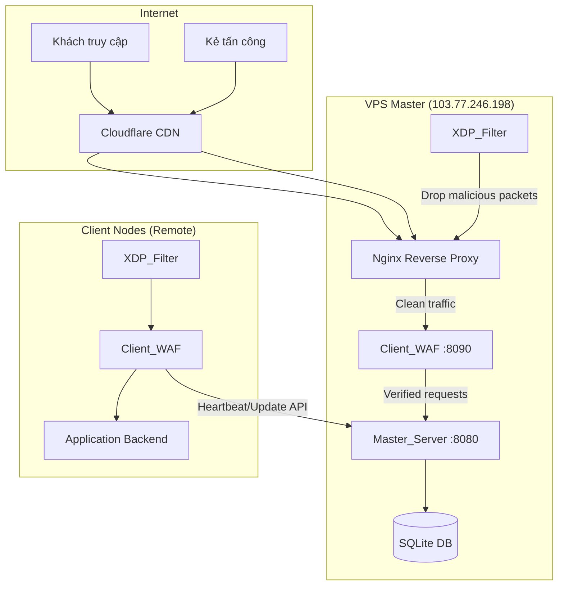
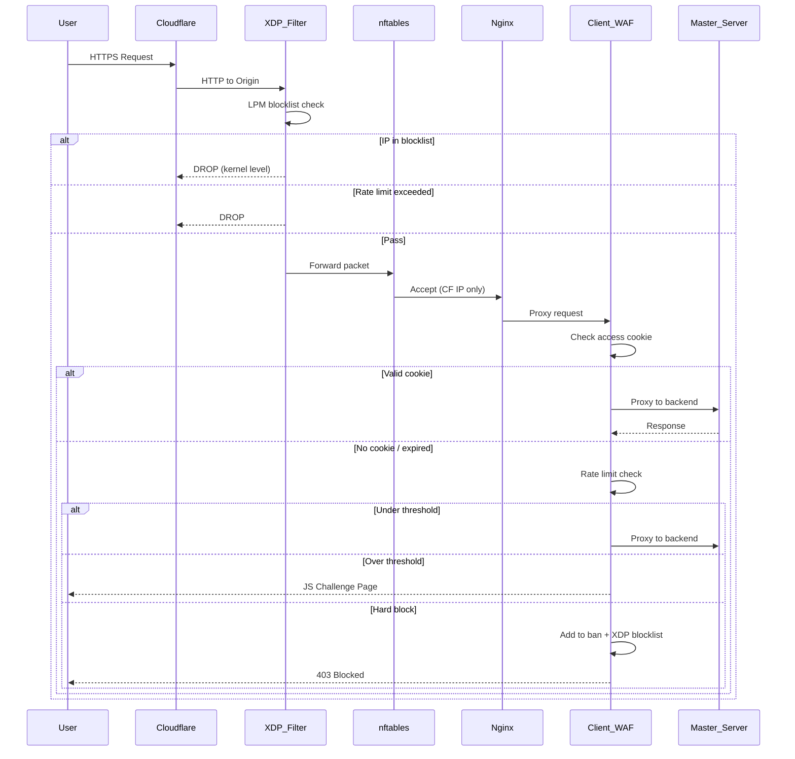
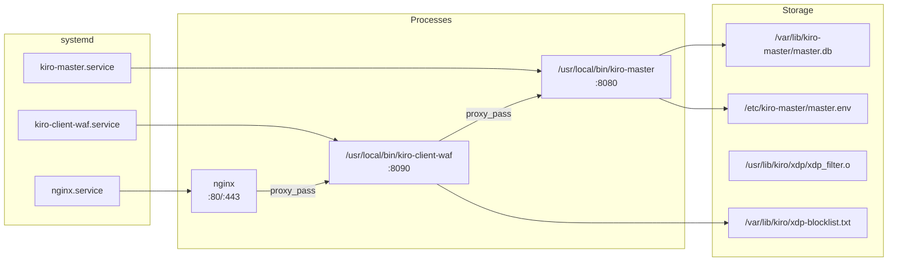
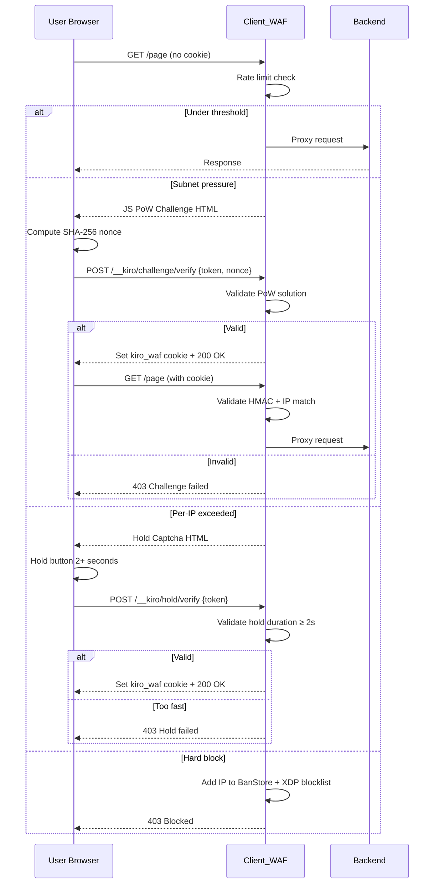
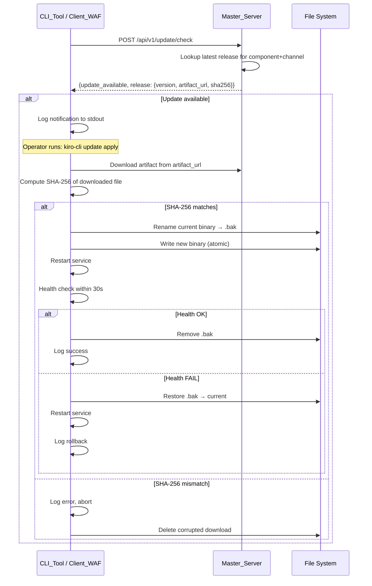
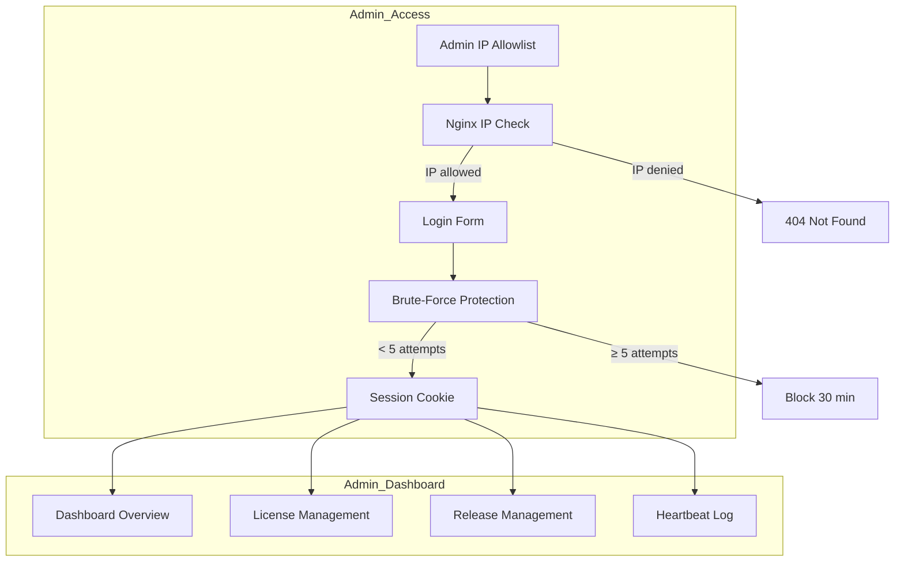
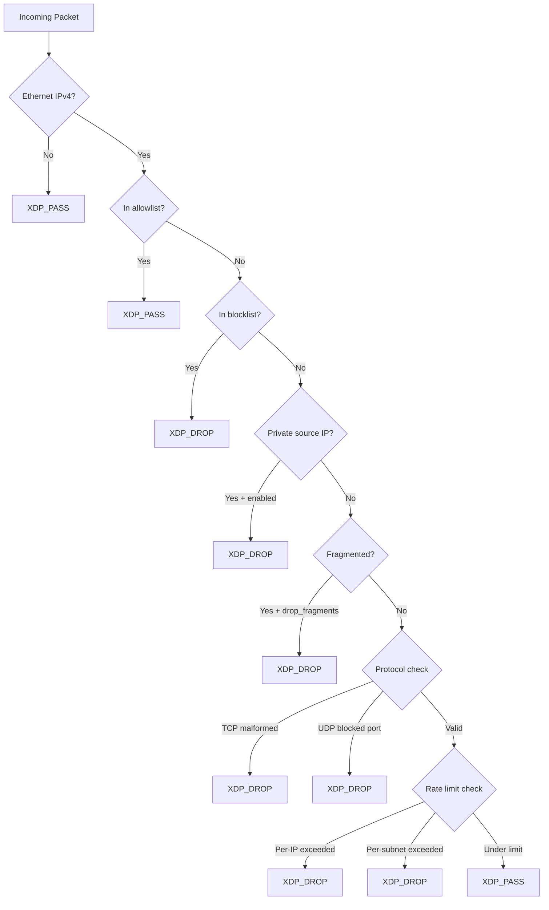
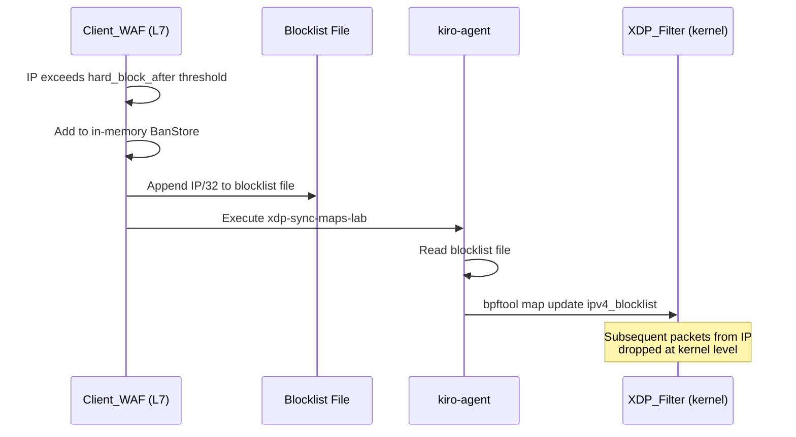

# Design Document: WAF System Overhaul

## Overview

Tài liệu thiết kế này mô tả kiến trúc kỹ thuật cho việc nâng cấp toàn diện hệ thống kiro_waf. Hệ thống bao gồm 4 thành phần chính:

1. **Master_Server** (`master-server/main.go`) — Máy chủ quản lý trung tâm chạy tại `firewall.vpsgen.com` (103.77.246.198), cung cấp: cơ sở dữ liệu license SQLite, bảng điều khiển admin, trang chủ công khai, API heartbeat/update, và phân phối bản cập nhật.

2. **Client_WAF** (`client-node/client_waf.go`) — Reverse proxy WAF phía client, xử lý: lọc lưu lượng L7, JS Proof-of-Work challenge, Hold-to-Confirm captcha, rate limiting per-IP/per-subnet, ban engine, và đồng bộ blocklist XDP.

3. **XDP_Filter** (`client-node/xdp_filter.c`) — Bộ lọc gói tin eBPF/XDP hoạt động tại kernel level, thực hiện: LPM trie blocklist lookup, per-IP/per-subnet rate limiting, malformed packet detection, và private source IP drop.

4. **CLI_Tool** (`kiro-cli`) — Công cụ dòng lệnh cho quản trị cục bộ, cập nhật binary, chẩn đoán, và giám sát trạng thái.

### Quyết Định Thiết Kế Chính

| Quyết định | Lý do |
|---|---|
| SQLite WAL mode cho Master_Server | Hỗ trợ concurrent reads, đơn giản triển khai single-binary, phù hợp quy mô VPS đơn |
| HMAC-SHA256 cookie binding IP | Ngăn cookie replay attack, zero-state server-side |
| XDP LPM trie cho blocklist | O(1) lookup tại kernel, line-rate drop không tốn CPU userspace |
| Atomic binary replace + rollback | Đảm bảo zero-downtime update, tự động phục hồi khi health check fail |
| Embedded HTML templates (no CDN) | Trang challenge/admin tải nhanh, không phụ thuộc bên ngoài, hoạt động khi mạng bị tấn công |

## Architecture

### Sơ Đồ Kiến Trúc Tổng Quan



### Luồng Xử Lý Request (Full Mode)



### Kiến Trúc Triển Khai Master VPS



## Components and Interfaces

### 1. Master_Server

**Trách nhiệm:**
- Quản lý license (CRUD, gia hạn, thu hồi, xoay key)
- Nhận heartbeat từ Client_WAF nodes
- Phân phối bản cập nhật (releases)
- Phục vụ trang chủ công khai
- Phục vụ bảng điều khiển admin (chỉ qua `/admin`)
- API endpoint cho heartbeat và update check

**Interfaces:**

```go
// HTTP API Endpoints
POST /api/v1/heartbeat          // Client heartbeat + license validation
POST /api/v1/update/check       // Client update check
GET  /healthz                   // Health check endpoint

// Admin API (protected by admin key + IP allowlist)
GET    /admin/                  // Dashboard overview
GET    /admin/licenses          // License list
POST   /admin/licenses          // Create license
PUT    /admin/licenses/:id      // Update license
DELETE /admin/licenses/:id      // Delete license
POST   /admin/licenses/:id/renew    // Renew license
POST   /admin/licenses/:id/rotate   // Rotate key
POST   /admin/licenses/:id/revoke   // Revoke license
GET    /admin/releases          // Release list
POST   /admin/releases          // Create release
DELETE /admin/releases/:id      // Delete release
GET    /admin/heartbeats        // Heartbeat log
POST   /admin/login             // Admin authentication

// Public
GET  /                          // Homepage
```

### 2. Client_WAF

**Trách nhiệm:**
- Reverse proxy lưu lượng đã xác minh đến backend
- JS Proof-of-Work challenge cho traffic đáng ngờ
- Hold-to-Confirm captcha cho traffic vượt ngưỡng
- Rate limiting per-IP và per-subnet
- Ban engine (L7 + XDP sync)
- Cookie-based access control (HMAC-SHA256, IP-bound)
- Heartbeat loop gửi trạng thái đến Master_Server
- Update check loop kiểm tra phiên bản mới

**Interfaces:**

```go
// HTTP Endpoints
GET  /__kiro/challenge          // Serve JS PoW challenge page
POST /__kiro/challenge/verify   // Verify PoW solution
GET  /__kiro/hold               // Serve hold captcha page
POST /__kiro/hold/verify        // Verify hold completion
GET  /healthz                   // Health check
ANY  /*                         // Proxy to backend (after verification)

// Internal APIs called
POST master_url/api/v1/heartbeat      // Send heartbeat
POST master_url/api/v1/update/check   // Check for updates
```

### 3. XDP_Filter

**Trách nhiệm:**
- Drop gói tin từ IP trong blocklist (LPM trie)
- Per-IP rate limiting (packets-per-second)
- Per-subnet /24 rate limiting
- Drop malformed packets (null flags, SYN+FIN, SYN+RST, Christmas tree)
- Drop private source IP (RFC 1918, loopback, link-local)
- Drop UDP từ source port bị chặn
- Drop IP fragments (configurable)
- Statistics per-CPU counters

**Interfaces (eBPF Maps):**

```c
// Input Maps
ipv4_allowlist    // LPM trie - IPs that always pass
ipv4_blocklist    // LPM trie - IPs to drop
kiro_config       // Array[1] - runtime configuration
udp_src_port_blocklist  // Hash - blocked UDP source ports

// State Maps
ipv4_rate_state   // LRU hash - per-IP/subnet rate counters

// Output Maps
kiro_stats        // Per-CPU array - drop/pass statistics
```

### 4. CLI_Tool

**Trách nhiệm:**
- Kiểm tra trạng thái hệ thống
- Thực hiện cập nhật binary
- Chẩn đoán và health report
- Quản lý license fingerprint
- Pilot report generation

**Interfaces:**

```
kiro-cli version                    // Print version
kiro-cli status --config <path>     // System status
kiro-cli health --config <path>     // Health report
kiro-cli preflight --config <path>  // Pre-deployment check
kiro-cli update check               // Check for updates (new)
kiro-cli update apply               // Download + verify + replace (new)
kiro-cli update rollback            // Rollback to previous (new)
```

### 5. Nginx Reverse Proxy

**Trách nhiệm:**
- TLS termination (khi không dùng Cloudflare Flexible)
- Cloudflare origin lock (chỉ accept traffic từ CF IPs)
- Admin path IP restriction
- Rate limiting bổ sung
- Static asset caching

**Cấu hình chính:**

```nginx
# Admin path - IP restricted
location /admin/ {
    include /etc/nginx/kiro-admin-allow.conf;
    proxy_pass http://127.0.0.1:8090/admin/;
}

# All other traffic through Client_WAF
location / {
    proxy_pass http://127.0.0.1:8090/;
}
```

## Data Models

### SQLite Schema (Master_Server)

```sql
-- License management
CREATE TABLE licenses (
    id INTEGER PRIMARY KEY AUTOINCREMENT,
    license_id TEXT UNIQUE NOT NULL,
    license_key TEXT UNIQUE NOT NULL,
    customer_id TEXT NOT NULL,
    customer_name TEXT DEFAULT '',
    client_ip TEXT DEFAULT '',
    fingerprint_hash TEXT DEFAULT '',
    plan TEXT NOT NULL DEFAULT 'community',
    status TEXT NOT NULL DEFAULT 'active',  -- active, suspended, revoked, expired
    valid_days INTEGER NOT NULL DEFAULT 365,
    created_at DATETIME DEFAULT CURRENT_TIMESTAMP,
    expires_at DATETIME NOT NULL,
    last_heartbeat_at DATETIME,
    notes TEXT DEFAULT ''
);

-- Release/update management
CREATE TABLE releases (
    id INTEGER PRIMARY KEY AUTOINCREMENT,
    component TEXT NOT NULL,          -- 'kiro-client-waf', 'kiro-master', 'xdp_filter'
    channel TEXT NOT NULL DEFAULT 'stable',  -- stable, security, beta
    version TEXT NOT NULL,
    artifact_url TEXT NOT NULL,
    sha256 TEXT NOT NULL,
    notes TEXT DEFAULT '',
    min_version TEXT DEFAULT '0.0.0',
    created_at DATETIME DEFAULT CURRENT_TIMESTAMP,
    UNIQUE(component, channel, version)
);

-- Heartbeat log
CREATE TABLE heartbeats (
    id INTEGER PRIMARY KEY AUTOINCREMENT,
    license_id TEXT NOT NULL,
    node_id TEXT NOT NULL,
    client_ip TEXT NOT NULL,
    fingerprint_hash TEXT DEFAULT '',
    stats_json TEXT DEFAULT '{}',
    created_at DATETIME DEFAULT CURRENT_TIMESTAMP
);

-- Admin login attempts (brute-force protection)
CREATE TABLE admin_login_attempts (
    id INTEGER PRIMARY KEY AUTOINCREMENT,
    ip TEXT NOT NULL,
    success INTEGER NOT NULL DEFAULT 0,
    attempted_at DATETIME DEFAULT CURRENT_TIMESTAMP
);

-- Admin sessions
CREATE TABLE admin_sessions (
    id INTEGER PRIMARY KEY AUTOINCREMENT,
    session_token TEXT UNIQUE NOT NULL,
    ip TEXT NOT NULL,
    created_at DATETIME DEFAULT CURRENT_TIMESTAMP,
    expires_at DATETIME NOT NULL
);

-- Indexes for performance
CREATE INDEX idx_licenses_key ON licenses(license_key);
CREATE INDEX idx_licenses_status ON licenses(status);
CREATE INDEX idx_heartbeats_license ON heartbeats(license_id);
CREATE INDEX idx_heartbeats_created ON heartbeats(created_at);
CREATE INDEX idx_releases_component_channel ON releases(component, channel);
CREATE INDEX idx_admin_attempts_ip ON admin_login_attempts(ip, attempted_at);
CREATE INDEX idx_admin_sessions_token ON admin_sessions(session_token);
```

### Cấu Hình SQLite

```sql
PRAGMA journal_mode = WAL;
PRAGMA busy_timeout = 5000;
PRAGMA synchronous = NORMAL;
PRAGMA foreign_keys = ON;
PRAGMA cache_size = -8000;  -- 8MB cache
```

### Data Models (Go Structs)

```go
// Master_Server models
type License struct {
    ID              int64     `json:"id"`
    LicenseID       string    `json:"license_id"`
    LicenseKey      string    `json:"license_key"`
    CustomerID      string    `json:"customer_id"`
    CustomerName    string    `json:"customer_name"`
    ClientIP        string    `json:"client_ip"`
    FingerprintHash string    `json:"fingerprint_hash"`
    Plan            string    `json:"plan"`
    Status          string    `json:"status"`
    ValidDays       int       `json:"valid_days"`
    CreatedAt       time.Time `json:"created_at"`
    ExpiresAt       time.Time `json:"expires_at"`
    LastHeartbeat   time.Time `json:"last_heartbeat_at"`
    Notes           string    `json:"notes"`
}

type Release struct {
    ID          int64     `json:"id"`
    Component   string    `json:"component"`
    Channel     string    `json:"channel"`
    Version     string    `json:"version"`
    ArtifactURL string    `json:"artifact_url"`
    SHA256      string    `json:"sha256"`
    Notes       string    `json:"notes"`
    MinVersion  string    `json:"min_version"`
    CreatedAt   time.Time `json:"created_at"`
}

type Heartbeat struct {
    ID              int64          `json:"id"`
    LicenseID       string         `json:"license_id"`
    NodeID          string         `json:"node_id"`
    ClientIP        string         `json:"client_ip"`
    FingerprintHash string         `json:"fingerprint_hash"`
    Stats           map[string]any `json:"stats"`
    CreatedAt       time.Time      `json:"created_at"`
}

// Client_WAF models
type Challenge struct {
    ClientIP   string    `json:"client_ip"`
    Salt       string    `json:"salt"`
    Difficulty int       `json:"difficulty"`
    IssuedAt   time.Time `json:"issued_at"`
    ExpiresAt  time.Time `json:"expires_at"`
    Type       string    `json:"type"`  // "pow" or "hold"
}

type BanEntry struct {
    IP        string    `json:"ip"`
    ExpiresAt time.Time `json:"expires_at"`
    Reason    string    `json:"reason"`
}

// XDP_Filter config
type XDPConfig struct {
    WindowNS            uint64 `json:"window_ns"`
    PerIPPPS            uint32 `json:"per_ip_pps"`
    SynPerIPPerSecond   uint32 `json:"syn_per_ip_per_second"`
    UDPPerIPPerSecond   uint32 `json:"udp_per_ip_per_second"`
    ICMPPerIPPerSecond  uint32 `json:"icmp_per_ip_per_second"`
    DropPrivateSourceIP uint8  `json:"drop_private_source_ip"`
    DropMalformed       uint8  `json:"drop_malformed"`
    RateLimitEnabled    uint8  `json:"rate_limit_enabled"`
    DropFragments       uint8  `json:"drop_fragments"`
    PerSubnet24PPS      uint32 `json:"per_subnet24_pps"`
}
```

### Luồng Challenge Page



### Luồng Cập Nhật (Update Flow)



### Admin Panel Architecture



### XDP/Ban Detection Logic



### L7 → XDP Sync Flow




## Correctness Properties

*Một property là một đặc tính hoặc hành vi phải đúng trên tất cả các lần thực thi hợp lệ của hệ thống — về cơ bản là một phát biểu hình thức về những gì hệ thống phải làm. Properties đóng vai trò cầu nối giữa đặc tả dễ đọc cho con người và đảm bảo tính đúng đắn có thể kiểm chứng bằng máy.*

### Property 1: PoW Verification Correctness

*For any* valid token, salt, và nonce sao cho SHA-256(token + ":" + salt + ":" + nonce) bắt đầu bằng đúng `difficulty` ký tự "0", hàm `validPoW` SHALL trả về true. Ngược lại, *for any* nonce mà hash không thỏa mãn điều kiện prefix, hàm SHALL trả về false.

**Validates: Requirements 1.1**

### Property 2: Hold Time Validation

*For any* challenge với `IssuedAt` timestamp và thời điểm xác minh `verifyAt`, hàm hold verification SHALL chấp nhận khi `verifyAt - IssuedAt >= holdSeconds` (2 giây) và SHALL từ chối khi `verifyAt - IssuedAt < holdSeconds`.

**Validates: Requirements 1.2**

### Property 3: Cookie HMAC Round-Trip và IP Binding

*For any* IP address và cookie secret, việc tạo access cookie rồi xác thực với cùng IP SHALL thành công. *For any* IP_A ≠ IP_B, cookie được tạo cho IP_A SHALL bị từ chối khi xác thực với IP_B. *For any* cookie có expiration timestamp đã qua, xác thực SHALL thất bại bất kể IP có khớp hay không.

**Validates: Requirements 1.3, 7.1, 7.5**

### Property 4: Challenge Page No External Dependencies

*For any* challenge page HTML được sinh ra (cả JS PoW và Hold captcha), nội dung HTML SHALL không chứa bất kỳ URL nào trỏ đến domain bên ngoài (không có `http://` hoặc `https://` references đến host khác ngoài endpoint xác minh nội bộ `/__kiro/`).

**Validates: Requirements 2.4**

### Property 5: Homepage No Admin/API Exposure

*For any* homepage HTML được sinh ra, nội dung SHALL không chứa chuỗi `/admin`, `/api/`, hoặc bất kỳ tham chiếu nào đến endpoint quản trị hoặc API nội bộ.

**Validates: Requirements 3.1, 8.1**

### Property 6: Admin Brute-Force Protection

*For any* IP address và chuỗi N lần đăng nhập thất bại liên tiếp trong cửa sổ 10 phút, khi N > 5 thì tất cả các lần đăng nhập tiếp theo từ IP đó SHALL bị từ chối trong 30 phút. Khi N ≤ 5, đăng nhập với key đúng SHALL được chấp nhận.

**Validates: Requirements 3.4**

### Property 7: Admin IP Access Control

*For any* IP address không nằm trong danh sách admin allowlist, yêu cầu đến đường dẫn `/admin/` SHALL trả về HTTP 404. *For any* IP trong allowlist, yêu cầu SHALL trả về form đăng nhập (200) hoặc dashboard (nếu có session hợp lệ).

**Validates: Requirements 3.2**

### Property 8: SHA-256 Update Verification

*For any* byte array (artifact content), việc tính SHA-256 hash rồi so sánh với giá trị expected SHALL chấp nhận khi hash khớp chính xác và SHALL từ chối khi có bất kỳ sự khác biệt nào (kể cả 1 bit).

**Validates: Requirements 5.3, 5.4**

### Property 9: XDP Blocklist Drop

*For any* IPv4 address nằm trong LPM trie blocklist (khớp prefix), hàm XDP filter SHALL trả về XDP_DROP. *For any* IPv4 address nằm trong allowlist, hàm SHALL trả về XDP_PASS bất kể blocklist.

**Validates: Requirements 6.1**

### Property 10: XDP Per-IP Rate Limiting

*For any* IPv4 address và cấu hình `per_ip_pps` threshold, sau khi gửi đúng `per_ip_pps` packets trong một cửa sổ thời gian, gói tin thứ `per_ip_pps + 1` SHALL bị drop. Các gói tin từ IP khác SHALL không bị ảnh hưởng.

**Validates: Requirements 6.2**

### Property 11: XDP Per-Subnet Rate Limiting Independence

*For any* subnet /24 và cấu hình `per_subnet24_pps` threshold, khi tổng packets từ tất cả IP trong subnet vượt threshold, tất cả gói tin tiếp theo từ subnet đó SHALL bị drop — ngay cả khi mỗi IP riêng lẻ nằm dưới ngưỡng per-IP.

**Validates: Requirements 6.3, 7.4**

### Property 12: XDP Malformed Packet Detection

*For any* TCP packet có flag combination thuộc tập {null flags, SYN+FIN, SYN+RST, FIN+PSH+URG (Christmas tree)}, hoặc *for any* IP packet có `total_length < ip_header_length`, hoặc *for any* UDP packet có `udp_length < 8` hoặc `udp_length > ip_payload_length`, hàm XDP filter SHALL trả về XDP_DROP khi `drop_malformed` được bật.

**Validates: Requirements 6.4**

### Property 13: L7 Ban to XDP Sync

*For any* IP address vượt ngưỡng `hard_block_after` requests trong một phút, IP đó SHALL xuất hiện trong cả L7 BanStore (in-memory) và file blocklist XDP sau khi ban được thực thi.

**Validates: Requirements 6.5**

### Property 14: Automation User-Agent Detection

*For any* User-Agent string chứa các pattern đã biết (chuỗi rỗng, "curl/", "python-requests", "sqlmap", "httpclient", "libwww-perl"), hàm `automationUserAgent` SHALL trả về true. *For any* User-Agent string chứa browser identifier hợp lệ (Mozilla/5.0 với Chrome/Firefox/Safari/Edge), hàm SHALL trả về false.

**Validates: Requirements 6.6**

### Property 15: Private Source IP Detection

*For any* IPv4 address thuộc dải RFC 1918 (10.0.0.0/8, 172.16.0.0/12, 192.168.0.0/16), loopback (127.0.0.0/8), hoặc link-local (169.254.0.0/16), hàm `private_source_v4` SHALL trả về 1. *For any* IPv4 address thuộc dải public routable, hàm SHALL trả về 0.

**Validates: Requirements 7.3**

### Property 16: Heartbeat Failure Lockdown

*For any* chuỗi heartbeat responses, khi có N lần thất bại liên tiếp (N ≥ 1 trong implementation hiện tại, hoặc N ≥ 3 theo requirement mới), Client_WAF SHALL chuyển sang trạng thái locked. Khi heartbeat thành công tiếp theo xảy ra, trạng thái SHALL chuyển về unlocked.

**Validates: Requirements 9.2**

## Error Handling

### Client_WAF Error Handling

| Tình huống | Hành vi | Recovery |
|---|---|---|
| Backend không khả dụng | Trả về 502 với trang lỗi có thương hiệu | Tự động retry qua reverse proxy |
| Heartbeat thất bại liên tiếp | Vào chế độ khóa, chặn tất cả traffic | Tự động unlock khi heartbeat thành công |
| Blocklist file không ghi được | Log lỗi, tiếp tục với L7 enforcement | Không crash, graceful degradation |
| Cookie secret rỗng | Từ chối khởi động (fatal) | Operator phải cấu hình secret |
| License key rỗng | Từ chối khởi động (fatal) | Operator phải cấu hình license |
| XDP sync command thất bại | Log lỗi, L7 ban vẫn hoạt động | Retry ở lần ban tiếp theo |
| JSON decode lỗi từ client | Trả về 400 Bad Request | Client retry |
| Challenge token không hợp lệ | Trả về 403 Forbidden | Client phải request challenge mới |

### Master_Server Error Handling

| Tình huống | Hành vi | Recovery |
|---|---|---|
| SQLite busy (concurrent writes) | Retry với busy_timeout 5000ms | WAL mode giảm thiểu contention |
| Database file corrupted | Log fatal, exit | Restore từ backup |
| Admin key brute-force | Block IP 30 phút sau 5 lần sai | Tự động unblock sau timeout |
| Invalid heartbeat payload | Trả về 400, không update DB | Client sẽ retry ở interval tiếp theo |
| Disk full | Log error, reject writes | Alert operator |
| Invalid license key trong heartbeat | Trả về 200 với `valid: false, lock: true` | Client vào lockdown mode |

### XDP_Filter Error Handling

| Tình huống | Hành vi | Recovery |
|---|---|---|
| Packet quá ngắn (bounds check fail) | XDP_DROP (malformed) | N/A - kernel level |
| Config map không load được | Bypass tất cả checks, XDP_PASS | Operator phải sync maps |
| Rate state map đầy (LRU) | Evict entry cũ nhất, tạo mới | Tự động qua LRU policy |
| Allowlist/blocklist map đầy | Không thể thêm entry mới | Operator tăng max_entries |

### Update System Error Handling

| Tình huống | Hành vi | Recovery |
|---|---|---|
| Download timeout | Log lỗi, giữ binary hiện tại | Retry ở interval tiếp theo |
| SHA-256 mismatch | Abort, xóa file tải về, log lỗi | Giữ binary hiện tại |
| Binary replace thất bại | Log lỗi, giữ binary hiện tại | Operator can thiệp |
| Health check thất bại sau update | Rollback về .bak, restart service | Tự động phục hồi |
| Rollback thất bại | Log fatal, alert operator | Manual intervention |

## Testing Strategy

### Phương Pháp Testing Kép

Hệ thống sử dụng kết hợp **unit tests** (ví dụ cụ thể, edge cases) và **property-based tests** (kiểm chứng tính đúng đắn phổ quát) để đạt coverage toàn diện.

### Property-Based Testing

**Library:** [rapid](https://github.com/flyingmutant/rapid) (Go property-based testing library)

**Cấu hình:**
- Minimum 100 iterations per property test
- Mỗi property test PHẢI reference design document property
- Tag format: `// Feature: waf-system-overhaul, Property N: <property_text>`

**Properties cần implement:**

| Property | Component | Pattern |
|---|---|---|
| P1: PoW Verification | Client_WAF | Round-trip (compute → verify) |
| P2: Hold Time Validation | Client_WAF | Invariant (time threshold) |
| P3: Cookie HMAC Round-Trip | Client_WAF | Round-trip + Error condition |
| P4: No External Dependencies | Client_WAF | Invariant (HTML content) |
| P5: No Admin Exposure | Master_Server | Invariant (HTML content) |
| P6: Brute-Force Protection | Master_Server | Metamorphic (threshold behavior) |
| P7: Admin IP Access Control | Master_Server | Invariant (access control) |
| P8: SHA-256 Verification | Update_System | Round-trip (hash → compare) |
| P9: XDP Blocklist Drop | XDP_Filter | Invariant (lookup result) |
| P10: Per-IP Rate Limiting | XDP_Filter | Metamorphic (threshold) |
| P11: Per-Subnet Rate Limiting | XDP_Filter | Metamorphic (threshold + independence) |
| P12: Malformed Packet Detection | XDP_Filter | Error condition |
| P13: L7→XDP Ban Sync | Client_WAF | Invariant (dual-store consistency) |
| P14: Automation UA Detection | Client_WAF | Invariant (classification) |
| P15: Private Source IP | XDP_Filter | Invariant (classification) |
| P16: Heartbeat Lockdown | Client_WAF | State machine (transitions) |

### Unit Tests (Example-Based)

| Area | Test Cases |
|---|---|
| Admin login | Valid key → session created; Invalid key → rejected; Cookie attributes correct |
| Challenge page HTML | Contains noscript fallback; Vietnamese status text present |
| Homepage | No JS with internal references; Loads without external deps |
| Backend unavailable | Returns branded 502 page |
| Blocklist file unwritable | Logs error, continues L7 operation |
| Heartbeat logging | Lock event includes reason + timestamp |
| Nginx config | CF IP ranges present; deny all directive |
| Flash messages | Success/failure operations show appropriate messages |

### Integration Tests

| Area | Test Cases |
|---|---|
| License CRUD | Create, read, update, renew, rotate, revoke, delete |
| Release management | Create release, delete release |
| Heartbeat flow | Client → Master → DB → Response |
| Update flow | Check → Download → Verify → Replace → Health |
| Deployment script | Full deploy on Ubuntu 22.04 VM |
| Concurrent DB access | Multiple goroutines writing simultaneously |
| XDP build | Compile with -Wall -Werror, exit 0 |
| Cross-browser | Challenge pages on Chrome, Firefox, Safari, Edge |

### Smoke Tests

| Area | Verification |
|---|---|
| Master_Server binary | Starts, responds to /healthz |
| Client_WAF binary | Starts, responds to /healthz |
| XDP compilation | clang -Wall -Werror succeeds |
| systemd services | Enable, start, status active |

### Test Organization

```
tests/
├── property/
│   ├── pow_test.go           // P1
│   ├── hold_time_test.go     // P2
│   ├── cookie_hmac_test.go   // P3
│   ├── challenge_html_test.go // P4
│   ├── homepage_test.go      // P5
│   ├── brute_force_test.go   // P6
│   ├── admin_access_test.go  // P7
│   ├── sha256_verify_test.go // P8
│   ├── xdp_blocklist_test.go // P9
│   ├── xdp_rate_ip_test.go   // P10
│   ├── xdp_rate_subnet_test.go // P11
│   ├── xdp_malformed_test.go // P12
│   ├── ban_sync_test.go      // P13
│   ├── ua_detection_test.go  // P14
│   ├── private_ip_test.go    // P15
│   └── lockdown_test.go      // P16
├── unit/
│   ├── admin_login_test.go
│   ├── challenge_render_test.go
│   ├── homepage_render_test.go
│   ├── error_pages_test.go
│   └── flash_messages_test.go
├── integration/
│   ├── license_crud_test.go
│   ├── release_crud_test.go
│   ├── heartbeat_flow_test.go
│   ├── update_flow_test.go
│   └── concurrent_db_test.go
└── smoke/
    ├── binary_start_test.go
    └── xdp_build_test.go
```
