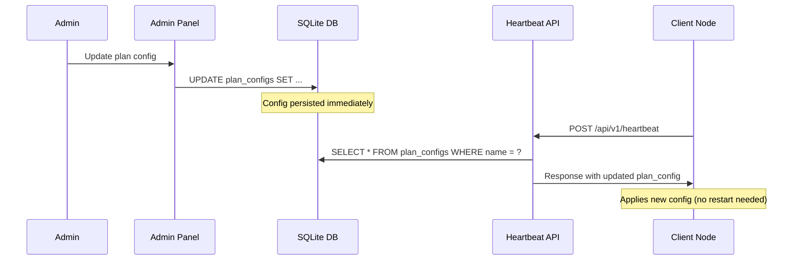

# Design: WAF UI & Experience Overhaul (Đợt 2)

## Overview

Thiết kế cải tiến toàn diện giao diện, trải nghiệm người dùng, và tính năng quản lý cho Kiro WAF. Bao gồm 6 module chính:

1. **Homepage tiếng Việt có dấu** — Cập nhật toàn bộ text trên homepage sang tiếng Việt Unicode đầy đủ dấu
2. **Admin cấu hình gói dịch vụ động** — Chuyển plan_configs từ hardcode sang database, quản lý qua admin panel
3. **Cải tiến Challenge Pages** — Thêm progress bar, cấu hình challenge mode per-plan
4. **CLI output hiện đại có màu** — ANSI colors, box drawing, progress bars, NO_COLOR fallback, --json flag
5. **Tăng cường chống crack license** — IP validation, request count audit, mandatory heartbeat fields
6. **Thời hạn linh hoạt** — Validation valid_days [1-3650], relative time display

### Design Decisions

- **Database-driven plan configs**: Chuyển từ `var PlanConfigs map[string]PlanConfig` hardcode sang bảng `plan_configs` trong SQLite. Heartbeat handler đọc trực tiếp từ DB thay vì map in-memory. Trade-off: thêm 1 DB query per heartbeat nhưng cho phép thay đổi config runtime mà không cần restart.
- **CLI color library**: Sử dụng ANSI escape codes trực tiếp (không thêm dependency) vì Go stdlib đủ mạnh và project hiện tại không dùng third-party CLI libraries. Tạo package `internal/shared/termcolor` để quản lý.
- **Challenge mode per-plan**: Thêm field `challenge_mode` vào PlanConfig thay vì global config, cho phép mỗi gói có challenge strategy riêng.
- **IP mismatch validation**: Thêm vào heartbeat handler hiện tại thay vì middleware riêng, giữ logic tập trung.

## Architecture

```mermaid
graph TB
    subgraph "Master Server"
        HP[Homepage Handler] --> DB[(SQLite DB)]
        AH[Admin Handlers] --> DB
        API[Heartbeat API] --> DB
        DB --> PC[plan_configs table]
        DB --> LIC[licenses table]
    end

    subgraph "Admin Panel"
        AP[/admin/plans] --> AH
        AL[/admin/licenses] --> AH
    end

    subgraph "Client Node"
        CW[Client WAF] --> API
        CH[Challenge Handler] --> POW[PoW Page]
        CH --> HOLD[Hold Page]
    end

    subgraph "CLI"
        CLI[kiro-cli] --> TC[termcolor pkg]
        CLI --> FMT[formatters pkg]
        TC --> ANSI[ANSI Output]
        TC --> PLAIN[Plain Output]
        FMT --> JSON[JSON Output]
    end

    API -->|plan_config in response| CW
    CW -->|challenge_mode| CH
```

### Data Flow: Plan Config Update



## Components and Interfaces

### 1. Plan Config Database Layer

**New file**: `master-server/db/plan_configs.go`

```go
// PlanConfigDB represents a plan configuration stored in the database.
type PlanConfigDB struct {
    ID            int64   `json:"id"`
    Name          string  `json:"name"`           // "community", "pro", "enterprise"
    DisplayName   string  `json:"display_name"`   // "Community", "Pro", "Enterprise"
    PriceUSD      float64 `json:"price_usd"`      // Monthly price in USD
    PriceVND      int64   `json:"price_vnd"`      // Monthly price in VND
    RPMPerIP      int     `json:"rpm_per_ip"`
    SubnetRPM     int     `json:"subnet_rpm"`
    MaxDomains    int     `json:"max_domains"`
    XDPEnabled    bool    `json:"xdp_enabled"`
    OTAEnabled    bool    `json:"ota_enabled"`
    DefaultDays   int     `json:"default_days"`
    ChallengeMode string  `json:"challenge_mode"` // "pow", "hold", "both"
    Description   string  `json:"description"`
    CreatedAt     time.Time `json:"created_at"`
    UpdatedAt     time.Time `json:"updated_at"`
}

// Interface methods on DB:
func (d *DB) ListPlanConfigs() ([]PlanConfigDB, error)
func (d *DB) GetPlanConfig(name string) (*PlanConfigDB, error)
func (d *DB) UpsertPlanConfig(pc *PlanConfigDB) error
func (d *DB) SeedDefaultPlanConfigs() error
```

### 2. Admin Plan Config Handlers

**New file**: `master-server/handlers/admin_plans.go`

```go
// GET /admin/plans — List all plan configs
func handleAdminPlans(database *db.DB) http.HandlerFunc

// GET /admin/plans/{name} — Edit form for a plan
func handleAdminPlanEdit(database *db.DB) http.HandlerFunc

// POST /admin/plans/{name} — Update plan config
func handleAdminPlanUpdate(database *db.DB) http.HandlerFunc
```

### 3. Heartbeat API Enhancement

**Modified file**: `master-server/handlers/api.go`

```go
// Updated planConfigResponse to include challenge_mode
type planConfigResponse struct {
    RPMPerIP      int    `json:"rpm_per_ip"`
    SubnetRPM     int    `json:"subnet_rpm"`
    MaxDomains    int    `json:"max_domains"`
    XDPEnabled    bool   `json:"xdp_enabled"`
    OTAEnabled    bool   `json:"ota_enabled"`
    ChallengeMode string `json:"challenge_mode"`
}

// New validation in HandleHeartbeat:
// 1. IP mismatch check (license.ClientIP vs request IP)
// 2. Request count audit (stats.request_count vs plan RPM limit)
// 3. Read plan_config from DB instead of hardcoded map
```

### 4. CLI Terminal Color Package

**New package**: `internal/shared/termcolor`

```go
package termcolor

// Writer wraps an io.Writer with color support detection.
type Writer struct {
    out       io.Writer
    colorMode ColorMode // Auto, Always, Never
}

type ColorMode int
const (
    ColorAuto ColorMode = iota
    ColorAlways
    ColorNever
)

// Color constants
const (
    Reset   = "\x1b[0m"
    Teal    = "\x1b[36m"
    Green   = "\x1b[32m"
    Red     = "\x1b[31m"
    Yellow  = "\x1b[33m"
    Bold    = "\x1b[1m"
    Dim     = "\x1b[2m"
)

func New(out io.Writer) *Writer
func (w *Writer) IsColorEnabled() bool
func (w *Writer) Color(color, text string) string
func (w *Writer) Box(title string, rows [][]string) string
func (w *Writer) ProgressBar(percent float64, width int) string
```

### 5. CLI Formatters

**New package**: `internal/shared/clifmt`

```go
package clifmt

type OutputMode int
const (
    OutputText OutputMode = iota
    OutputJSON
)

// FormatVersion formats the version output with product name in teal.
func FormatVersion(version string, mode OutputMode, color *termcolor.Writer) string

// FormatStatus formats status table with colored states.
func FormatStatus(status diagnostics.StatusReport, mode OutputMode, color *termcolor.Writer) string

// FormatReport formats system report with progress bars.
func FormatReport(report diagnostics.SystemReport, mode OutputMode, color *termcolor.Writer) string

// FormatUpdateCheck formats update check result.
func FormatUpdateCheck(result update.CheckResult, mode OutputMode, color *termcolor.Writer) string
```

### 6. Heartbeat Request Validation

**Modified**: `master-server/handlers/api.go`

```go
// Enhanced heartbeatRequest with mandatory fields
type heartbeatRequest struct {
    LicenseKey      string         `json:"license_key"`
    NodeID          string         `json:"node_id"`
    FingerprintHash string         `json:"fingerprint_hash"` // Now mandatory
    BinaryHash      string         `json:"binary_hash"`      // New: SHA-256 of client binary
    Stats           map[string]any `json:"stats"`            // Must include request_count
}

// validateHeartbeatRequest checks all mandatory fields are present.
func validateHeartbeatRequest(req *heartbeatRequest) error

// auditRequestCount checks if reported request count exceeds plan limit.
func auditRequestCount(stats map[string]any, planConfig *PlanConfigDB, licenseID string)
```

### 7. License Expiry Formatter

**New function in**: `master-server/templates/admin/helpers.go`

```go
// FormatRelativeExpiry returns "còn X ngày" or "hết hạn Y ngày trước"
func FormatRelativeExpiry(expiresAt time.Time, now time.Time) string
```

### 8. Valid Days Validator

**New function in**: `master-server/handlers/admin.go`

```go
// ValidateValidDays checks that days is in [1, 3650].
func ValidateValidDays(days int) error
```

## Data Models

### plan_configs Table (New)

```sql
CREATE TABLE IF NOT EXISTS plan_configs (
    id INTEGER PRIMARY KEY AUTOINCREMENT,
    name TEXT NOT NULL UNIQUE,
    display_name TEXT NOT NULL,
    price_usd REAL NOT NULL DEFAULT 0,
    price_vnd INTEGER NOT NULL DEFAULT 0,
    rpm_per_ip INTEGER NOT NULL DEFAULT 60,
    subnet_rpm INTEGER NOT NULL DEFAULT 600,
    max_domains INTEGER NOT NULL DEFAULT 1,
    xdp_enabled INTEGER NOT NULL DEFAULT 0,
    ota_enabled INTEGER NOT NULL DEFAULT 0,
    default_days INTEGER NOT NULL DEFAULT 30,
    challenge_mode TEXT NOT NULL DEFAULT 'pow',
    description TEXT NOT NULL DEFAULT '',
    created_at TEXT NOT NULL DEFAULT (datetime('now')),
    updated_at TEXT NOT NULL DEFAULT (datetime('now'))
);
```

### Seed Data

```sql
INSERT INTO plan_configs (name, display_name, price_usd, price_vnd, rpm_per_ip, subnet_rpm, max_domains, xdp_enabled, ota_enabled, default_days, challenge_mode, description)
VALUES
('community', 'Community', 0, 0, 60, 600, 1, 0, 0, 30, 'pow', 'Dành cho cá nhân, dự án nhỏ'),
('pro', 'Pro', 29, 700000, 120, 1800, 5, 1, 1, 365, 'pow', 'Dành cho doanh nghiệp vừa và nhỏ'),
('enterprise', 'Enterprise', 99, 2400000, 0, 0, 0, 1, 1, 3650, 'both', 'Dành cho tổ chức lớn, hosting provider');
```

### Updated PlanConfig Model

```go
type PlanConfig struct {
    Name          string  `json:"name"`
    DisplayName   string  `json:"display_name"`
    PriceUSD      float64 `json:"price_usd"`
    PriceVND      int64   `json:"price_vnd"`
    RPMPerIP      int     `json:"rpm_per_ip"`
    SubnetRPM     int     `json:"subnet_rpm"`
    MaxDomains    int     `json:"max_domains"`
    XDPEnabled    bool    `json:"xdp_enabled"`
    OTAEnabled    bool    `json:"ota_enabled"`
    DefaultDays   int     `json:"default_days"`
    ChallengeMode string  `json:"challenge_mode"`
    Description   string  `json:"description"`
}
```

### Heartbeat Response (Updated)

```go
type heartbeatResponse struct {
    Valid      bool                `json:"valid"`
    Lock       bool               `json:"lock"`
    Status     string             `json:"status,omitempty"`
    ExpiresAt  string             `json:"expires_at,omitempty"`
    PlanConfig *planConfigResponse `json:"plan_config,omitempty"`
    Reason     string             `json:"reason,omitempty"`
}

type planConfigResponse struct {
    RPMPerIP      int    `json:"rpm_per_ip"`
    SubnetRPM     int    `json:"subnet_rpm"`
    MaxDomains    int    `json:"max_domains"`
    XDPEnabled    bool   `json:"xdp_enabled"`
    OTAEnabled    bool   `json:"ota_enabled"`
    ChallengeMode string `json:"challenge_mode"`
}
```

## Correctness Properties

*A property is a characteristic or behavior that should hold true across all valid executions of a system — essentially, a formal statement about what the system should do. Properties serve as the bridge between human-readable specifications and machine-verifiable correctness guarantees.*

### Property 1: PlanConfig Persistence Round-Trip

*For any* valid PlanConfig with all fields populated (name, display_name, price_usd, price_vnd, rpm_per_ip, subnet_rpm, max_domains, xdp_enabled, ota_enabled, default_days, challenge_mode, description), saving it to the database and reading it back by name should produce an equivalent PlanConfig with all fields preserved.

**Validates: Requirements 2.2, 2.3, 3.5**

### Property 2: Heartbeat Returns Updated Plan Config

*For any* valid PlanConfig stored in the database and any active license assigned to that plan, the heartbeat response should contain plan_config values matching the current database values (rpm_per_ip, subnet_rpm, max_domains, xdp_enabled, ota_enabled, challenge_mode).

**Validates: Requirements 2.4**

### Property 3: ValidHold Duration Validation

*For any* holdSeconds value in [2, 5] and any elapsed duration, ValidHold(issuedAt, verifyAt, holdSeconds) should return true if and only if verifyAt - issuedAt >= holdSeconds seconds.

**Validates: Requirements 3.1**

### Property 4: CLI Formatter Color Correctness

*For any* status entry with state in {ok, error, warning} and color enabled, the formatted output should contain the corresponding ANSI color code (green for ok, red for error, yellow for warning) and box drawing characters for table borders.

**Validates: Requirements 4.1, 4.2, 4.3, 4.4**

### Property 5: NO_COLOR Disables ANSI Escape Sequences

*For any* CLI output content, when the NO_COLOR environment variable is set or color mode is Never, the output string must not contain any ANSI escape sequence (the byte sequence \x1b[).

**Validates: Requirements 4.5**

### Property 6: JSON Output Mode Produces Valid JSON

*For any* CLI command data (version, status, report, update check), when output mode is JSON, the output must be valid parseable JSON that deserializes without error.

**Validates: Requirements 4.6**

### Property 7: Request Count Over-Limit Warning

*For any* heartbeat stats containing a request_count value and any plan config with a non-zero rpm_per_ip limit, the audit function should produce a warning log entry if and only if request_count exceeds the plan's rpm_per_ip limit.

**Validates: Requirements 5.4**

### Property 8: IP Mismatch Rejection

*For any* license with a non-empty client_ip field and any heartbeat request originating from a different IP address, the heartbeat handler should respond with valid=false, lock=true, and reason="ip_mismatch".

**Validates: Requirements 5.5**

### Property 9: Heartbeat Request Field Validation

*For any* heartbeat request missing one or more of the mandatory fields (license_key, node_id, fingerprint_hash), the server should reject the request with an error response.

**Validates: Requirements 5.6**

### Property 10: Valid Days Range Validation

*For any* integer value provided as valid_days during license creation, the system should accept it if and only if it falls within the range [1, 3650].

**Validates: Requirements 6.1**

### Property 11: License Expiry Relative Time Formatting

*For any* license expiry date and current time, the formatter should produce "còn X ngày" when expiresAt is in the future (where X = days until expiry) or "hết hạn Y ngày trước" when expiresAt is in the past (where Y = days since expiry).

**Validates: Requirements 6.2**

## Error Handling

### Database Errors
- Plan config DB queries fail → heartbeat returns 500 Internal Server Error (same pattern as existing license lookup)
- Admin plan update fails → redirect with flash error message (existing pattern)
- Migration/seed fails on startup → log fatal and exit (prevents serving stale hardcoded data)

### Heartbeat Validation Errors
- Missing mandatory fields → 400 Bad Request with `{"error": "invalid payload"}`
- IP mismatch → 200 OK with `{"valid": false, "lock": true, "reason": "ip_mismatch"}`
- Request count over-limit → log warning only (don't lock client, just audit)

### CLI Errors
- Terminal detection fails → default to NO_COLOR mode (safe fallback)
- JSON marshaling fails → write error to stderr, exit 1
- Config file not found → existing error handling preserved

### Challenge Page Errors
- Invalid challenge mode in plan_config → default to "pow" (safe fallback)
- Hold duration outside [2,5] → clamp to nearest valid value

## Testing Strategy

### Property-Based Tests (using `testing/quick` or `pgregory.net/rapid`)

The project uses Go's standard testing. For property-based testing, we'll use `pgregory.net/rapid` which provides excellent Go PBT support with shrinking.

**Configuration**: Minimum 100 iterations per property test.

Each property test must be tagged with a comment referencing the design property:
```go
// Feature: waf-ui-performance-overhaul, Property 1: PlanConfig persistence round-trip
```

**Property tests to implement:**
1. PlanConfig round-trip (DB write/read preserves all fields)
2. Heartbeat returns current DB plan config
3. ValidHold duration correctness
4. CLI color formatter correctness
5. NO_COLOR removes all ANSI sequences
6. JSON output mode validity
7. Request count audit logic
8. IP mismatch rejection
9. Heartbeat field validation
10. Valid days range validation
11. Expiry relative time formatting

### Unit Tests (Example-Based)

- Homepage contains Vietnamese diacritics (specific strings)
- Navigation bar text content
- Pricing section content
- Challenge page HTML content verification
- Admin /admin/plans route returns 200
- License creation with plan from DB

### Integration Tests

- Plan config update propagates to heartbeat response (end-to-end)
- Homepage renders plan data from database
- Client does not cache plan_config locally

### Test File Locations

```
master-server/db/plan_configs_test.go          — Property 1 (DB round-trip)
master-server/handlers/api_test.go             — Properties 2, 7, 8, 9
client-node/challenge/hold_test.go             — Property 3 (ValidHold)
internal/shared/termcolor/termcolor_test.go    — Properties 4, 5
internal/shared/clifmt/clifmt_test.go          — Properties 4, 6
master-server/handlers/admin_test.go           — Property 10
master-server/templates/admin/helpers_test.go  — Property 11
```
