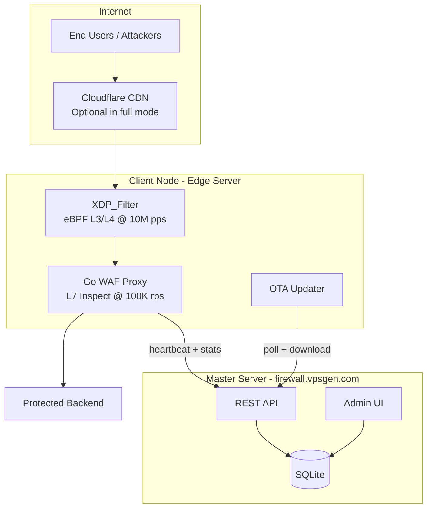
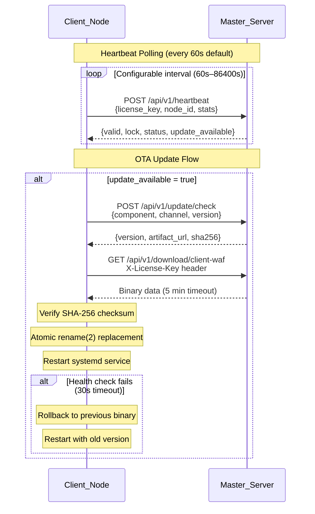

[](https://github.com/vantrong/kiro_waf/actions/workflows/ci.yml)
[](https://go.dev/)
[](./SECURITY.md)

# Kiro WAF

A production-grade Web Application Firewall platform combining XDP/eBPF packet filtering at 10M pps with a Go reverse proxy handling 100K rps. Designed for single-server protection with centralized management.

## Overview

Kiro WAF protects servers and web applications through a two-tier architecture:

- **Layer 3/4**: XDP/eBPF filter drops malicious packets at wire speed in the kernel
- **Layer 7**: Go reverse proxy performs deep inspection, rate limiting, bot challenges, and request forwarding

The system operates in two modes:
- **`server`** — Protects the server and network services only (no HTTP proxy)
- **`full`** — Full website/API protection with reverse proxy, WAF, bot defense, and optional Cloudflare integration

## Architecture



### Heartbeat & OTA Update Flow



## Quick Start

Build and test from a clean clone in under 10 minutes.

### Prerequisites

| Tool | Version | Purpose |
|------|---------|---------|
| Go | 1.21+ | Build all binaries |
| make | any | Build orchestration |
| clang/llvm | 14+ | XDP/eBPF compilation (optional) |
| libbpf-dev | any | XDP headers (optional) |

### Build & Test

```bash
# Clone the repository
git clone https://github.com/vantrong/kiro_waf.git
cd kiro_waf

# Build all Go binaries (kiro-master, kiro-client, kiro-cli)
make build

# Run the full test suite
make test

# (Optional) Build XDP/eBPF filter — requires clang/llvm
make build-xdp
```

Build output goes to `build/`:
```
build/
├── kiro-master      # Master server (control plane)
├── kiro-client      # Client WAF node (edge proxy)
├── kiro-cli         # CLI management tool
└── xdp_filter.o     # XDP/eBPF object (if built)
```

### Verify Installation

```bash
# Check CLI version
./build/kiro-cli version

# Validate example config
./build/kiro-master --config configs/management.firewall.vpsgen.com.example.yaml --check
```

## Configuration

Configuration uses YAML files. See `configs/` for examples.

### Client Node (Minimal)

```yaml
mode: full
plan: school_smb
license_key: KIRO-XXXX-XXXX

server:
  interface: eth0
  ssh_port: 22

website:
  enabled: true
  cloudflare: true
  tls_mode: flexible_http
  sites:
    - domains: [example.com, www.example.com]
      backend: http://127.0.0.1:3000

protection:
  profile: balanced
  waf: true
  bot: true
```

### Key Configuration Files

| File | Purpose |
|------|---------|
| `configs/kiro.example.yaml` | Minimal client config (most users) |
| `configs/kiro.advanced.example.yaml` | Full client config with all options |
| `configs/management.firewall.vpsgen.com.example.yaml` | Master server config |
| `configs/provider.example.yaml` | License provider config |
| `configs/tenant.full-cloudflare.example.yaml` | Full mode with Cloudflare |
| `configs/tenant.server-only.example.yaml` | Server-only mode |

## Deployment

### Master Server

Deploy the control plane at `firewall.vpsgen.com`:

```bash
# Build and deploy
make build
sudo cp build/kiro-master /usr/local/bin/
sudo cp deployments/systemd/kiro-master.service /etc/systemd/system/
sudo systemctl daemon-reload
sudo systemctl enable --now kiro-master
```

See [docs/SETUP_MASTER.md](docs/SETUP_MASTER.md) for full setup including Nginx, SQLite, and TLS.

### Client Node

Deploy edge WAF on protected servers:

```bash
# Automated installation (recommended)
sudo bash scripts/install-client.sh --license-key KIRO-XXXX-XXXX

# Or manual deployment
make build
sudo cp build/kiro-client /usr/local/bin/kiro-client-waf
sudo cp deployments/systemd/kiro-client-waf.service /etc/systemd/system/
sudo systemctl daemon-reload
sudo systemctl enable --now kiro-client-waf
```

The install script handles OS detection, dependency installation, binary download with SHA-256 verification, and systemd service setup.

See [docs/SETUP_CLIENT.md](docs/SETUP_CLIENT.md) for detailed client setup.

### Deployment Configs

| Directory | Contents |
|-----------|----------|
| `deployments/systemd/` | Service unit files |
| `deployments/nginx/` | Nginx reverse proxy configs |
| `deployments/nftables/` | Firewall rules |
| `deployments/sysctl/` | Kernel tuning |
| `deployments/apparmor/` | AppArmor profiles |

## Project Structure

```
kiro_waf/
├── cmd/                    # Binary entry points
│   ├── kiro-master/        # Master server
│   ├── kiro-client/        # Client WAF node
│   └── kiro-cli/           # CLI tool
├── internal/               # Private packages
│   ├── master/             # Master server logic
│   └── client/             # Client node logic
├── pkg/                    # Public shared packages
├── web/                    # Templates and static assets
├── configs/                # Example configurations
├── deployments/            # Deployment configs (systemd, nginx, etc.)
├── scripts/                # Build and install scripts
├── docs/                   # Documentation
└── tests/                  # Property-based tests
```

## Contributing

### Development Setup

```bash
# Install prerequisites (Ubuntu/Debian)
sudo apt install golang-go clang llvm libbpf-dev make

# Build everything
make all

# Run tests
make test

# Clean build artifacts
make clean
```

### Workflow

1. Fork the repository
2. Create a feature branch from `main`
3. Make changes and ensure `make test` passes
4. Submit a pull request using the [PR template](.github/pull_request_template.md)

### Code Standards

- Go code follows `gofmt` formatting (enforced by CI)
- All new functionality requires tests
- XDP/C code compiles with `clang -O2` and produces valid BPF objects
- CSS changes must maintain WCAG 2.1 AA contrast ratios

### Make Targets

| Target | Description |
|--------|-------------|
| `make build` | Build all Go binaries |
| `make build-xdp` | Compile XDP/eBPF object |
| `make test` | Run all Go tests |
| `make clean` | Remove build artifacts |
| `make all` | Build everything (Go + XDP) |

## Documentation

- [Documentation Index](docs/README.md)
- [Setup Guide](docs/SETUP.md)
- [Master Server Setup](docs/SETUP_MASTER.md)
- [Client Node Setup](docs/SETUP_CLIENT.md)
- [Project Structure](docs/PROJECT_STRUCTURE.md)
- [Security Policy](SECURITY.md)
