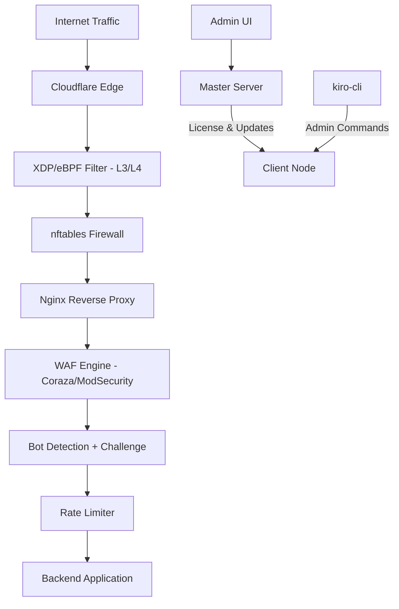

# Kiro WAF Documentation

## Overview

Kiro WAF là hệ thống Web Application Firewall hoàn chỉnh, bảo vệ website từ tầng L3/L4 (XDP/eBPF) đến tầng L7 (reverse proxy + WAF rules). Hệ thống được thiết kế cho VPS Ubuntu, tích hợp Cloudflare, và hỗ trợ quản lý tập trung qua Master Server.

## Architecture Diagram



## Documentation Index

| Tài liệu | Mô tả |
|-----------|--------|
| [Architecture](./architecture.md) | Kiến trúc hệ thống, data flow, components |
| [Installation](./installation.md) | Hướng dẫn cài đặt đầy đủ |
| [Configuration](./configuration.md) | Tham chiếu cấu hình kiro.yaml |
| [CLI Reference](./cli-reference.md) | Tất cả lệnh CLI với ví dụ |
| [Deployment](./deployment.md) | Triển khai VPS, Master, Client |
| [Development](./development.md) | Hướng dẫn phát triển, build, test |
| [Troubleshooting](./troubleshooting.md) | Xử lý sự cố thường gặp |
| [Security](./security.md) | Mô hình bảo mật, threat model |
| [Plans](./plans.md) | Các gói dịch vụ và tính năng |

## Quick Start

```bash
# Community plan (miễn phí, tự động đăng ký)
curl -fsSL https://firewall.vpsgen.com/install.sh | bash

# Pro/Enterprise plan (cần license key)
curl -fsSL https://firewall.vpsgen.com/install.sh | bash -s -- --key KIRO-XXXX-XXXX
```

## System Requirements

- Ubuntu 22.04 hoặc 24.04 LTS (x86_64)
- RAM tối thiểu: 512MB (khuyến nghị 1GB+)
- Go 1.22+ (để build từ source)
- clang/llvm (để compile XDP filter)

## Project Repository Structure

```
kiro_waf/
├── cmd/                    # Entry points (master, client, cli)
├── client-node/            # Client WAF logic (proxy, challenge, rate limit)
├── internal/               # Internal packages
├── configs/                # Example configuration files
├── deployments/            # Systemd, nginx, nftables configs
├── scripts/                # Install & deploy scripts
├── docs/                   # Documentation (bạn đang ở đây)
└── build/                  # Build output
```
