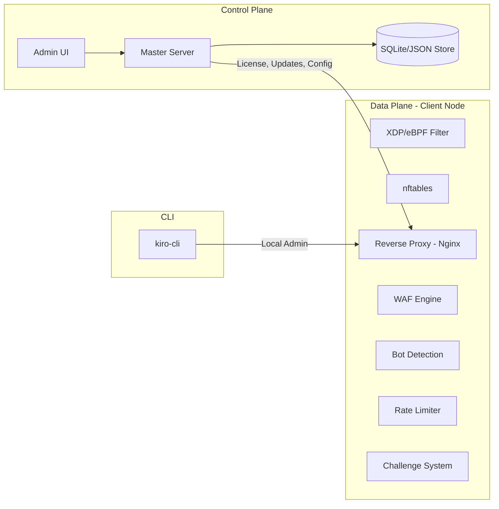
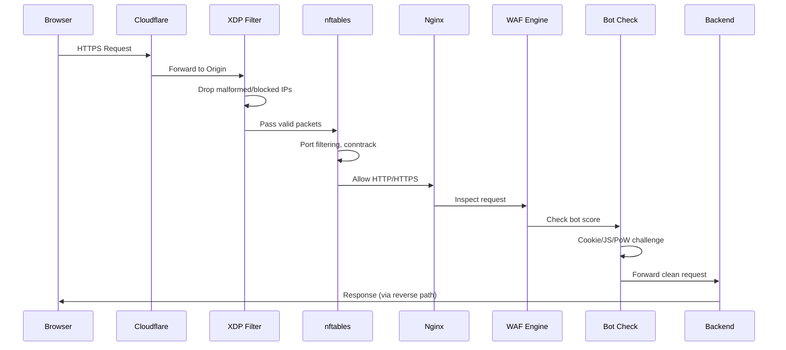
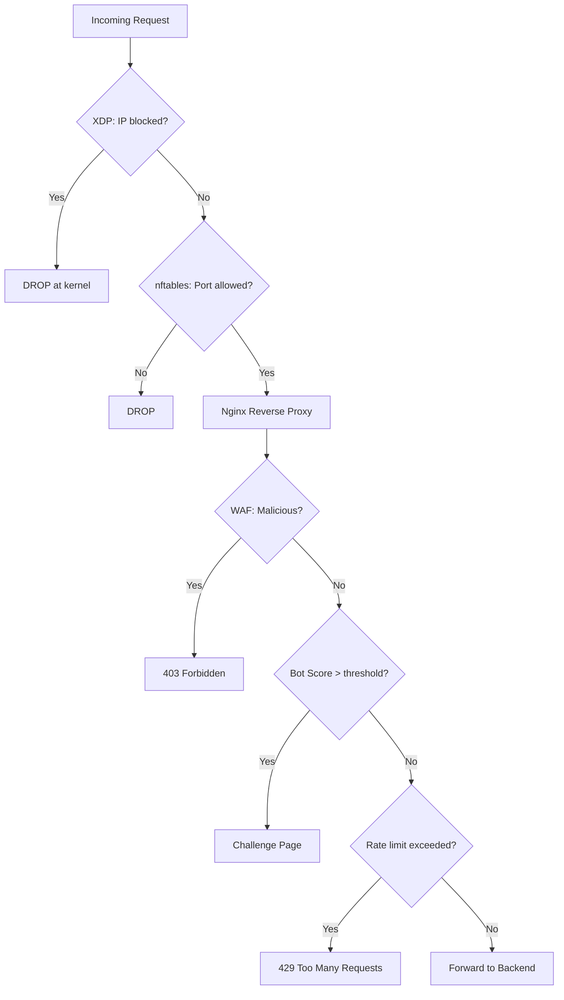
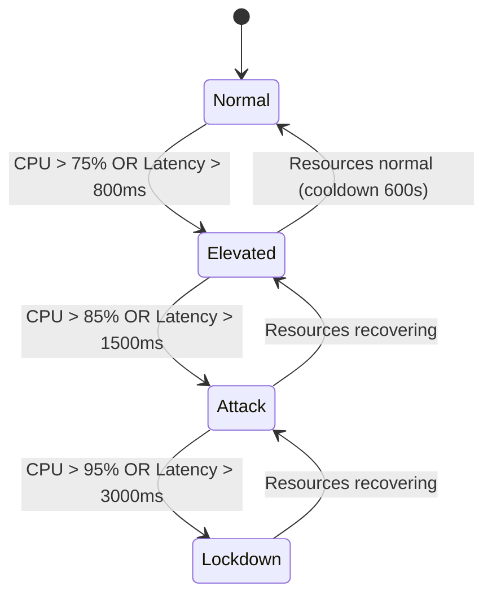

# Architecture

## System Overview

Kiro WAF gồm 3 thành phần chính hoạt động phối hợp để bảo vệ website:

## Components

### 1. Master Server (Control Plane)

Master Server là trung tâm quản lý, chạy trên một VPS riêng hoặc cùng server với client.

**Chức năng:**
- Quản lý license và đăng ký node
- Phân phối cập nhật (OTA updates)
- Admin UI để quản lý tất cả client nodes
- API cho client nodes giao tiếp
- Quản lý tenant/domain

**Tech stack:**
- Go HTTP server
- SQLite database
- HTML templates (Admin UI)
- REST API

### 2. Client Node (Data Plane)

Client Node chạy trên mỗi VPS cần bảo vệ, xử lý traffic thực tế.

**Chức năng:**
- Reverse proxy (qua Nginx)
- WAF rules (Coraza/ModSecurity + OWASP CRS)
- Bot detection (cookie challenge, JS challenge, PoW)
- Rate limiting (per-IP, per-route)
- Ban engine (tạm khóa IP vi phạm)
- Resource governor (tự động điều chỉnh theo tải)

### 3. XDP/eBPF Filter (L3/L4)

XDP filter hoạt động ở kernel level, xử lý packet trước khi đến network stack.

**Chức năng:**
- Drop IP trong blocklist (O(1) lookup)
- Drop malformed packets
- Drop fragmented packets
- Drop private source IP (anti-spoofing)
- DDoS mitigation (PPS limiting per IP/subnet)
- SYN flood protection

**Modes:**
- `native`: Gắn trực tiếp vào NIC driver (nhanh nhất)
- `generic`: Chạy trong kernel network stack (tương thích cao)
- `offload`: Offload xuống NIC hardware (nếu NIC hỗ trợ)

### 4. CLI Tool (Administration)

`kiro-cli` là công cụ dòng lệnh để quản trị local.

**Commands:** version, license, status, health, preflight, mode, install, update, incident, pilot, report

## Data Flow

### Normal Request Flow

### Resource Governor Flow

**Hành động theo level:**

| Level | Hành động |
|-------|-----------|
| Normal | Hoạt động bình thường |
| Elevated | Thắt chặt rate limit, challenge client mới, tăng cache |
| Attack | Block bad clients, disable expensive routes, giảm timeout |
| Lockdown | Chỉ cho admin + known clients, bảo vệ backend |

## Deployment Modes

### Server Mode
Chỉ bảo vệ server (XDP + nftables), không có reverse proxy.

### Full Mode
Bảo vệ đầy đủ: XDP + nftables + Nginx reverse proxy + WAF + Bot detection.

## Communication

### Client → Master
- Đăng ký license (POST /api/register)
- Kiểm tra cập nhật (GET /api/updates/check)
- Tải binary mới (GET /api/updates/download)
- Gửi health report (POST /api/telemetry/health)

### Master → Client
- Push config changes (qua polling interval)
- Revoke license (client kiểm tra định kỳ)
