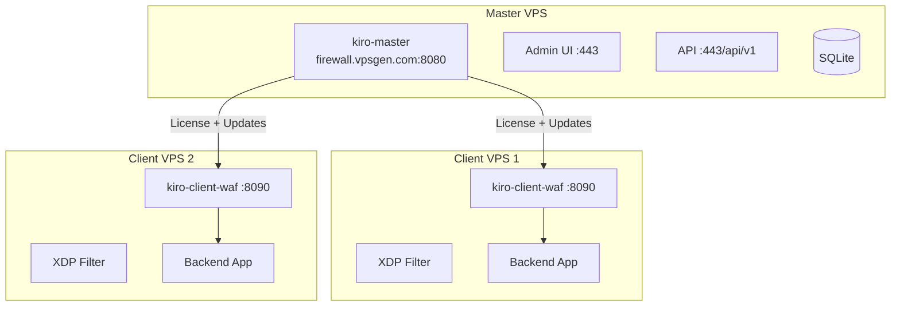

# Deployment

## Deployment Architecture



## Binaries

| Binary | Build output | Install path | Purpose |
|--------|-------------|--------------|---------|
| `kiro-master` | `build/kiro-master` | `/usr/local/bin/kiro-master` | Master server (control plane, admin UI, API, docs) |
| `kiro-client` | `build/kiro-client` | `/usr/local/bin/kiro-client-waf` | Client WAF (reverse proxy + XDP filter) |
| `kiro-cli` | `build/kiro-cli` | `/usr/local/bin/kiro-cli` | CLI administration tool |

**Note:** The binary is built as `kiro-client` but installed as `kiro-client-waf` on the VPS.

## Systemd Services

| Service | Binary | Config |
|---------|--------|--------|
| `kiro-master.service` | `/usr/local/bin/kiro-master` | `/etc/kiro-master/master.env` |
| `kiro-client-waf.service` | `/usr/local/bin/kiro-client-waf` | `/etc/kiro/client-waf.env` |

## VPS Deployment (Ubuntu 22.04/24.04)

### Yêu cầu VPS

| Thành phần | Spec tối thiểu |
|------------|---------------|
| Master Server | 1 vCPU, 1GB RAM, 10GB disk |
| Client Node | 1 vCPU, 512MB RAM, 5GB disk |
| Network | Public IPv4, port 80/443 open |

### Chuẩn bị VPS

```bash
# Update system
apt update && apt upgrade -y

# Cài đặt packages cần thiết
apt install -y curl wget jq nginx nftables

# Bật nftables
systemctl enable --now nftables

# Tắt ufw (nếu có) - Kiro dùng nftables
systemctl disable --now ufw 2>/dev/null || true
```

## Master Server Setup

### Option A: Automated Deploy Script

```bash
# Clone project lên VPS
git clone https://github.com/vantrong/kiro_waf.git /opt/kiro_waf
cd /opt/kiro_waf

# Chạy deploy script (build + install + configure + start)
sudo bash scripts/deploy_master.sh
```

Script `deploy_master.sh` thực hiện:
1. Cài đặt system dependencies (Go, clang, nginx, etc.)
2. Build binaries: `kiro-master`, `kiro-client-waf`, XDP object
3. Tạo users và directories
4. Generate secrets và environment files
5. Install systemd services
6. Configure Nginx reverse proxy
7. Start services và health check

### Option B: Manual Deploy

#### Bước 1: Build binaries

```bash
cd /opt/kiro_waf
make build
```

Output:
```
build/kiro-master
build/kiro-client
build/kiro-cli
```

#### Bước 2: Install binaries

```bash
sudo install -m 0755 build/kiro-master /usr/local/bin/kiro-master
sudo install -m 0755 build/kiro-client /usr/local/bin/kiro-client-waf
sudo install -m 0755 build/kiro-cli /usr/local/bin/kiro-cli
```

#### Bước 3: Create directories

```bash
sudo mkdir -p /etc/kiro-master /var/lib/kiro-master
sudo mkdir -p /etc/kiro /var/lib/kiro /var/log/kiro
```

#### Bước 4: Configure Master environment

```bash
sudo cat > /etc/kiro-master/master.env << 'EOF'
KIRO_MASTER_ADDR=127.0.0.1:8080
KIRO_MASTER_DB=/var/lib/kiro-master/master.db
KIRO_MASTER_ADMIN_KEY=YOUR-RANDOM-SECRET-KEY
KIRO_MASTER_ADMIN_IPS=
KIRO_MASTER_SESSION_TTL=12h
EOF
sudo chmod 640 /etc/kiro-master/master.env
```

#### Bước 5: Install systemd services

```bash
sudo cp deployments/systemd/kiro-master.service /etc/systemd/system/
sudo cp deployments/systemd/kiro-client-waf.service /etc/systemd/system/
sudo systemctl daemon-reload
```

#### Bước 6: Start Master

```bash
sudo systemctl enable --now kiro-master
```

#### Bước 7: SSL Certificate

```bash
# Dùng certbot
apt install -y certbot python3-certbot-nginx
certbot --nginx -d firewall.vpsgen.com
```

## Client Node Setup

### Option A: Auto-install (khuyến nghị)

```bash
# Community (tự đăng ký, không cần key)
curl -fsSL https://firewall.vpsgen.com/install.sh | bash

# Pro/Enterprise (có license key)
curl -fsSL https://firewall.vpsgen.com/install.sh | bash -s -- --license-key KIRO-XXXX-XXXX
```

### Option B: Manual install

```bash
# Tải binary
curl -fsSL -H "X-License-Key: YOUR-KEY" \
  https://firewall.vpsgen.com/api/v1/download/client-waf \
  -o /usr/local/bin/kiro-client-waf
curl -fsSL https://firewall.vpsgen.com/download/kiro-cli \
  -o /usr/local/bin/kiro-cli
chmod +x /usr/local/bin/kiro-client-waf /usr/local/bin/kiro-cli
```

### Configure Client environment

```bash
cat > /etc/kiro/kiro-client.env << 'EOF'
KIRO_CLIENT_LISTEN=:8090
KIRO_BACKEND_URL=http://127.0.0.1:3000
KIRO_MASTER_URL=https://firewall.vpsgen.com
KIRO_LICENSE_KEY=YOUR-LICENSE-KEY
KIRO_CLIENT_COOKIE_SECRET=RANDOM-SECRET
KIRO_NODE_ID=my-server
KIRO_RPM_PER_IP=120
KIRO_SUBNET_RPM=1800
KIRO_HARD_BLOCK_AFTER=360
KIRO_BLOCK_TTL_SECONDS=900
KIRO_POW_DIFFICULTY=4
KIRO_HOLD_SECONDS=2
KIRO_HEARTBEAT_SECONDS=60
KIRO_UPDATE_SECONDS=300
KIRO_XDP_BLOCKLIST_FILE=/var/lib/kiro/xdp-blocklist.txt
EOF
chmod 600 /etc/kiro/kiro-client.env
```

### Start Client

```bash
sudo systemctl enable --now kiro-client-waf
systemctl status kiro-client-waf
```

## All-in-One Deployment

Cho trường hợp Master + Client chạy trên cùng 1 VPS:

```bash
# Clone project
git clone https://github.com/vantrong/kiro_waf.git /opt/kiro_waf
cd /opt/kiro_waf

# Deploy all-in-one (build + install + configure + start)
sudo bash scripts/deploy-all-in-one.sh
```

Hoặc dùng deploy_master.sh (đã bao gồm client):

```bash
sudo bash scripts/deploy_master.sh
```

## Cloudflare Integration

### DNS Setup

1. Đăng nhập Cloudflare Dashboard
2. Thêm domain → DNS Records:
   - `A` record: `yourdomain.com` → `VPS_IP` (Proxied ☁️)
   - `A` record: `www.yourdomain.com` → `VPS_IP` (Proxied ☁️)

### SSL/TLS Configuration

| Kiro TLS Mode | Cloudflare SSL Mode | Mô tả |
|---------------|-------------------|--------|
| `flexible_http` | Flexible | CF→Origin qua HTTP. Đơn giản nhất |
| `full_tls` | Full | CF→Origin qua HTTPS (self-signed OK) |
| `full_strict` | Full (Strict) | CF→Origin qua HTTPS (valid cert required) |

## Production Checklist

- [ ] Admin IP đã được cấu hình
- [ ] SSH port đúng trong config
- [ ] Cloudflare DNS đã proxied (orange cloud)
- [ ] SSL mode phù hợp giữa Cloudflare và Kiro
- [ ] `systemctl status kiro-client-waf` shows active
- [ ] `curl http://127.0.0.1:8090/healthz` returns OK
- [ ] Backup config: `cp /etc/kiro/kiro-client.env /etc/kiro/kiro-client.env.bak`
- [ ] Test truy cập website qua Cloudflare
- [ ] Test SSH vẫn hoạt động

## Rollback Plan

Nếu có sự cố sau deploy:

```bash
# 1. Rollback binary
kiro-cli update rollback \
  --binary-path /usr/local/bin/kiro-client-waf \
  --service kiro-client-waf

# 2. Rollback config
cp /etc/kiro/kiro-client.env.bak /etc/kiro/kiro-client.env
systemctl restart kiro-client-waf

# 3. Emergency: tắt Kiro
systemctl stop kiro-client-waf
```

## Service Management

```bash
# Master
systemctl status kiro-master
systemctl restart kiro-master
journalctl -u kiro-master -f

# Client WAF
systemctl status kiro-client-waf
systemctl restart kiro-client-waf
journalctl -u kiro-client-waf -f
```
