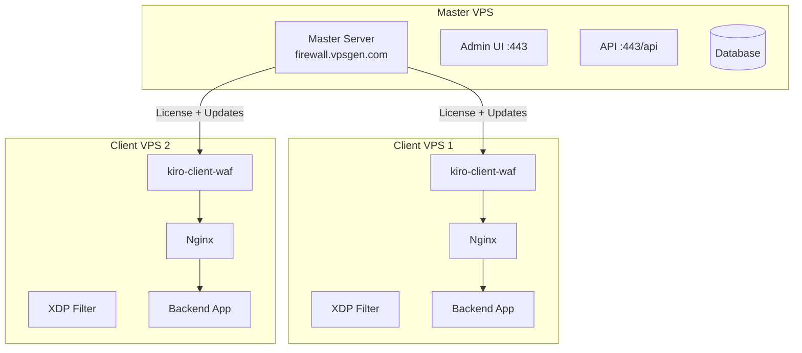

# Deployment

## Deployment Architecture



## VPS Deployment (Ubuntu 22.04/24.04)

### Yêu cầu VPS

| Thành phần | Spec tối thiểu |
|------------|---------------|
| Master Server | 1 vCPU, 1GB RAM, 10GB disk |
| Client Node | 1 vCPU, 512MB RAM, 5GB disk |
| Network | Public IPv4, port 80/443 open |

### Chuẩn bị VPS

```bash
# Update system
apt update && apt upgrade -y

# Cài đặt packages cần thiết
apt install -y curl wget jq nginx nftables

# Bật nftables
systemctl enable --now nftables

# Tắt ufw (nếu có) - Kiro dùng nftables
systemctl disable --now ufw 2>/dev/null || true
```

## Master Server Setup

### Bước 1: Deploy Master

```bash
# Tải và chạy deploy script
curl -fsSL https://raw.githubusercontent.com/your-repo/kiro_waf/main/scripts/deploy_master.sh | bash
```

Hoặc manual:

```bash
# Tải binary
wget -O /usr/local/bin/kiro-master https://firewall.vpsgen.com/download/kiro-master
chmod +x /usr/local/bin/kiro-master

# Tạo thư mục
mkdir -p /etc/kiro /var/lib/kiro /var/log/kiro
```

### Bước 2: Cấu hình Master

```bash
cat > /etc/kiro/master.yaml << 'EOF'
server:
  listen: ":8443"
  domain: firewall.vpsgen.com
  tls:
    cert_file: /etc/letsencrypt/live/firewall.vpsgen.com/fullchain.pem
    key_file: /etc/letsencrypt/live/firewall.vpsgen.com/privkey.pem

database:
  path: /var/lib/kiro/master.db

admin:
  username: admin
  # Đổi password ngay sau deploy
  password_hash: "$2a$10$..."

updates:
  releases_dir: /var/lib/kiro/releases
  channel: stable
EOF
```

### Bước 3: Systemd Service

```bash
cat > /etc/systemd/system/kiro-master.service << 'EOF'
[Unit]
Description=Kiro WAF Master Server
After=network-online.target
Wants=network-online.target

[Service]
Type=simple
ExecStart=/usr/local/bin/kiro-master --config /etc/kiro/master.yaml
Restart=on-failure
RestartSec=5
LimitNOFILE=65535
User=kiro
Group=kiro

[Install]
WantedBy=multi-user.target
EOF

# Tạo user
useradd -r -s /bin/false kiro
chown -R kiro:kiro /var/lib/kiro /var/log/kiro

# Start
systemctl daemon-reload
systemctl enable --now kiro-master
```

### Bước 4: SSL Certificate

```bash
# Dùng certbot
apt install -y certbot
certbot certonly --standalone -d firewall.vpsgen.com

# Hoặc dùng Cloudflare Origin CA
```

## Client Node Setup

### Bước 1: Install Client

```bash
# Auto-install (khuyến nghị)
curl -fsSL https://firewall.vpsgen.com/install.sh | bash -s -- --key KIRO-XXXX-XXXX

# Hoặc manual
wget -O /usr/local/bin/kiro-client https://firewall.vpsgen.com/download/kiro-client
wget -O /usr/local/bin/kiro-cli https://firewall.vpsgen.com/download/kiro-cli
chmod +x /usr/local/bin/kiro-client /usr/local/bin/kiro-cli
```

### Bước 2: Cấu hình

```bash
cat > /etc/kiro/kiro.yaml << 'EOF'
mode: full
plan: professional
license_key: KIRO-XXXX-XXXX

admin:
  allow_ips:
    - YOUR_IP/32

server:
  interface: eth0
  ssh_port: 22

website:
  enabled: true
  cloudflare: true
  tls_mode: flexible_http
  sites:
    - domains:
        - yourdomain.com
        - www.yourdomain.com
      backend: http://127.0.0.1:3000
      routes:
        - path: /api/
          backend: http://127.0.0.1:4000

protection:
  profile: balanced
  waf: true
  bot: true
  auto_attack_mode: true

updates:
  auto_security_updates: true
EOF
```

### Bước 3: Preflight Check

```bash
# Kiểm tra trước khi start
kiro-cli preflight --config /etc/kiro/kiro.yaml

# Kiểm tra output, fix issues nếu có
```

### Bước 4: Start Service

```bash
systemctl enable --now kiro-client-waf

# Verify
kiro-cli status --config /etc/kiro/kiro.yaml
kiro-cli health --config /etc/kiro/kiro.yaml
```

## Cloudflare Integration

### DNS Setup

1. Đăng nhập Cloudflare Dashboard
2. Thêm domain → DNS Records:
   - `A` record: `yourdomain.com` → `VPS_IP` (Proxied ☁️)
   - `A` record: `www.yourdomain.com` → `VPS_IP` (Proxied ☁️)

### SSL/TLS Configuration

| Kiro TLS Mode | Cloudflare SSL Mode | Mô tả |
|---------------|-------------------|--------|
| `flexible_http` | Flexible | CF→Origin qua HTTP. Đơn giản nhất |
| `full_tls` | Full | CF→Origin qua HTTPS (self-signed OK) |
| `full_strict` | Full (Strict) | CF→Origin qua HTTPS (valid cert required) |

### Cloudflare Settings Khuyến nghị

```
SSL/TLS → Overview: Chọn mode phù hợp
SSL/TLS → Edge Certificates: Always Use HTTPS = ON
SSL/TLS → Edge Certificates: Minimum TLS Version = 1.2
Security → Settings: Security Level = Medium
Speed → Optimization: Auto Minify = ON (JS, CSS, HTML)
```

### Block Direct Origin Access

Kiro tự động cấu hình nftables để chỉ cho phép traffic từ Cloudflare IPs:

```bash
# Kiro tự động update Cloudflare IP ranges
# File: /etc/kiro/cloudflare-ips-v4.txt
# File: /etc/kiro/cloudflare-ips-v6.txt
```

## All-in-One Deployment

Cho trường hợp Master + Client chạy trên cùng 1 VPS:

```bash
# Deploy all-in-one
curl -fsSL https://raw.githubusercontent.com/your-repo/kiro_waf/main/scripts/deploy-all-in-one.sh | bash
```

## Production Checklist

- [ ] Admin IP đã được cấu hình trong `admin.allow_ips`
- [ ] SSH port đúng trong config
- [ ] Cloudflare DNS đã proxied (orange cloud)
- [ ] SSL mode phù hợp giữa Cloudflare và Kiro
- [ ] `kiro-cli preflight` pass tất cả checks
- [ ] `kiro-cli health` không có lỗi
- [ ] Backup config: `cp /etc/kiro/kiro.yaml /etc/kiro/kiro.yaml.bak`
- [ ] Test truy cập website qua Cloudflare
- [ ] Test SSH vẫn hoạt động
- [ ] Cấu hình auto-update (nếu Pro/Enterprise)
- [ ] Monitoring/alerting đã setup

## Rollback Plan

Nếu có sự cố sau deploy:

```bash
# 1. Rollback binary
kiro-cli update rollback --binary-path /usr/local/bin/kiro-client --service kiro-client-waf

# 2. Rollback config
cp /etc/kiro/kiro.yaml.bak /etc/kiro/kiro.yaml
systemctl restart kiro-client-waf

# 3. Emergency: tắt Kiro, traffic đi thẳng
systemctl stop kiro-client-waf
# Nginx vẫn chạy với config cũ
```
