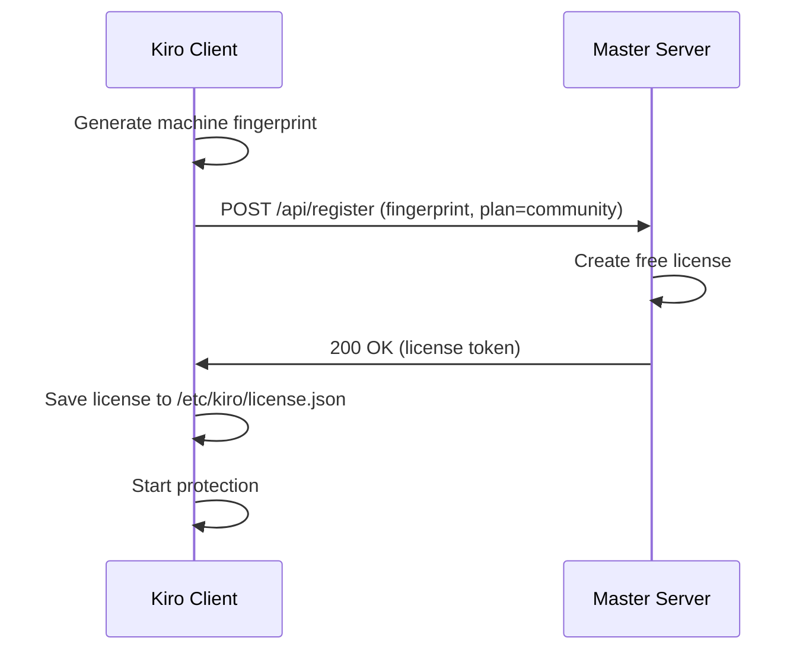

# Plans

## Package Plans Overview

Kiro WAF cung cấp 3 gói dịch vụ chính:

| Tính năng | Community | Pro | Enterprise |
|-----------|-----------|-----|-----------|
| **Giá** | Miễn phí | Có phí | Custom |
| **Domains** | 1 | 5 | Unlimited |
| **Rate Limit** | 60 RPM/IP | 120 RPM/IP | Custom |
| **WAF** | ✅ Basic | ✅ Full CRS | ✅ Full + Custom |
| **Bot Detection** | ✅ Cookie only | ✅ Cookie + JS + PoW | ✅ All + Custom |
| **XDP/eBPF** | ❌ | ✅ | ✅ |
| **OTA Updates** | ❌ Manual | ✅ Auto | ✅ Auto + Priority |
| **Resource Governor** | ❌ | ✅ | ✅ |
| **Cloudflare Integration** | ✅ Basic | ✅ Full | ✅ Full + Custom |
| **TLS Modes** | flexible_http | All modes | All modes |
| **Backend Pools** | 1 | 5 | Unlimited |
| **Load Balancing** | ❌ | ✅ | ✅ |
| **Health Checks** | ❌ | ✅ | ✅ |
| **Runtime Security** | ❌ | ✅ | ✅ |
| **Incident Reports** | ❌ | ✅ | ✅ |
| **Support** | Community | Email | Dedicated |
| **License Key** | Không cần | Cần | Cần |
| **Registration** | Tự động | Manual | Manual |

## Community Plan (Miễn phí)

### Đặc điểm
- **Không cần license key** - tự động đăng ký khi cài đặt
- Phù hợp cho: blog cá nhân, website nhỏ, testing
- Không giới hạn bandwidth
- Bảo vệ cơ bản nhưng hiệu quả

### Cài đặt

```bash
# Không cần key, tự động đăng ký
curl -fsSL https://firewall.vpsgen.com/install.sh | bash
```

### Giới hạn
- 1 domain duy nhất
- Rate limit cố định 60 RPM/IP
- Không có XDP filter (chỉ nftables + WAF)
- Cập nhật thủ công
- Không có resource governor
- Bot detection chỉ cookie challenge
- Không có load balancing

### Cấu hình mẫu

```yaml
mode: full
plan: community

website:
  enabled: true
  cloudflare: true
  tls_mode: flexible_http
  sites:
    - domains: [myblog.com]
      backend: http://127.0.0.1:3000

protection:
  profile: balanced
  waf: true
  bot: true
```

## Pro Plan

### Đặc điểm
- Bảo vệ đầy đủ với XDP/eBPF
- Phù hợp cho: SME, e-commerce nhỏ, SaaS
- Auto-update OTA
- Multi-domain support

### Cài đặt

```bash
curl -fsSL https://firewall.vpsgen.com/install.sh | bash -s -- --key KIRO-PRO-XXXX-XXXX
```

### Tính năng nổi bật
- **XDP/eBPF Filter**: Drop malicious traffic ở kernel level
- **5 domains**: Nhiều website trên 1 server
- **120 RPM/IP**: Rate limit cao hơn
- **Full bot detection**: Cookie + JS + PoW challenges
- **Resource Governor**: Tự động điều chỉnh theo tải
- **OTA Updates**: Tự động cập nhật security patches
- **Backend pools**: Load balancing giữa nhiều backends
- **Health checks**: Tự động detect backend down

### Cấu hình mẫu

```yaml
mode: full
plan: professional
license_key: KIRO-PRO-XXXX-XXXX

admin:
  allow_ips: [203.0.113.10/32]

server:
  interface: eth0
  ssh_port: 22

website:
  enabled: true
  cloudflare: true
  tls_mode: full_strict
  sites:
    - domains: [app.example.com, www.example.com]
      backend: http://127.0.0.1:3000
      routes:
        - path: /api/
          backend: http://127.0.0.1:4000
          protection: strict
    - domains: [docs.example.com]
      backend: http://127.0.0.1:8080

protection:
  profile: balanced
  waf: true
  bot: true
  auto_attack_mode: true

updates:
  auto_security_updates: true
```

## Enterprise Plan

### Đặc điểm
- Unlimited everything
- Custom rules và policies
- Dedicated support
- Phù hợp cho: enterprise, banking, government

### Cài đặt

```bash
curl -fsSL https://firewall.vpsgen.com/install.sh | bash -s -- --key KIRO-ENT-XXXX-XXXX
```

### Tính năng bổ sung (so với Pro)
- **Unlimited domains**
- **Custom rate limits** per route, per user
- **Custom WAF rules** (ngoài OWASP CRS)
- **Advanced DDoS mitigation**
- **Multi-server management** từ 1 dashboard
- **Priority OTA updates**
- **Runtime security monitoring**
- **File integrity monitoring**
- **Process execution alerts**
- **Dedicated support channel**
- **SLA guarantee**

## Deployment Profiles

Ngoài plans, Kiro còn có deployment profiles cho từng loại tổ chức:

| Profile | Mô tả | Plan tối thiểu |
|---------|--------|----------------|
| `community` | Cá nhân, testing | Community |
| `school_smb` | Trường học, SME | Pro |
| `professional` | Business, SaaS | Pro |
| `enterprise_lite` | Enterprise nhỏ | Enterprise |

## Auto-Registration (Community)



**Quy trình:**
1. Client tự động thu thập machine fingerprint (machine-id + MAC)
2. Gửi request đăng ký đến master server
3. Master tạo license miễn phí, bind vào fingerprint
4. Client nhận và lưu license
5. Bắt đầu bảo vệ ngay lập tức

**Lưu ý:**
- 1 machine = 1 community license
- Đổi hardware (MAC/machine-id) cần đăng ký lại
- Không cần tương tác người dùng

## Upgrade Flow

### Community → Pro

```bash
# 1. Mua license key từ provider
# 2. Cập nhật config
sed -i 's/plan: community/plan: professional/' /etc/kiro/kiro.yaml
sed -i 's/license_key: ""/license_key: "KIRO-PRO-XXXX-XXXX"/' /etc/kiro/kiro.yaml

# 3. Restart service
systemctl restart kiro-client-waf

# 4. Verify
kiro-cli status --config /etc/kiro/kiro.yaml
```

### Pro → Enterprise

```bash
# 1. Nhận enterprise key từ provider
# 2. Cập nhật config
sed -i 's/plan: professional/plan: enterprise_lite/' /etc/kiro/kiro.yaml
sed -i 's/KIRO-PRO-/KIRO-ENT-/' /etc/kiro/kiro.yaml

# 3. Restart
systemctl restart kiro-client-waf
```

## Downgrade Flow

### Pro → Community

```bash
# 1. Cập nhật config
# Lưu ý: sẽ mất tính năng XDP, multi-domain, auto-update

# 2. Giảm xuống 1 domain trong config
# 3. Đổi plan
sed -i 's/plan: professional/plan: community/' /etc/kiro/kiro.yaml
sed -i 's/license_key: "KIRO-PRO-.*"/license_key: ""/' /etc/kiro/kiro.yaml

# 4. Restart
systemctl restart kiro-client-waf
```

**Lưu ý khi downgrade:**
- Tính năng XDP sẽ bị tắt
- Chỉ giữ 1 domain đầu tiên
- Rate limit giảm về 60 RPM
- Auto-update bị tắt
- Resource governor bị tắt

## License Management

### License File Format

```json
{
  "key": "KIRO-PRO-XXXX-XXXX",
  "plan": "professional",
  "domains_limit": 5,
  "issued_at": "2024-01-01T00:00:00Z",
  "expires_at": "2025-01-01T00:00:00Z",
  "machine_fingerprint": "a1b2c3d4...",
  "signature": "base64..."
}
```

### Machine Fingerprint

```bash
# Xem fingerprint hiện tại
kiro-cli license fingerprint

# Fingerprint dựa trên:
# - /etc/machine-id
# - Primary MAC address
# - All MACs hash
```

### Grace Period

Khi license hết hạn:
1. **7 ngày grace**: Hoạt động bình thường, cảnh báo trong logs
2. **Sau grace**: Giảm về Community features
3. **Không bao giờ tắt hoàn toàn** - luôn có bảo vệ cơ bản

### License Rebind

Khi thay đổi hardware (VPS migration):
1. Liên hệ provider với license key
2. Provider revoke license cũ
3. Cài đặt lại trên server mới với cùng key
4. Auto-rebind vào fingerprint mới
