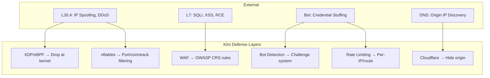
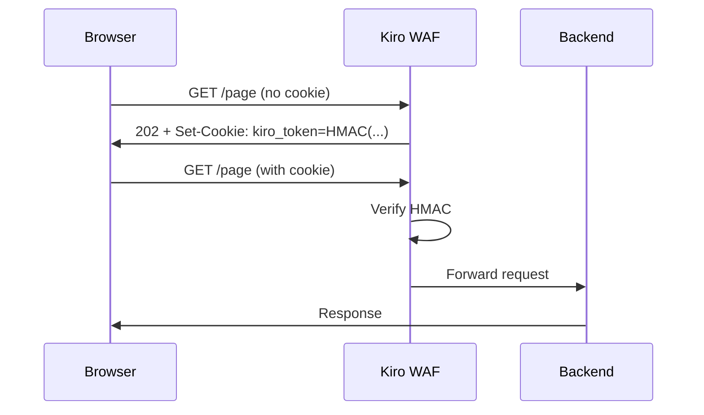
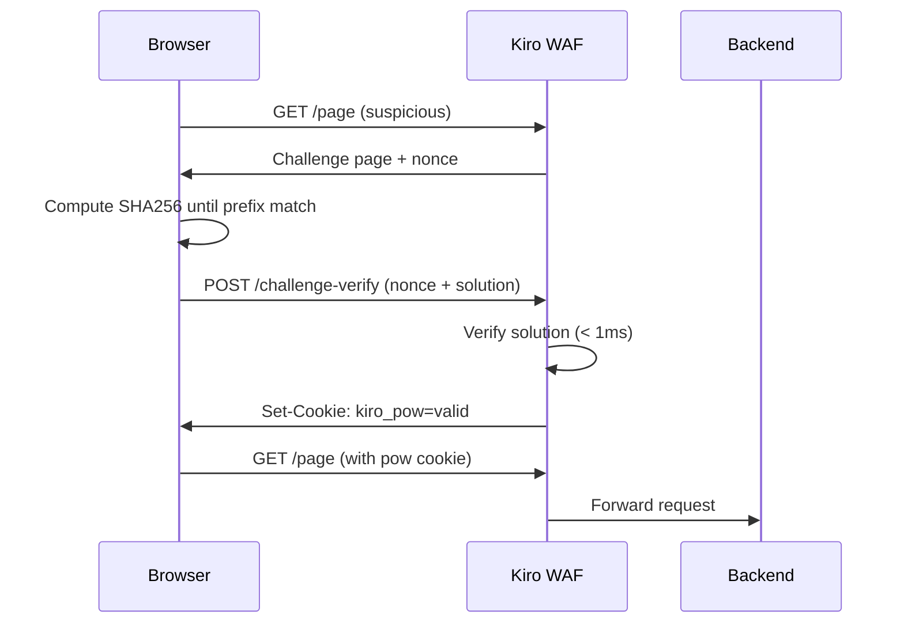

# Security

## Threat Model

### Assets Được Bảo Vệ

| Asset | Mức độ | Mô tả |
|-------|--------|--------|
| Backend Application | Critical | Ứng dụng web của khách hàng |
| Server Access (SSH) | Critical | Quyền truy cập quản trị |
| User Data | High | Dữ liệu người dùng qua website |
| Origin IP | High | IP thật của server (ẩn sau Cloudflare) |
| License/Config | Medium | Cấu hình và license key |

### Threat Actors

| Actor | Capability | Mục tiêu |
|-------|-----------|----------|
| Script Kiddie | Low | DDoS, scan, brute force |
| Automated Bot | Medium | Credential stuffing, scraping |
| Skilled Attacker | High | SQLi, XSS, RCE, bypass WAF |
| DDoS Service | High | Volumetric/application layer DDoS |
| APT | Very High | Persistent access, data exfiltration |

### Attack Surfaces



## Defense Layers

### Layer 1: XDP/eBPF (L3/L4)

Xử lý packet ở kernel level, trước network stack.

**Bảo vệ chống:**
- IP spoofing (drop private source IPs)
- Malformed packets
- Fragment attacks
- Volumetric DDoS (PPS limiting)
- SYN flood
- UDP flood
- ICMP flood

**Security properties:**
- Chạy trong eBPF sandbox (kernel verified)
- Không thể truy cập userspace memory
- Bounded execution (no infinite loops)
- Read-only access to packet data
- Allowlist/blocklist O(1) lookup via eBPF maps

**Giới hạn:**
- Không inspect L7 payload
- Không decrypt TLS
- Cần kernel 5.15+ cho native mode

### Layer 2: nftables (L3/L4)

Stateful firewall với connection tracking.

**Bảo vệ chống:**
- Unauthorized port access
- Connection flooding
- Port scanning

**Rules:**
```
# Chỉ allow ports cần thiết
allow: 22 (SSH, admin IP only), 80, 443
drop: everything else

# Conntrack protection
limit new connections per IP
drop invalid state packets
```

### Layer 3: WAF Engine (L7)

Coraza/ModSecurity với OWASP Core Rule Set.

**Bảo vệ chống:**
- SQL Injection (SQLi)
- Cross-Site Scripting (XSS)
- Remote Code Execution (RCE)
- Local File Inclusion (LFI)
- Remote File Inclusion (RFI)
- Server-Side Request Forgery (SSRF)
- XML External Entity (XXE)

**Anomaly scoring:**
- Mỗi rule match tăng anomaly score
- Threshold mặc định: 5
- Vượt threshold → block request
- Giảm false positive bằng cách tăng threshold

### Layer 4: Bot Detection

Hệ thống phát hiện và challenge bot.

**Phương pháp:**
1. **Cookie Challenge**: Set cookie, kiểm tra request tiếp theo có cookie
2. **JavaScript Challenge**: Yêu cầu browser execute JS
3. **Proof of Work (PoW)**: Yêu cầu browser giải bài toán tính toán

**Bot scoring:**
| Signal | Score |
|--------|-------|
| No cookie support | +20 |
| No JS execution | +30 |
| Known bot UA | +40 |
| Suspicious headers | +15 |
| High request rate | +25 |
| Failed PoW | +50 |

### Layer 5: Rate Limiting

Token bucket algorithm per IP, per route.

**Levels:**
- Global: default RPM per IP
- Per-route: custom RPM cho sensitive endpoints
- Per-account: limit cho authenticated users
- Concurrent: max simultaneous connections

## Challenge/PoW System

### Cookie Challenge Flow



### Proof of Work Flow



**PoW Parameters:**
- Difficulty: 4-6 leading zero bits (adjustable)
- Thời gian giải trên browser: 1-5 giây
- Thời gian verify trên server: < 1ms
- Cookie validity: 1 giờ

### HMAC Cookie Security

- Algorithm: HMAC-SHA256
- Key: Random 32 bytes, generated at startup
- Payload: `IP + timestamp + nonce`
- Expiry: Configurable (default 1h)
- Không lưu state server-side (stateless verification)

## Admin Access Control

### SSH Protection

```yaml
admin:
  allow_ips:
    - 203.0.113.10/32  # Admin IP cố định
```

- SSH chỉ cho phép từ admin IPs
- nftables rule: `tcp dport 22 ip saddr @admin_ips accept`
- Tất cả IP khác bị drop ở SSH port
- Safety: `never_block_admin_ips: true` đảm bảo không tự lock out

### Safety Mechanisms

| Mechanism | Mô tả |
|-----------|--------|
| Dry-run before apply | Test rules trước khi áp dụng |
| Rollback timer | Tự rollback sau 60s nếu mất kết nối |
| Admin IP whitelist | Không bao giờ block admin |
| Last-good config | Backup config hoạt động tốt |
| Graceful degradation | Giảm protection thay vì crash |

### Master Server Admin

- Admin UI protected by username/password
- Password stored as bcrypt hash
- HTTPS only (TLS 1.2+)
- Session timeout: configurable
- Rate limit on login attempts

## Data Privacy

### Telemetry

Mặc định **tắt**. Khi bật:

```yaml
telemetry:
  privacy:
    send_request_body: false      # Không gửi body
    send_cookie: false            # Không gửi cookie
    send_authorization_header: false  # Không gửi auth header
    send_raw_client_ip: false     # Không gửi IP thật
    hash_client_ip: true          # Hash IP trước khi gửi
    redact_secrets: true          # Redact secrets trong log
```

### Log Privacy

- Client IPs có thể được hash trong logs
- Request bodies không được log
- Sensitive headers (Authorization, Cookie) được redact
- Log rotation tự động

## Runtime Security

### File Integrity Monitoring

```yaml
runtime_security:
  file_integrity:
    enabled: true
    paths:
      - /var/www          # Web files
      - /etc/nginx        # Nginx config
      - /etc/kiro         # Kiro config
```

Alert khi file trong monitored paths bị thay đổi.

### Process Execution Monitoring

```yaml
runtime_security:
  alert_when_web_user_executes:
    - sh, bash           # Shell
    - curl, wget         # Download tools
    - nc                 # Netcat
    - python, perl       # Scripting languages
```

Alert khi web user (www-data) execute suspicious commands → dấu hiệu RCE.

## Security Best Practices

### Deployment

1. **Luôn set admin IP** trước khi apply firewall rules
2. **Dùng Cloudflare** để ẩn origin IP
3. **Block direct origin access** - chỉ allow Cloudflare IPs
4. **Enable auto-update** cho security patches
5. **Backup config** trước khi thay đổi

### Configuration

1. **Không dùng `0.0.0.0/0`** trong admin allow_ips
2. **Bật `dry_run_before_apply`** trong production
3. **Bật `require_admin_ip_before_firewall_apply`**
4. **Dùng `full_strict` TLS** cho dữ liệu nhạy cảm
5. **Set `protection.profile: strict`** cho e-commerce/banking

### Monitoring

1. Kiểm tra `kiro-cli health` định kỳ
2. Monitor logs cho patterns bất thường
3. Set up alerting cho resource_governor level changes
4. Review incident reports
5. Audit admin access logs

## Vulnerability Reporting

Nếu phát hiện lỗ hổng bảo mật:

1. **KHÔNG** public disclosure
2. Email: security@vpsgen.com
3. Include: mô tả, steps to reproduce, impact assessment
4. Response time: 48 giờ
5. Xem thêm: [SECURITY.md](../SECURITY.md)
